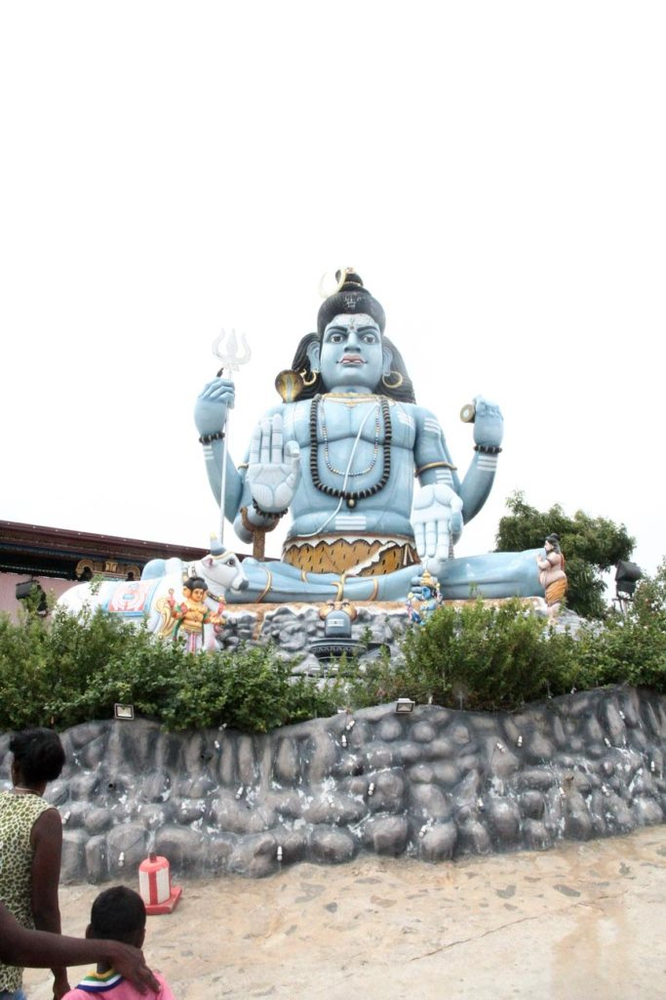

Petit déjeuner, toujours devant notre chambre.

Nous rejoignons **Valachchenai** en tuktuk, où nous prenons un bus pour **Trincomalee**. Puis enfin un tuktuk pour notre hôtel.

Nous partons ensuite en balade dans **Trincomalee** à pieds. Tuktuk jusqu’au fort, magnifique pour visiter le temple. Nous redescendons après la visite du temple à pieds au milieu des daims jusqu’à la plage de Dutch Bay.

Tuktuk jusqu’à **Upuveli** pour voir. Hélas nous n’avons pas nos maillots de bain avec nous, nous reviendrons demain. Nous avons en effet trouvé une chambre au Regish french Garden sur la plage pour le lendemain.

Nous allons manger au Sunrise Hotel sous une pluie tropicale qui ne nous quittera plus de la soirée.