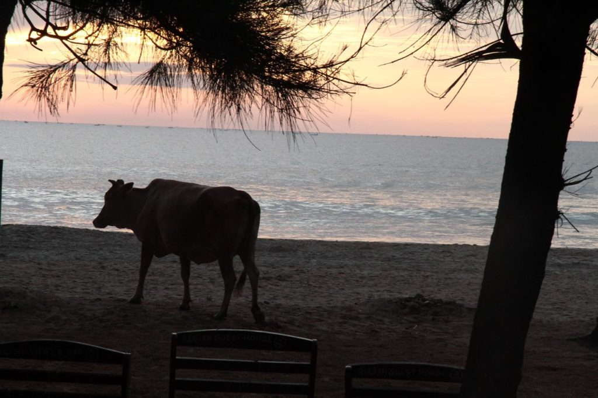

J’assiste au lever de soleil sur l’océan indien avec le grand, il est 5h30. Puis bain de mer avec les deux en attendant une heure descente pour demander un petit déjeuner qui sera pris sur la terrasse face à la mer.

Tuktuk jusqu’à la gare routière de **Trincomalee**, puis bus jusqu’à la gare de **Vavuniya**. Un tuktuk nous conduit alors à notre hôtel, qui s’avère n’être distant que d’une centaine de mètres.

Nous partons en balade et visitons le musée, désert, et un temple situé non loin d’un joli réservoir.

Retour à l’hôtel par la rue principale.

Nous terminons la soirée par un passage par le bar de l’hôtel pour boire une bière accompagnée de quelques naans. Le bar est caché derrière des tentures noires dans un recoin de l’hôtel, ambiance bar clandestin plutôt rigolote où nous ne passons pas inaperçus.