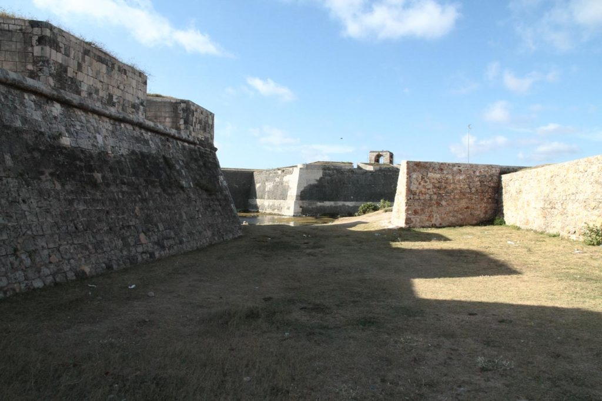
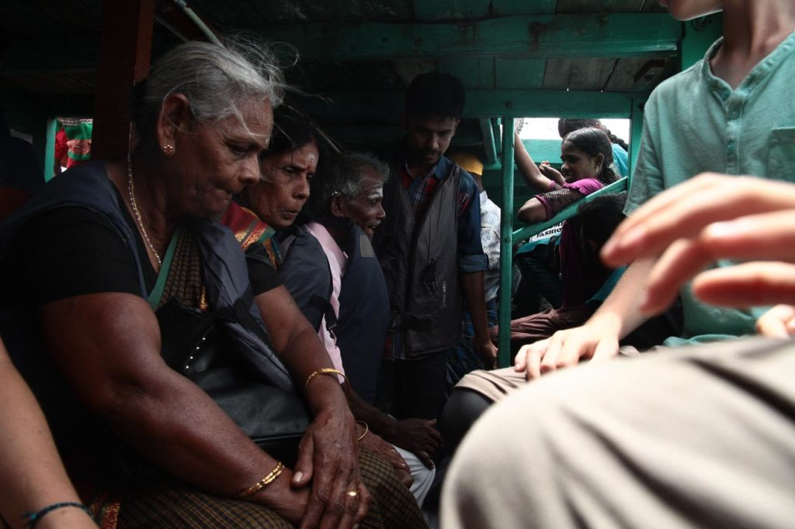
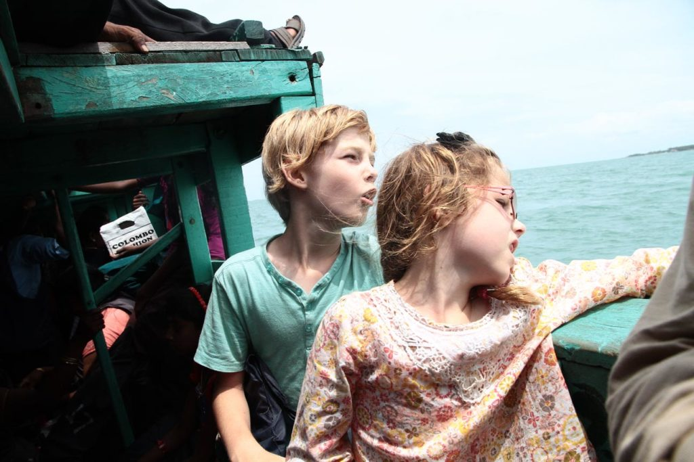
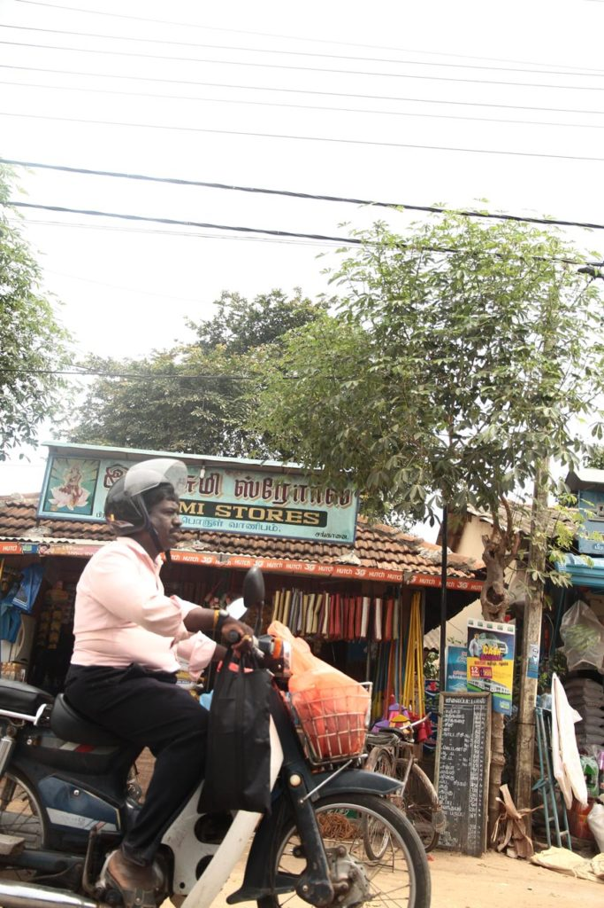

Petit déjeuner à l’hôtel et nous retournons à la gare routière, à pieds cette fois ci.

## Jour 1

Bus pour Jaffna.

Puis tuktuk pour notre guesthouse Teressa Inn. Tuktuk pour aller voir le temple. Arrêt bière au Morgan’s, à la recherche d’un tailleur dans les ruelles de **Jaffna**. Passage chez le glacier Rio et retour au Morgan’s pour se renseigner sur le tailleur, mais il est trop tard pour ça.

Nous prenons un tuktuk pour le fort où nous faisons une magnifique balade de fin de journée. Seuls avec les mouettes. Nous revenons à pieds en passant par la bibliothèque et le centre commercial où nous faisons le plein d’aloé vera pour les coups de soleil.

Retour en tuktuk à l’hôtel où nous prenons notre repas. Nouilles légumes et crevettes pimentées.

## Jour 2

Petit déjeuner à la guesthouse. Nous prenons le tuktuk privé de la guesthouse pour partir à la recherche des robes de ces dames.

1. Tailleur du Lonely : 500 r par pièce cela nous semble un peu trop cher pour en avoir discuté avec les locaux ces derniers jours.
2. Magasin n°1 tissus rien d’extraordinaire
3. Magasin n°2 robe, on déniche une jolie petite robe tamoule pour K..
4. Magasin n°3 saree x2 pour Madame
5. Passage chez la couturière recommandée par notre logeur pour confectionner les jupons et blouses pour les 2 saree 300r/saree
6. Notre chauffeur nous dépose derrière le bus pour **Kurikadduwan**.

1 heure de bus plus tard nous embarquons à **Kurikadduwan** pour la traversée vers **Nainativu**. Une fois déchaussés, l’île n’est qu’un grand temple. nous visitons ce que nous pouvons en fonction des accès possibles ou pas. Temple hindou, temple bouddhiste, etc…

Nous reprenons ensuite le chemin de notre guesthouse. Bateau, bus,tuktuk. Avant de rentrer à la guesthouse nous passons par le centre commercial refaire le plein de petits gâteaux et d’aloé vera.

Après une bonne douche nous prenons un tuktuk pour un restaurant indien. Très copieux et très bon. Mix végétable pakoda,chicken tika, 2 cheese naan, 1 garlic naans, panir butter massala

tuktuk pour l’hotel.

## Jour 3

Petit déjeuner encore une fois énorme à l’hôtel.

Passons la journée en tuktuk sur un circuit organisé avec le patron de la guesthouse. Nous serons accompagnés d’une australienne qui y loge aussi. 6 dans le tuktuk avec le chauffeur…. Pour une balade de 6h00 (8h30/14h30).

1. Puit sans fond
2. Kantarodai
3. Kankesanturai
4. Dambakola patuna
5. ile Karaitivu plage et fort, nous nous arrêtons au café en face du fort hammiel et payons une bière au chauffeur.
6. temple singe

Après une courte pause, petite marche jusqu’au magasin du couvent pour acheter une très bonne bouteille de vin local :)

Séance dessin dans le jardin du temple tout proche.

Après la livraison des sarees, magnifiques, par la couturière, nous prenons un tuktuk pour tester la terrasse restaurant du greengrass, ce sera cheese naans frites pour les enfants, indian veg curry pour G. et Chicken penjabi pour moi.

## Jour 4

Apres un copieux petit déjeuner, tuktuk jusqu’à la gare pour se renseigner sur les horaires de train du lendemain.

Reprenons ensuite un tuktuk pour le marché en vue de faire quelques courses avant de réaliser que nous sommes dimanche et que presque tout est fermé. Nous reviendrons finalement à la guesthouse avec quelques livres d’apprentissage de l’écriture tamoule.

Après avoir chargé le sac de serviettes et maillots de bain nous reprenons un tuktuk pour la gare routière où nous prenons le 570 en direction de **point pedro** (1 heure).

halte grignotage (beignets/thé/oignons pimentés/dhaal/etc.) dans un hôtel proche de la gare routière avant de prendre un tuktuk pour rejoindre **Munaï Beach** le long des étals de poissons séchés.

La plage est déserte, seuls au monde je me baigne une ptite heure avec les enfants.

Pour le retour, nous marchons, longuement, sous le soleil avant de croiser un tuktuk qui nous ramène à la gare routière de **point pedro** où nous prenons le 571 en direction de Jaffna.

Profitons de la terrasse ombragée du greegrass pour boire une bière.

Nous rentrons ensuite à pieds dans les rues de **Jaffna** à la pension.

Le soir nous retournons à l’indien du 2eme jour nous régaler de spécialités indiennes, tandor, paneer, etc…

