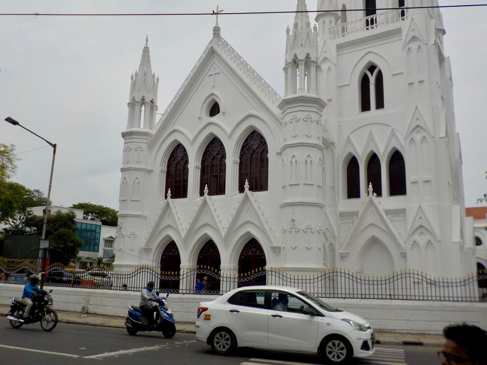
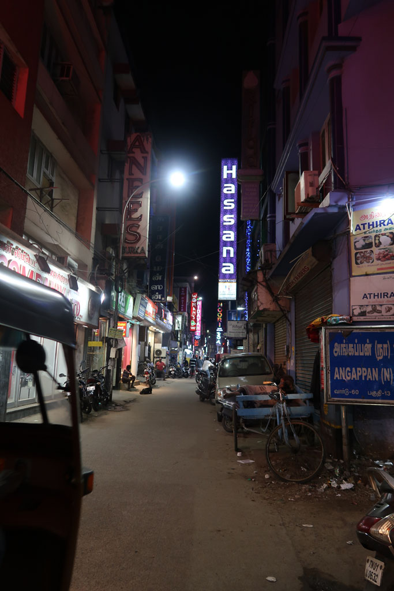

**9h00** Réveil pour moi

**9h30** Tout le monde émerge, nous trouvons une petite gargote pour un petit déjeuner (masala dosa, vada x5, cafés au lait x 3, jus d’orange frais) 305 R

Tuk tuk en direction du musée (250 R), le premier n’est pas le bon, on continue, pour découvrir que ce dernier est fermé le week-end.

Tuk tuk pour le temple de **Kapaeeshwarar**, belle balade après avoir laissé nos chaussures à la consigne (50 R offerts)

Partons ensuite à pieds vers la **cathédrale** Saint Thomas où nous visitons le **musée** et la crypte

On continue à pieds en direction du **phare**, qui lui aussi se trouve être fermé le vendredi.

Pause boisson dans un kiosque de marina Beach (mirinda x2, lime juice x 2) 150R

Déambulation dans les rues entre Triplicane et Chepauk

**14h00** K. à vraiment trop chaud, on décide de prendre un tuk tuk pour revenir à l’hôtel 15OR, on achète de l’eau sur le chemin 35R

**15H30** réveil de la sieste, G. sort acheter quelques trucs à grignoter (10R). Je pars en balade dans le quartier dont je parcours systématiquement toutes les rues. Chacune est spécialisée dans un type de produit (Barres d’acier, tubes d’acier, plaque d’acier, tubes PVC, etc.)

**17h00** de retour, le personnel de l’hôtel, insiste pour faire notre chambre.

**18h30** à la recherche du repas du soir dans une petit restaurant local (Veg biryani, veg fried rice, butter naan x2, cucumber raita, fresh lime juice x 4) 546 R, vraiment excellent.

**20H00** retour à l’hôtel en passant par notre petite échoppe acheter quelques gâteaux (25R)

