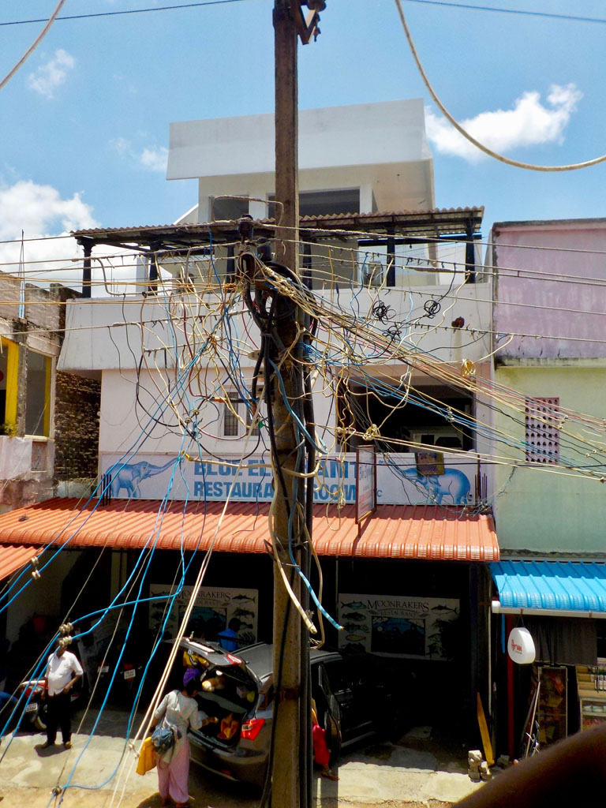
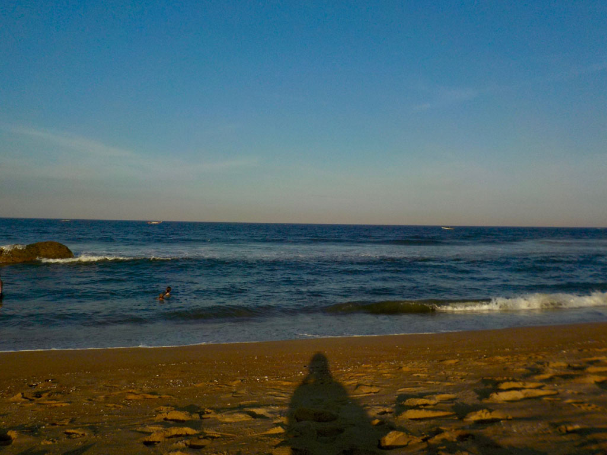

**7h30** réveil

**8h30** à a réception on demande un tuk tuk pour la station de bus de Brodaway

**8h45** A peine descendus du tuk tuk on monte dans un **bus** pour **Kovalam** 145R

**10h00** Le contrôleur nous indique le second bus à prendre (188)

**10H15** dans le deuxième **bus** pour **Mahabalipuram** 124R

**10H45** descente du bus, on prend un tuk tuk pour une guest house, mais elle est pleine ,le conducteur nous en indique une autre.

**11h00** nous posons enfin les sacs.

**12h00** grignotage dans un petit restaurant (fried rice, fried rice + egg, veg noodle, lime soda x3, plain soda) 610R

**13H00** Après un passage sur le front de mer on rentre se protéger de la chaleur

**15h30** je pars en balade dans les rues avoisinantes.

**17h30** Direction la **plage**, E. s’isole du soleil, G. mouille son pantalon. Je me baigne avec K.

**18h30** après une bonne douche on part à la recherche d’un endroit ou manger. Nous sommes sur la côte touristique et les prix s’envole dans ce quartier (il aurait fallu prendre un tuk tuk et retourner dans les bouis bouis de la gare routière). Le premier est vraiment trop cher pour nous, on se contente de boire une bière et 2 sodas (400R)

**19H00** On teste le Yogi (à peine moins her et portions congrues) currys crevettes + riz, curry poulet + riz, curry poulet + chapati, butter naan, raïta, sodas x 3, lime juice 895R

**20h00** retour à l’hôtel, on donne les affaires pour une grande lessive

**21h00** extinction des feux, E. et G. se font attaquer par les moustiques, j’accroche la moustiquaire à la fenêtre.