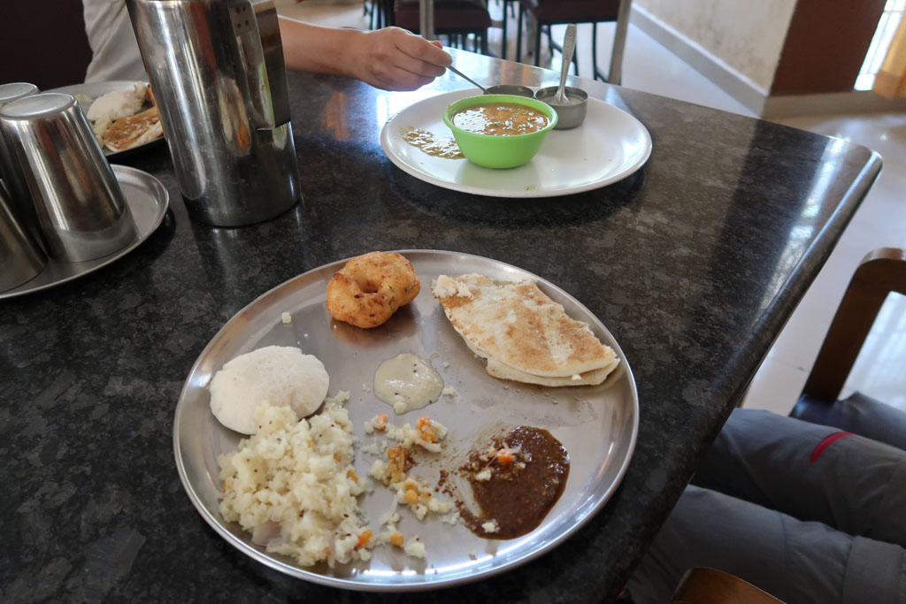
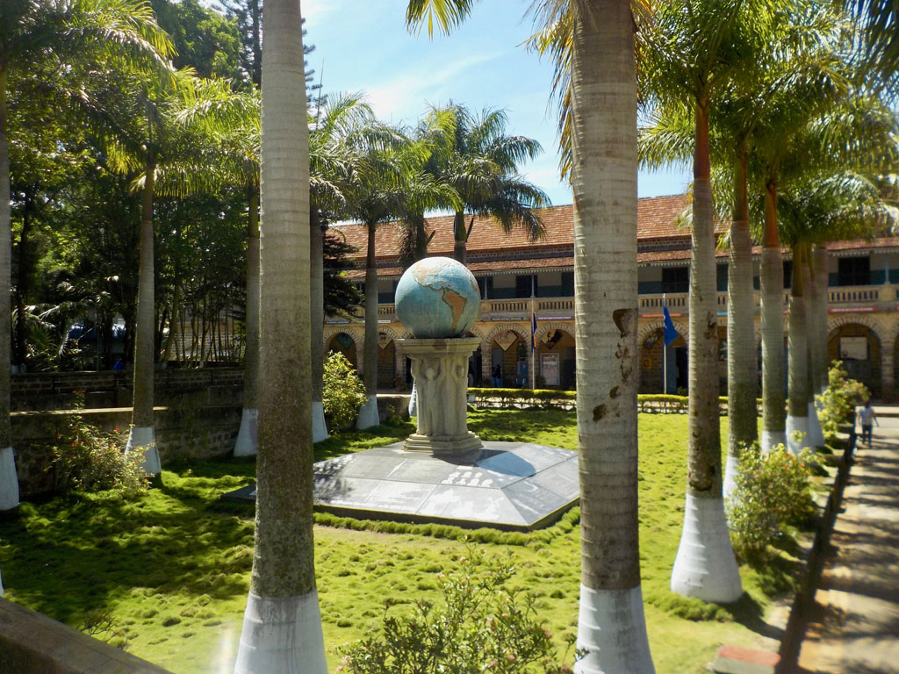
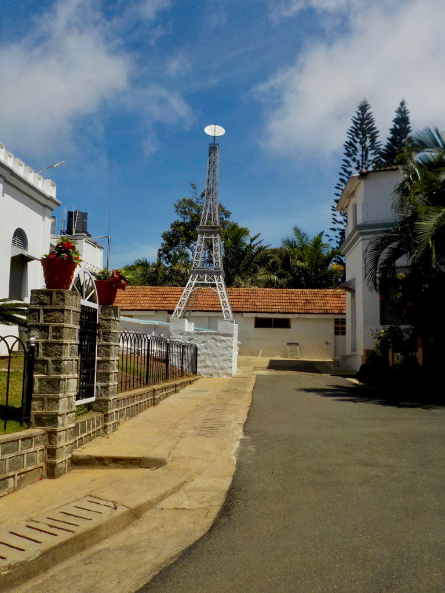
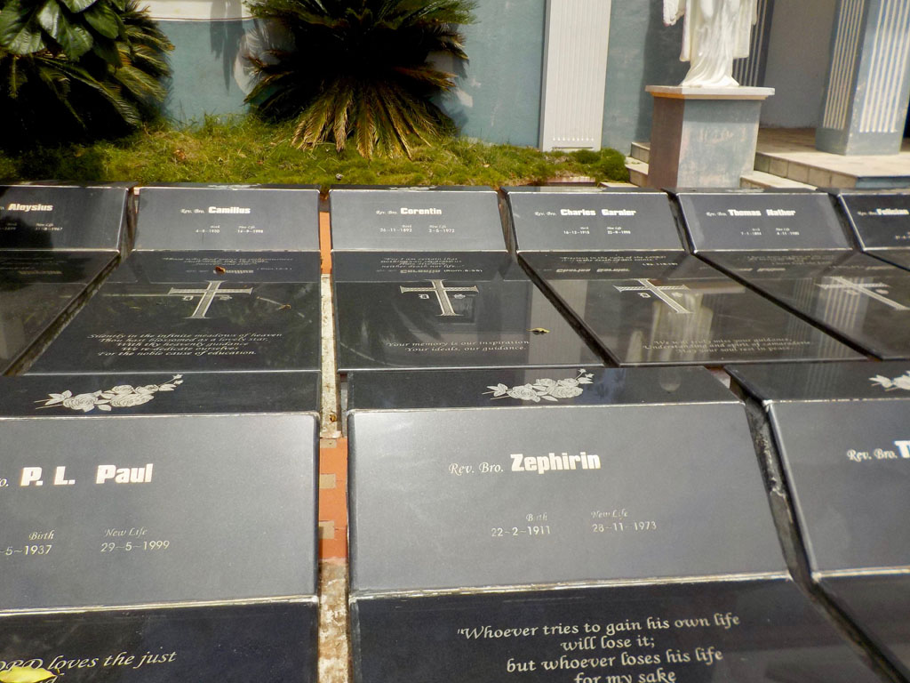
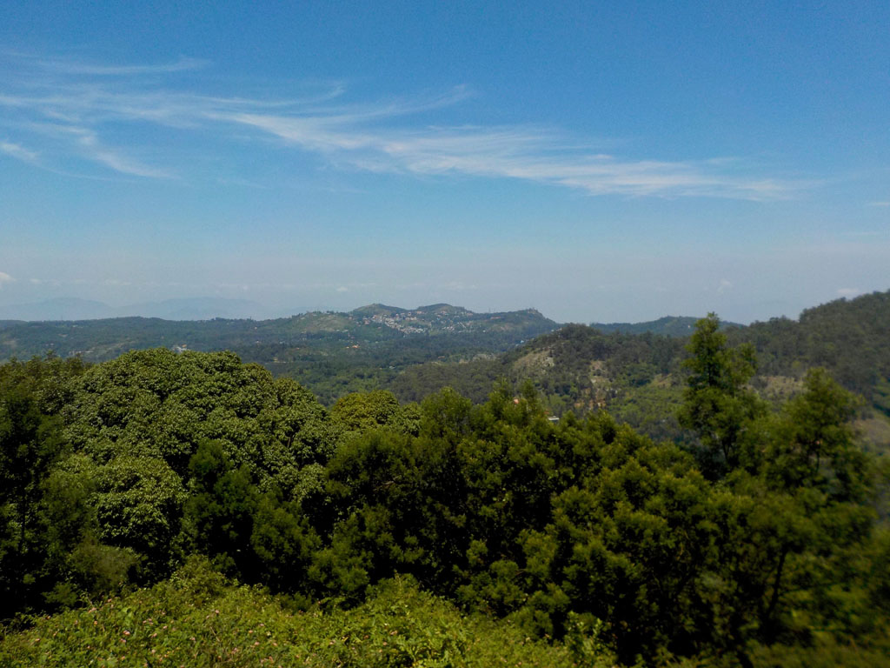
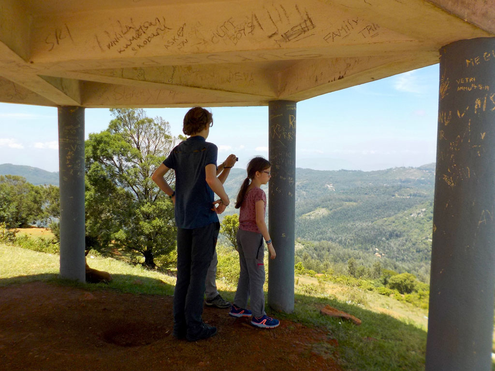
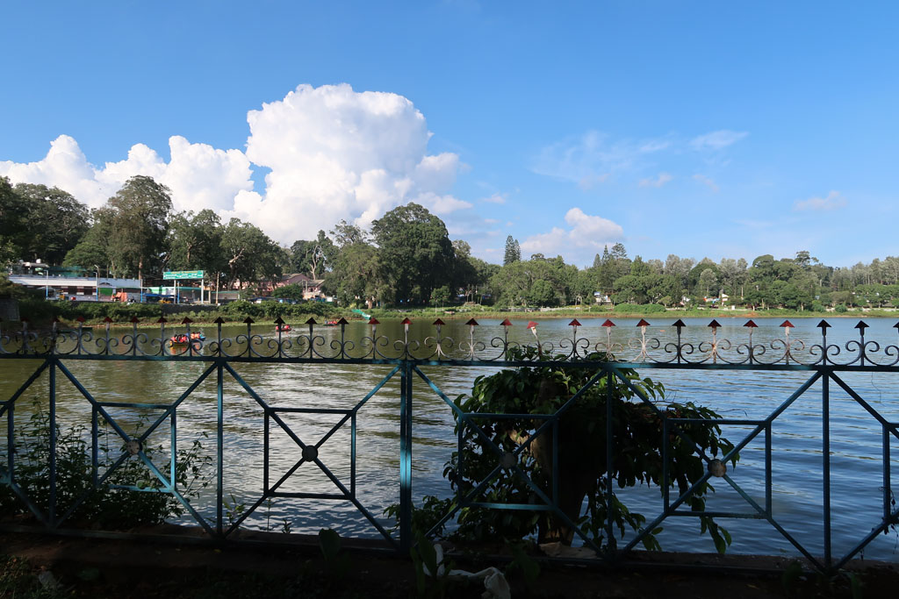
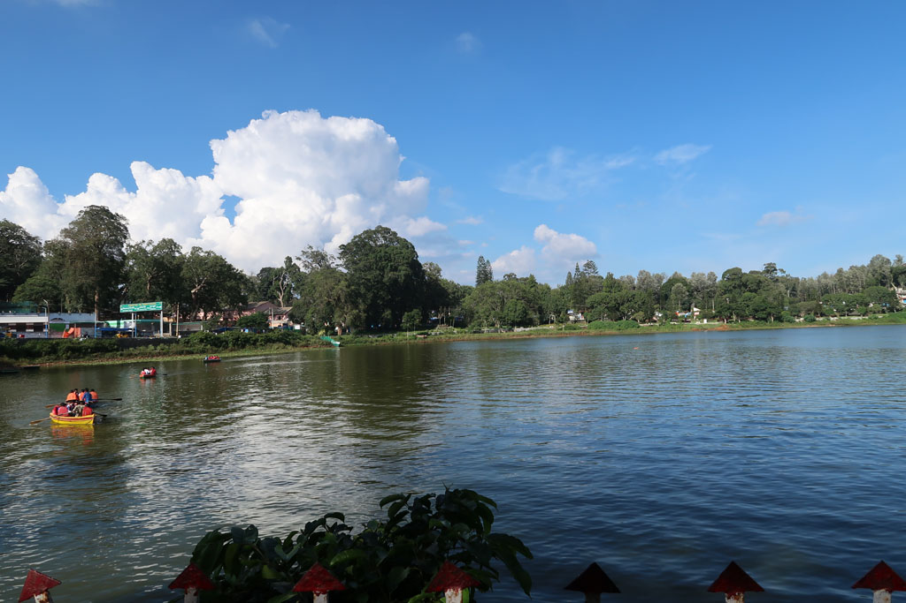
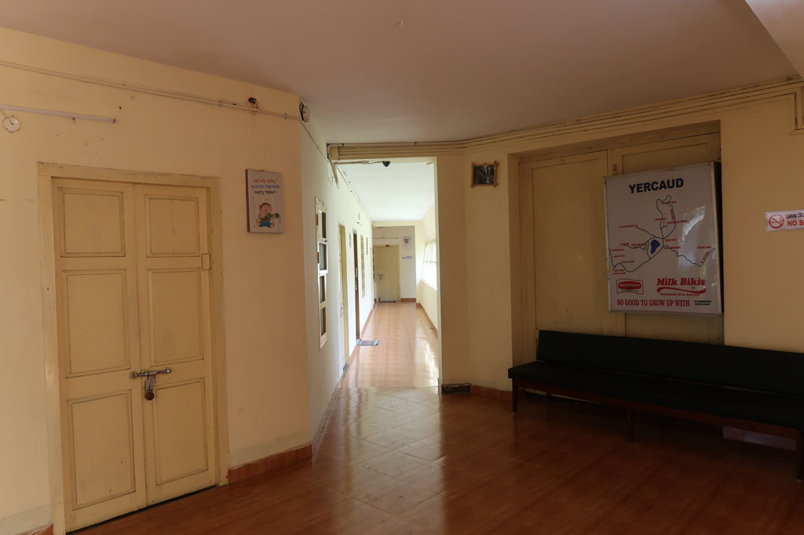

**6h30** Réveil pour moi, le ciel est bleu, je profite du petit balcon pendant que tout le monde dort encore.

**9h15** le téléphone sonne pour annoncer la fin du petit déjeuner (Nous ne savions pas qu’il y en avait un). Heureusement que nous ne sommes que 2 adultes. Dosa, Idli, semoule, beignets, pancakes, café….

**10h00** Nous partons à pieds dans la vallée, en direction le la villa “Montford Brothers”

> *Mais que faisons nous là ? C’est en faisant quelques recherches avant de partir sur des souvenirs de Papa à propos de son oncle, frère aux Indes non loin de Madras. En farfouillant sur le net j’ai retrouvé son appartenance à l’ordre : **The Montfort Brothers of St. Gabriel.** La principale congrégation indienne de cet ordre se trouve être à Yercaud, ainsi que la maison de retraite des frères.*

Nous rencontrons un gardien à l’entrée qui com- mence à nous faire visiter la cour et la statue de St Gabriel. Un frère, informé de notre présence nous re- joint. Nous lui expliquons notre démarche et lui montrons la seule photo en notre possession de Yves Cossec. De la villa nous rejoignons le campus qu’il nous fait visiter.

Piscine, terrains de tennis, salles de science, etc… les lieux sont immenses. Nous terminons notre visite dans la maison des frères, invités à prendre une petite collation en compagnie des autres frères présents, thé, café, fruits frais, gâteau au chocolat préparé par le cuisinier des frères.

Le supérieur de l’ordre est en déplacement pour la journée, mais on nous invite à 13h00 prendre le repas avec les frères présents. En attendant, le gardien, le chauffeur et le 4x4 de l’ordre sont mis à notre disposition pour aller visiter les environs. On commence la balade par le cimetière de l’ordre sur une colline proche. Posé au milieu des plantations de café et des terrains qui appartiennent à l’ordre (il apparait bien vite que Yercaud et ses environs sont tous dépendants des frères).

Après le cimetière nous allons visiter les endroits touristiques de Yercaud. Ce sont majoritairement des points de vue sur les différentes collines qui cernent la ville. On nous ramène à la villa pour rencontrer un vieux frère, qui à connu frère Zéphirin. Mais il se rappelle plus de frère Othon qui lui à succédé à la tête de l’ordre ici à Yercaud. Frère Othon est le copain de classe de Zéphirin, ils sont partis ensemble de Trémeoc. Nous rejoignons ensuite la maison des frères pour manger avec ceux présents, dont un qui parle très bien français, pour l’avoir appris à Loctudy. Le cuisinier s’est démené pour satisfaire les goûts de tous : frites, pilons de poulet, bœuf mariné pimenté, bryani, riz, salade aigre douce, raita, épinars, gombos vapeur,/grillés, papayes, bananes, gâteaux…..

**14h30** Les frères enseignants retrouvent leur classe, nous voulons quant à nous rentrer à pieds pour profiter des abords du campus et de la ville mais c’est hors de question pour les frères. Le chauffeur nous ramène donc en voiture à notre hôtel. Nous avons décliné, la possibilité de dormir sur place, de nous ramener à Salem dans les jours prochains, de revenir manger le soir même ou le lendemain pour rencontrer l’intégralité des frères. Mais nos vacances ne sont pas extensibles…

**16h00** pour terminer cette journée bien remplie, on part faire une petite balade sur l’île/parc de loisir situé sur le lac avant de prendre un petit café à la «boat house» toute proche.

Retour à l’hôtel, prendre une douche et boucler les sacs en prévision du départ prévu pour Maduraï à 7h00 demain avec le bus qui passe devant notre hôtel.

**19h15** Une fois les sacs bouclés, nous allons au restaurant de l’hôtel. fried rice vegetables, chapatis, vegetables curry, coffees