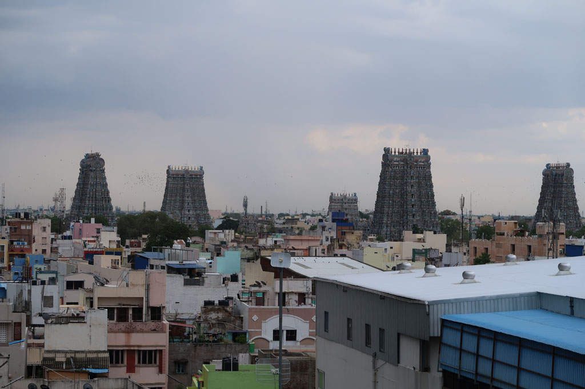
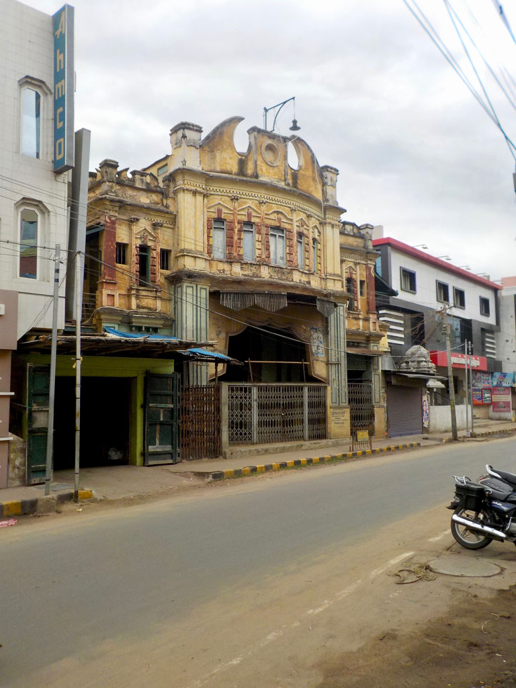
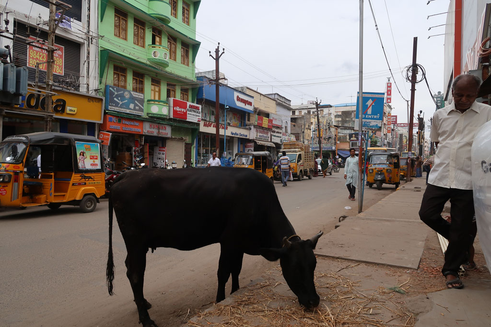

6h00 Réveil, les sacs sont bouclés depuis la veille.

6h40 départ en passant par la réception signer le registre.

7h05 le bus nous prend sur le coté de la route, c’est parti pour la longue succession de virages. Le bus prend de temps en temps des sportifs marcheurs/coureurs qui redescendent à leur point de départ.

8h15 Arrivée à **Salem**, le temps d’acheter quelques friandises à un kiosque nous voilà dans un bus pour **Maduraï**. Avec un arrêt **samosas** sur le chemin.

14h30 Arrivés à Maduraï. On prend un tuk tuk pour un hôtel (super cher mais cela semble être la norme ici) Nous donnons nos affaires à la lessive.

15h30 Nous partons à pieds dans les avenues/rues/ruelles de Maduraï. Avant que l’orage ne s’abatte sur la ville nous allons boire un café sur le toit d’un hôtel profiter de la vue.

16h30 nous repartons déambuler autour du **temple**.

Après avoir fait le tour, la pluie tombe de plus en plus fort. On s’arrête prendre un café x2 (20R) sous un auvent avant de prendre un tuk tuk pour l’hôtel.

19h00 départ repas dans une grande gargote locale. garlic uttapam, fried rice + paneer, chapatis, masala dosa, café x 3

20h10 On ressort, la pluie recommence à tomber, tant pis pour la promenade digestive, nous rentrons directement à l’hôtel en achetant de l’eau.

20h30 dodo après une bonne douche.