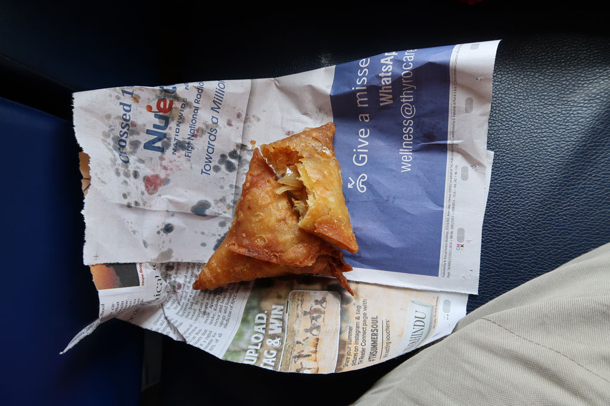
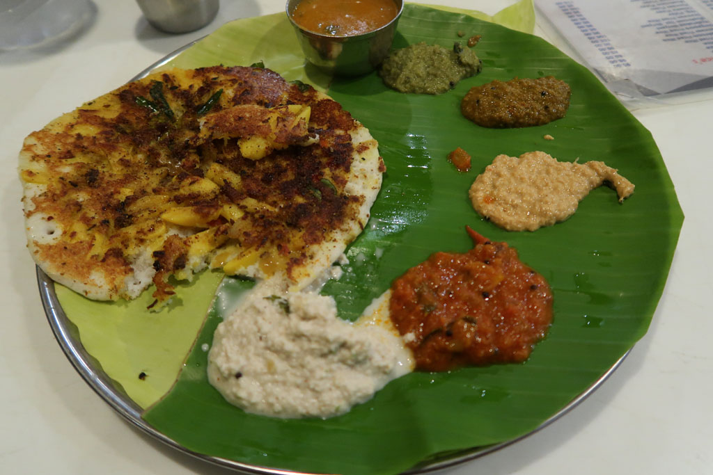

**6h30** Réveil, on fini de boucler les sacs.

**7h30** Ouverture du restaurant de l’hôtel, nous allons vie prendre notre petit déjeuner.

**8h00** Checkout. On saute dans un tuk tuk pour la gare routière.

**8h30** On n prend pas la bus indiqué, qui nous aurait fait faire un trop grand détour. 880R

**8h40** Direction **Nagercoil**, avec un petit arrêt beignets et eau. Dès que les montagnes sont dépassées, paysage change du tout au tout. De désertique il devient verdoyant. Coincé entre les montagnes et le long de la mer les éoliennes poussent comme des champignons.

**13h15** Arrivés à Nagercoil, un vieux monsieur nous indique le bus local pour **Kanyakumari** 5 min plus tard. 22R/p

**15h00** Descendus du bus sur la rue principale, nous déclinons les propositions des tuk tuks pour partir à pieds à la recherche de notre hôtel. Le premier est en travaux, l’accueil peu aimable et propose des chambres pas terribles. Le deuxième est parfait, nous négocions néanmoins le prix, qui passe de 4400R à 2500R. Du coup nous prenons 2 nuits.

**16h00** nous partons en balade, dans la partie touristique puis dans le village de pécheurs.

**17h30** retour à l’hôtel pour une bonne douche.

**19h00** A la recherche d’un ATM qui fonctionne.

**19h10** repas au Triveni, grande cantine locale. Thali, palaak paneer, parotta, roti, dhal, rice, chapati x 2, lemon juice x4. vraiment excellent.

**20h00** direction un petit papi, qui tient un stand de café/thé, pour thé et petit gâteau sur le trottoir. Nous savourons le moment sur nos petits tabourets bleus.

**20h30** mission cigarettes avant de revenir à l’hôtel pour une bonne nuit de repos.