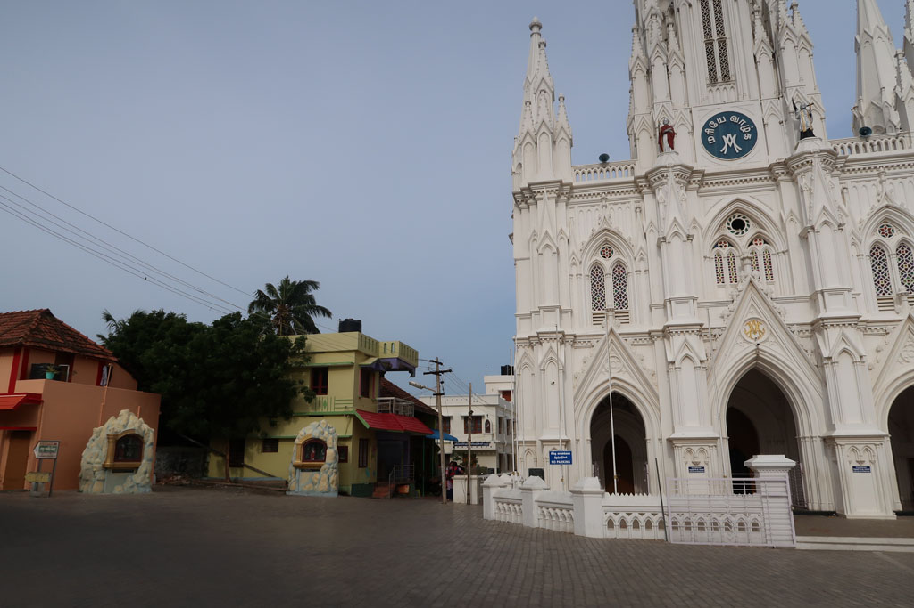
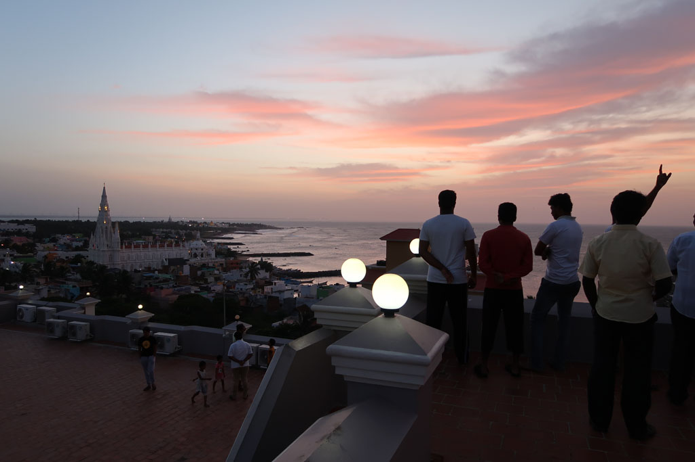
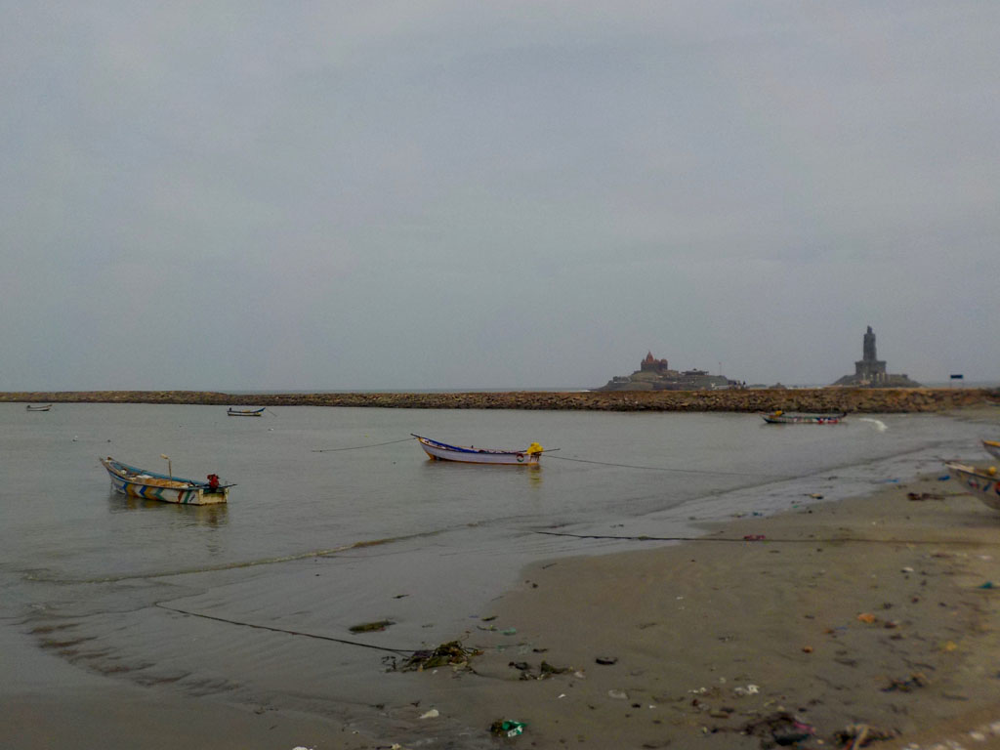
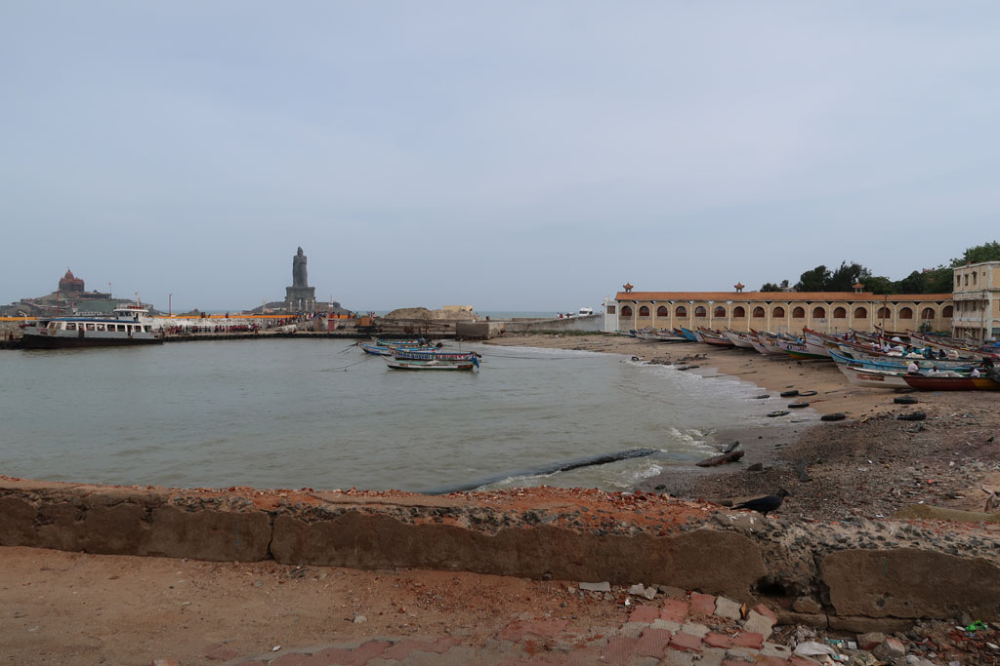
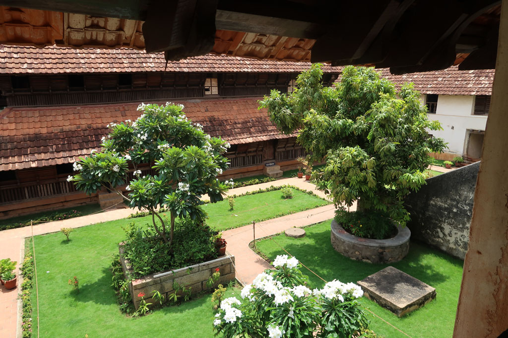
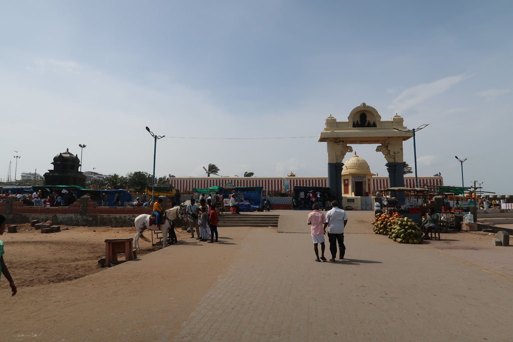
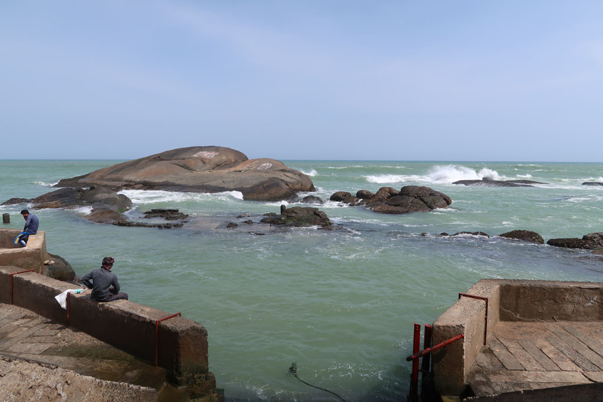

**4h00** La cathédrale diffuse de la musique par de gros haut-parleurs.

On ferme la fenêtre

**4h30** Le room service sonne à la porte pour vérifier que le ballon d’eau chaude est bien en fonctionnement. La musique dehors continue toujours.

**5h00** le téléphone sonne, c’est la réception. Réveil pour le **sunrise**. La musique + prière + sermon continue toujours.

**6h00** je monte finalement sur le toit avec les autres pensionnaires pour assister au lever de soleil. Sur tous les toits c’est la même chose. Ainsi que sur les digues et le long du port.

**6h30** retour au lit.

**7h00** douche “chaude” dehors la messe continue.

**8h30** nous allons prendre un petit café chez notre petit papi avec quelques vadas. (90R) Finalement nous ne prendrons par le ferry, pour aller visiter les temples des iles voisines (on les voit depuis la côte) compte tenu de la très très très longue file d’attente.

**9h30** On saute dans le bus 303 pour aller visiter le palace de **Padmanabhapuram**

**11h00** arrivée à la gare routière de **Thuckalay**, deux samosas bien épicés plus tard nous prenons un tuk tuk pour rejoindre le palais.

**11h20** une fois déchaussés nous visitons ce superbe palais en bois. Le guichetier, complice, nous compte E. comme un enfant. 850R pour nous 4.

**13h00** sortie du palais, après un stop boisson dans un petit stand non loin nous reprenons un tuk tuk pour la gare routière 50R.

**13h10** nous reprenons le bus du matin dans l’autre sens.

**15h00** On déambule au milieu des échoppes pour finalement trouver un saree pour K.

**16h00** Il y a toujours une foule immense pour le bateau. Nous ne nous voyons pas attendre sous le soleil, du coup nous rentrons à l’hôtel où nous nous faisons livrer 4 cafés. Douche et repos pour tous après cette journée bien poussiéreuse.

**18h00** on ressort à la recherche de notre repas du soir après un passage par le Gat asséché, transformé en terrain de cricket par les enfants du quartier. On change de restaurant ce soir, on teste le Saravannah, pas mauvais mais plutôt cher et avec de petites portions.

**19h30** nous terminons chez notre petit papi après avoir fait notre ravitaillement en cigarettes et bananes séchées. Moment selfy avec les autres clients.

**20h30** direction l’hôtel en passant par les ruelles du village de pécheur. A la réception nous demandons à ne pas être réveillés le lendemain matin :)