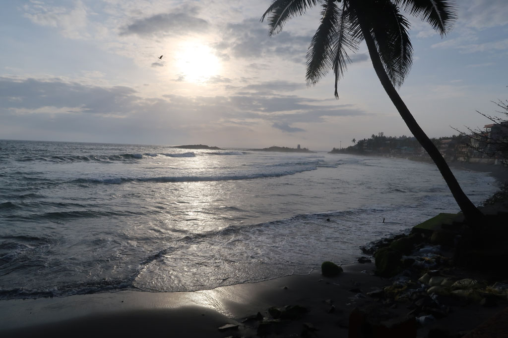

**7h00** réveil et bouclage des sacs.

**8h00** checkout et direction le bord de la route pour prendre le bus de Nagercoil.

Arrivés à **Nagercoil**, le chef de gare nous aiguille vers le mauvais bus. Nous devrons descendre au bout de 600m et revenir à pieds à la gare routière. Deux chauffeurs nous indiquent le bus à prendre pour rejoindre la bonne gare routière de Nagercoil, car il y en a deux. Nous prenons ensuite le bon bus pour **Trivandrum**.

A la descente notre indifférence fait baisser les prix des tuk tuks. Nous en prenons finalement un pour **Kovalam** à 200R.

Descendus du tuk tuk le frère du patron du Wilson nous aborde. On nous propose un grande chambre avec piscine pour 1200R. Nous allons voir. Cela n’est pas terrible. Un coup de fil plus tard, la très belle chambre avec cuisine du lieu se libère pour le même prix.

**13h00** les formalités remplies nous partons sur le front de mer, déception en cette saison la plage est inaccessible car la mer trop proche. Le coté station balnéaire décatie et abandonnée est rigolo. On achète des tongs pour K. et on grignote au Leo omelette oignions, omelette oignions pommes de terre, fried rice, soda, lemon soda, lemon juice, pepsi, cafés x2 pour 600R

**14h00** retour à l’hôtel, K et E se changent et direction la piscine.

**18h00** nous ressortons arpenter le front de mer et les ruelles cachées.C’est le désert, les touristes be sont pas là ce n’est pas la bonne saison nous devons être au maximum une dizaine à loger sur place. Les restaurants se battent pour attirer le client. Nous commençons par une petite bière face au soleil couchant.

**19h00** Ce soir nous testons le Kingfisher restaurant.

**20h30** de retour à l’hôtel, c’est l’heure du carnet et des comptes avant de passer une bonne nuit.