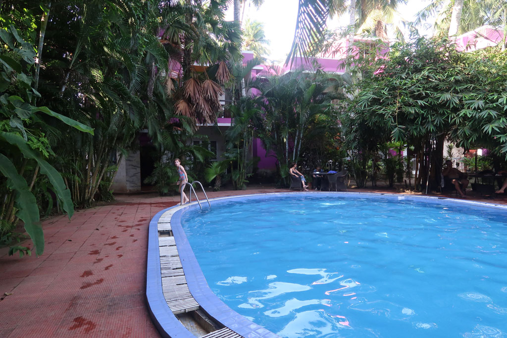

Nuit infernale, les moustiques indiens sont résistants à l’Insecte écran, formule tropicale… Je passe une partie de la nuit dehors à coté de la piscine, c’est plus supportable. Et dès que le soleil se lève je pars en promenade.

**8h30** je reviens, tout le monde est levé, on part en balade pour finir dans un petit restaurant prendre notre petit déjeuner. Purri + curry, tartines beurre confiture, cafés.

**10h00** le phare ouvre ses portes, nous le visitons. Très belle vue sur les environs.

**11h30** nous allons visiter le conservatoire de poissons du coin.

**12h00** de retour à l’hôtel après un passage café.

Après midi piscine.

**18h00** nous retrouvons des amis pour boire une bière et aller manger. C’est un couple de français croisés deux ans auparavant au Vietnam à Dalat avec qui nous avons gardé contact.

**22h00** dodo après nous être équipés de produit anti moustique local, bien plus efficace (Odomos)