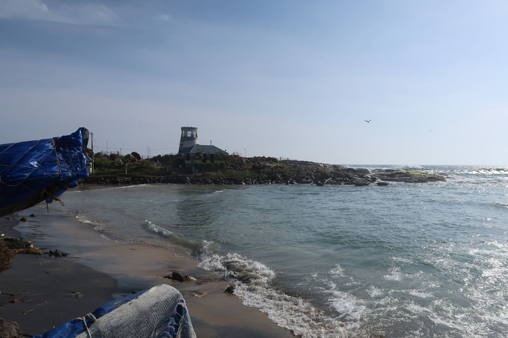

**7h00** réveil au son du haut parleur. C’est la cérémonie de pleine lune à la mémoire des parents décédés. Cela durera jusqu’à 11h00 sur les 2 plages de la ville.

**9h00** nous allons prendre un petit déjeuner chez un papi, il finira par nous demander d’écrire nous même la note.

**10h00** Piscine

**12h00** Omelette en terrasse

**13h00** Piscine / sieste / repos. Un groupe d’indiens vient se faire une séance photo au bord de la **piscine**. Certains ne savant pas nager. Moment sympa.

**18H00** nous retrouvons nos amis pour assister au coucher de soleil avec une bonne bière.

**21h30** restaurant

**23h00** sacs bouclés.

