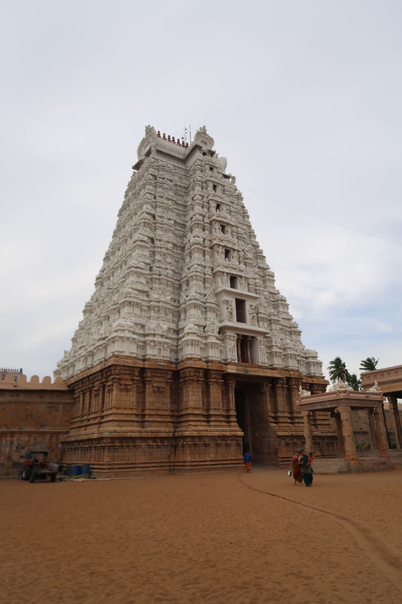
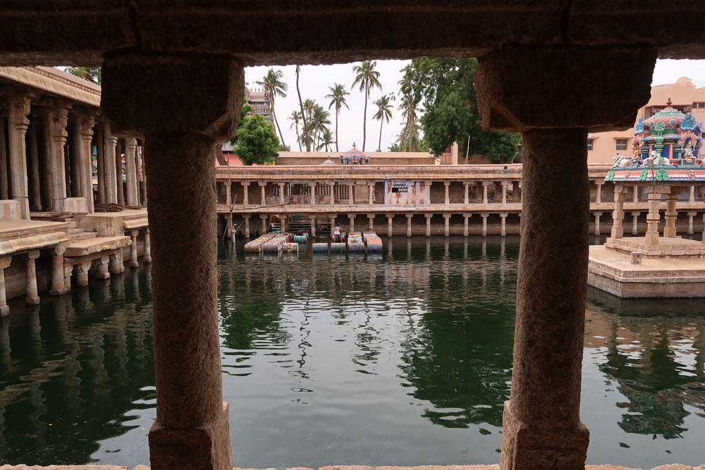

**6h20** Réveil

**7h00** On quitte l’hôtel en uk tuk pour la gare routière de Trivandrum

**8h00** Bus pour **Nagercoil**.

**10h15** Arrivée à Nagercoil

**10h40** Bus pour **Madurai**

**15h30** Arrivés à Madurai, coup de bol, c’est le bus dans lequel nous sommes qui continue vers Trichy.

**15h40** départ pour **Trichy**

**18H30** Arrivés à la gare de **Tiruchirappalli** alias **Trichy**, nous partons à pieds à la recherche de notre hôtel.

**19h00** Nous posons les sacs dans la chambre et on ressort chercher à manger.

**19h30** dans cette cantine nous sommes l’attraction pour tout le staff. Nouilles sautées, masala dosa du Chettinad, onion utapam, cheese naan, lemon soda x2, lemon juice x3, cafés x3 468R. Nous nous régalons.

**20h45** retour à l’hôtel après un passage DAB.

**21h00** dodo pour tous.

