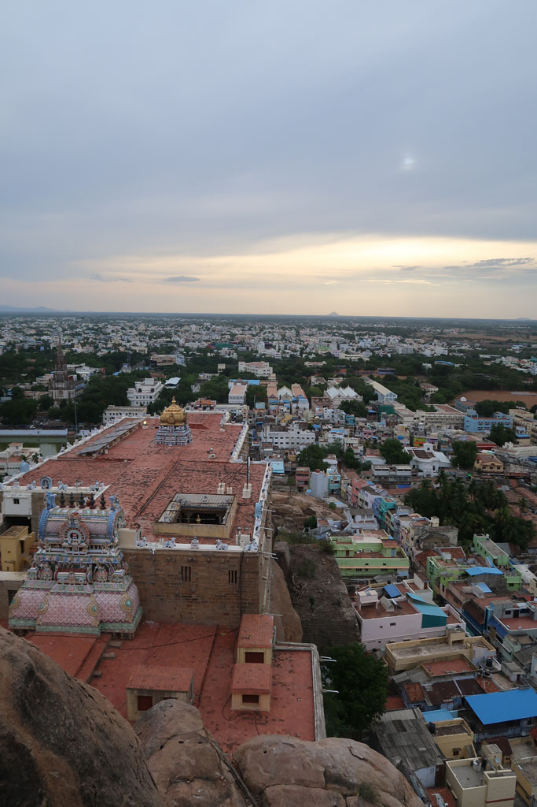
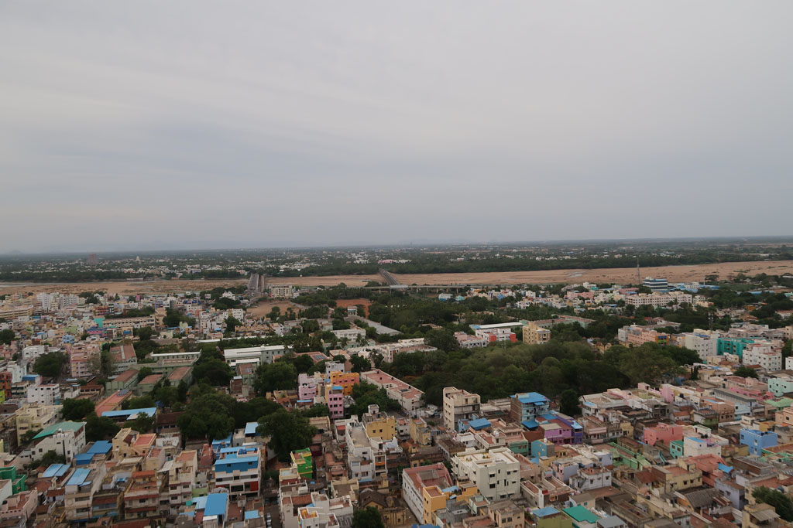
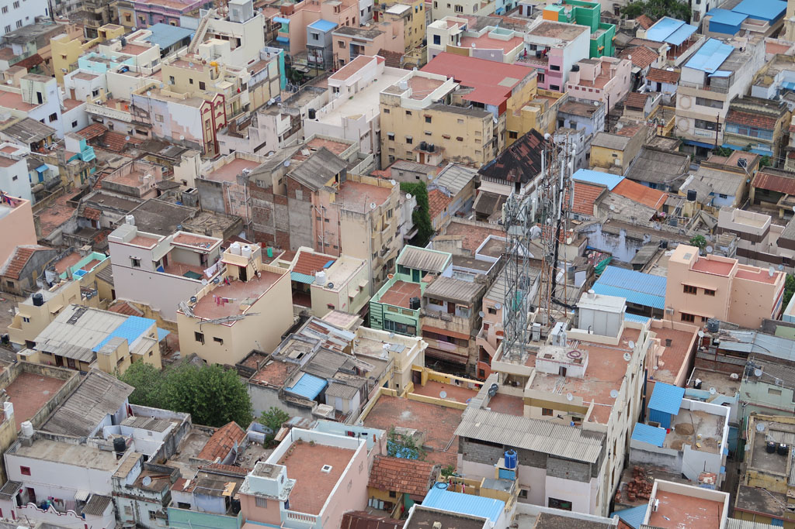
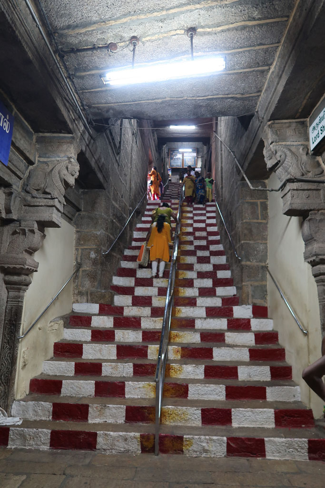
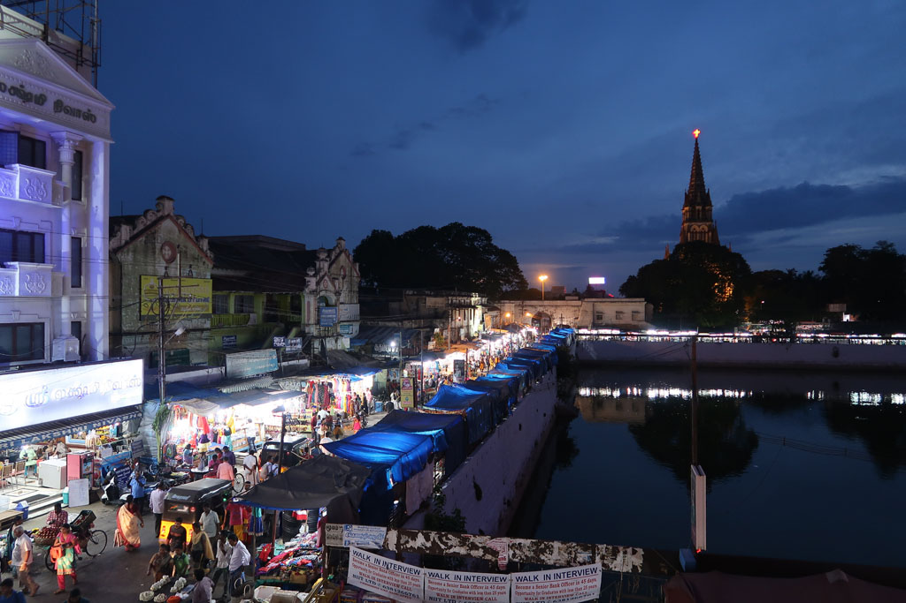
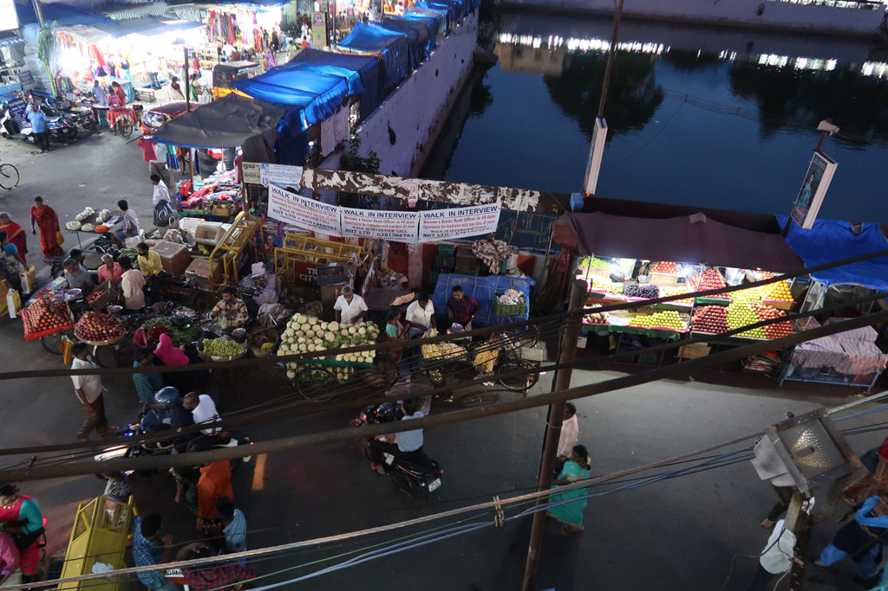

**7h00** Réveil.

**8h00** Tuk tuk pour le temple, en sortant café, gâteaux et boissons.

**10h00** Tuk Tuk pour un deuxième temple dédié à l’eau, l’entrée est noyée, le pèlerin comme le visiteur doit patauger.

**11h30** Tuk tuk de retour vers le centre ville. Mais le chauffeur n’a pas tout compris et nous dépose à la gare ferroviaire. On retourne au restaurant du soir. Dhal, Briyani, fried rice, nouilles sautées, lemon juice, x2, soda, lemon soda 325R

**12h40** Retour hôtel, repos.

**16h00** après une petite sieste nous partons à pieds en direction du musée du train (45R)

**17h00** Tuk tuk pour le **rock fort temple**

**18h00** Après cette superbe visite, nous partons en balade autour du Gat non loin. Achat de tasses à café. Nous allons manger face au réservoir. Butter naan, fried noodles, puri chola, onion dosa, ananas juice, lemon juice x3 470R

**20h00** Balade nocturne dans les rues. Dans un magasin de sport nous renouvelons notre matériel pour le Carom, avant de prendre un tuk tuk pour notre hôtel.

