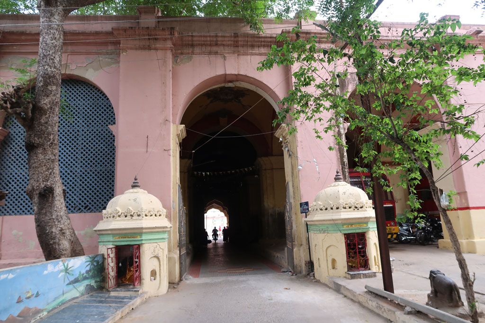

**7h00** Réveil en douceur

**8h00** On se dirige à pieds vers la gare routière. Après avoir fait le plein d’eau direction Tanjore.

**9h30** Arrivés à **Tanjore**, nous prenons un tuk tuk pour notre hôtel.

**10h00** Nous ressortons en direction de la poste. Après avoir fait longuement la queue nous de devons évidemment changer de guichet. On achète quelques Ramboutans sur la route.

Nous marchons ensuite vers la ville, c’est le jour des soldes, il y a foule.

**12h00** repas dans une cantine, non loin de la gare routière. Masala butter paneer + chapatis, rice (cajou, grenade, ananas), onion uttapam, mushroom dosa, water, juice 586 R.

**13h30** retour en tuk tuk pour une petite sieste

**15h00** tuk tuk pour le **palais**, visite de ce palais décrépi et de toutes ses annexes (payantes) L’endroit est joli on aimerait pouvoir se perdre dans les coursives et bâtiments inaccessibles. Sans compter sur la coupure de courant qui nous empêche de voir nombre de vitrines.

**17h30** on sort du **musée** / **palace** et nous partons déambuler dans les rues. café x2, jus de fruits x4

**18h30** on prend finalement un tuk tuk pour le dernier kilomètre.

**19h30** compte et journal

**20h00** direction le restaurant de l’hôtel. Veg noodles, chapatis x2, masala dosa x2 lemon juice x2, lemon soda, plain soda 380R

Retour à la chambre après avoir profité du jardin.