**5h00** réveil

**9h00** départ de l’hôtel en tuk tuk pour le **temple** de **Tanjore**

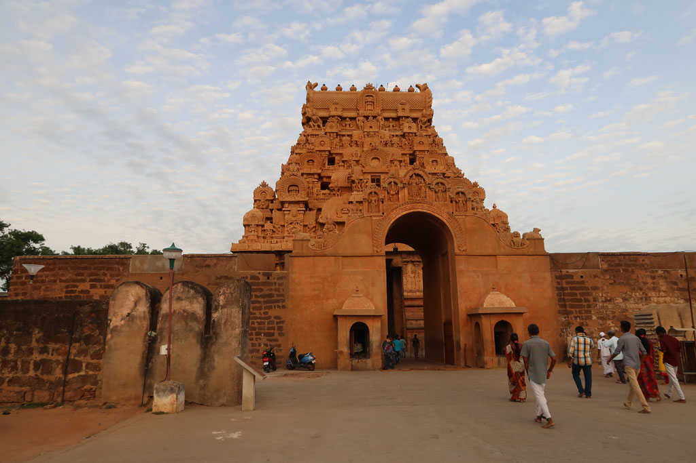

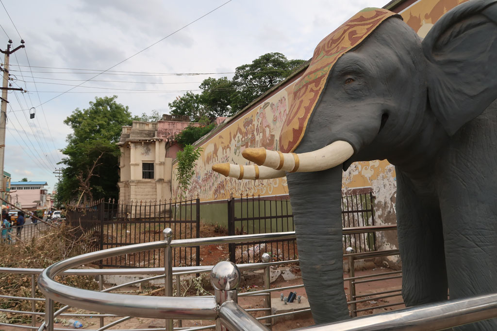
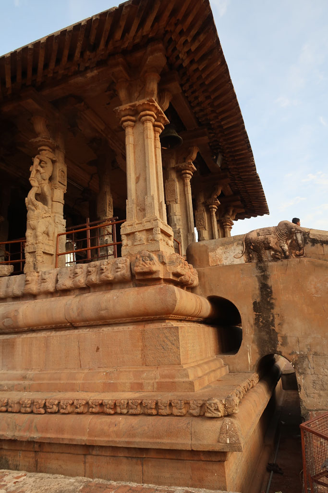
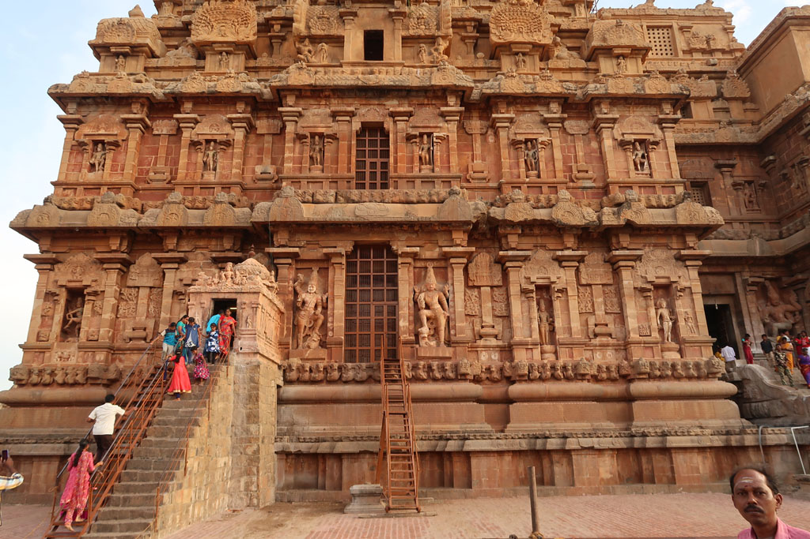
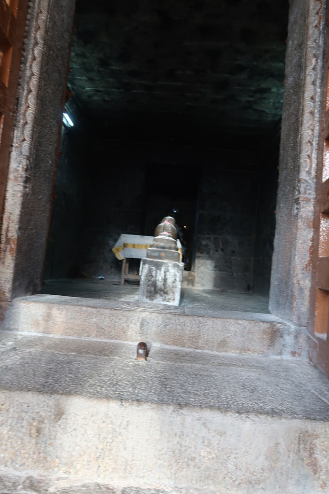
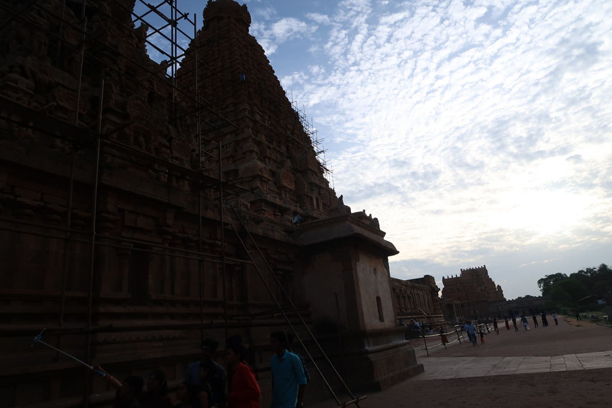
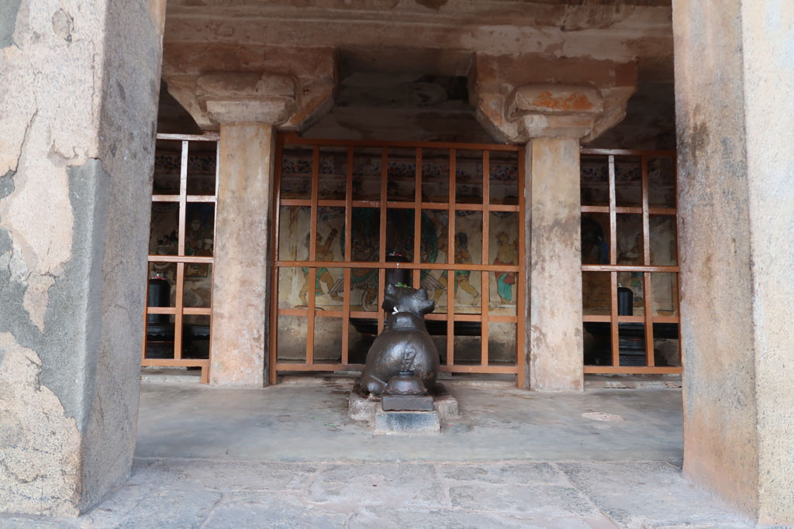
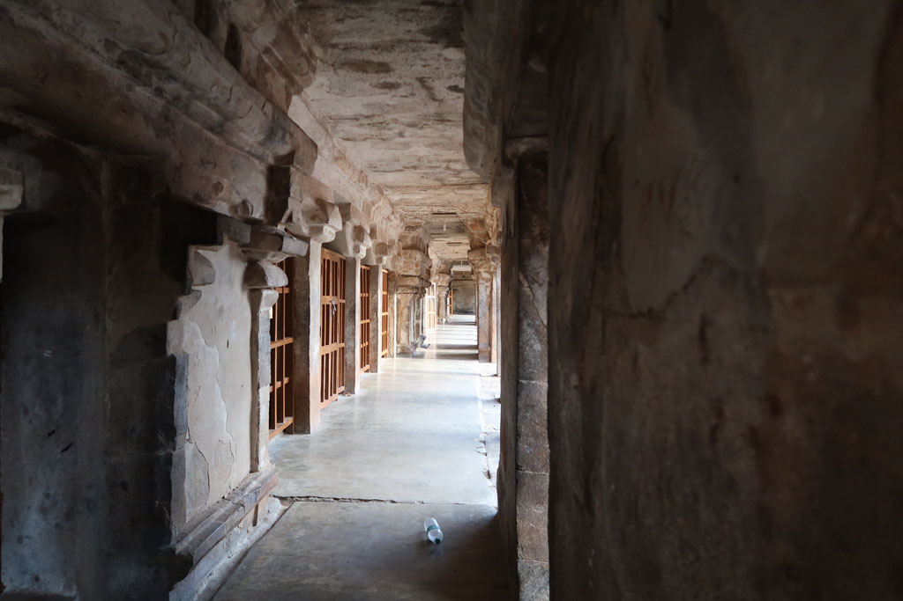

Superbe visite

**7h30** fin de la visite, on se balade autour des **remparts**.

**8h30** petit déjeuner indien x3

**9h00** départ pour la gare routière en tuk tuk, à peine arrivés on saute dans le bus en partance.

**10h30** en cours de route on s’arrête à **Kumbakonam**, tuk tuk pour rejoindre l’hôtel

**11h40** on ressort faire le tour du quartier, on croise un marché, achat de bananes, on nous donne ensuite 2 fois plus que ce que l’on a acheté.

**12h30** grosse chaleur, retour à l’ombre.

**17h00** il est temps de ressortir, grande promenade dans les temples et rues de la ville. magnifique. Pause jus de fruits et cafés. Arrêt au bord du réservoir avec les habitants tandis que le soleil se couche.

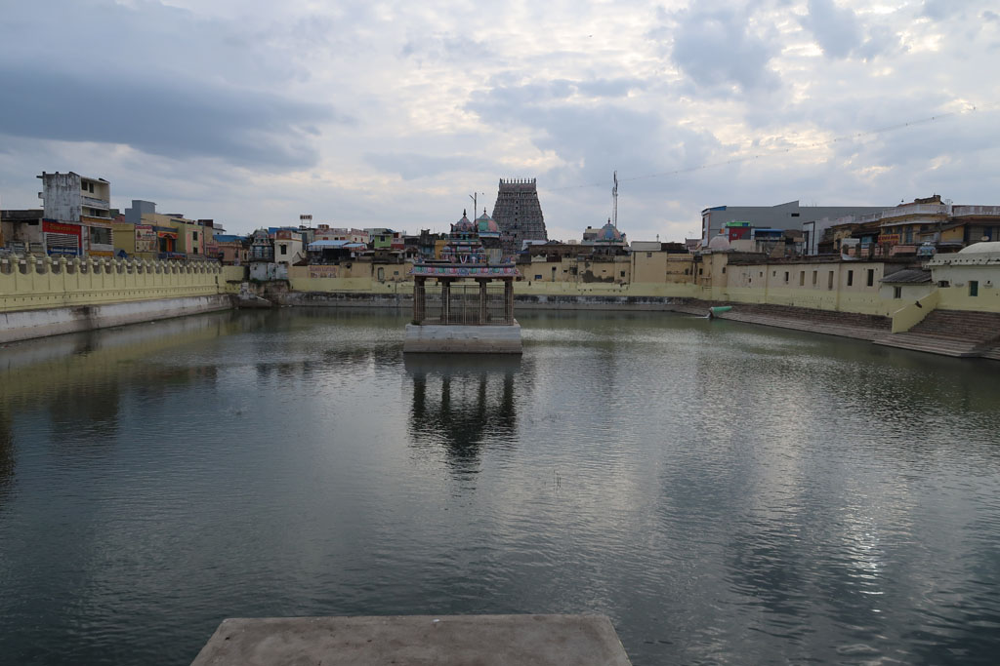
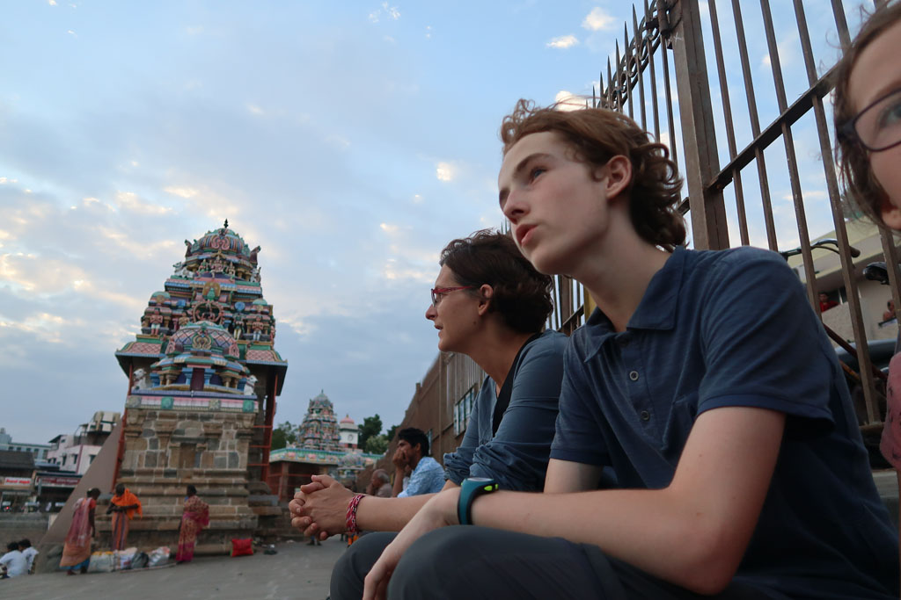
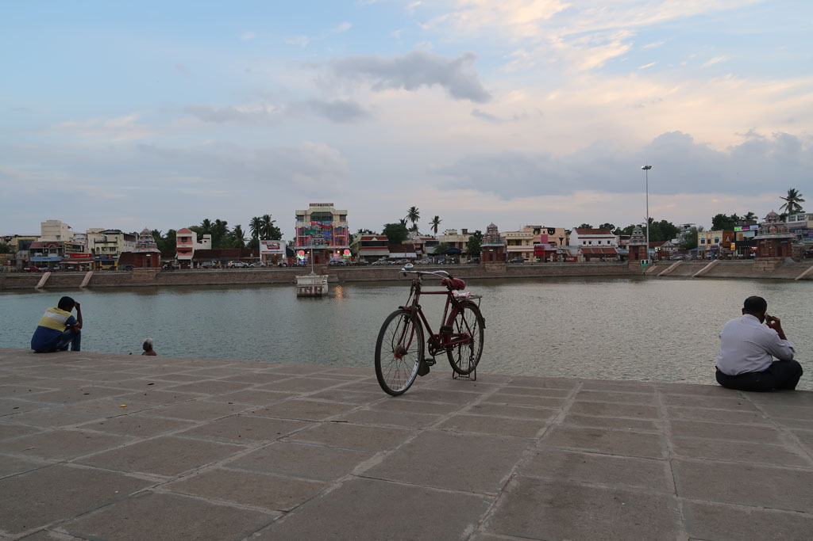
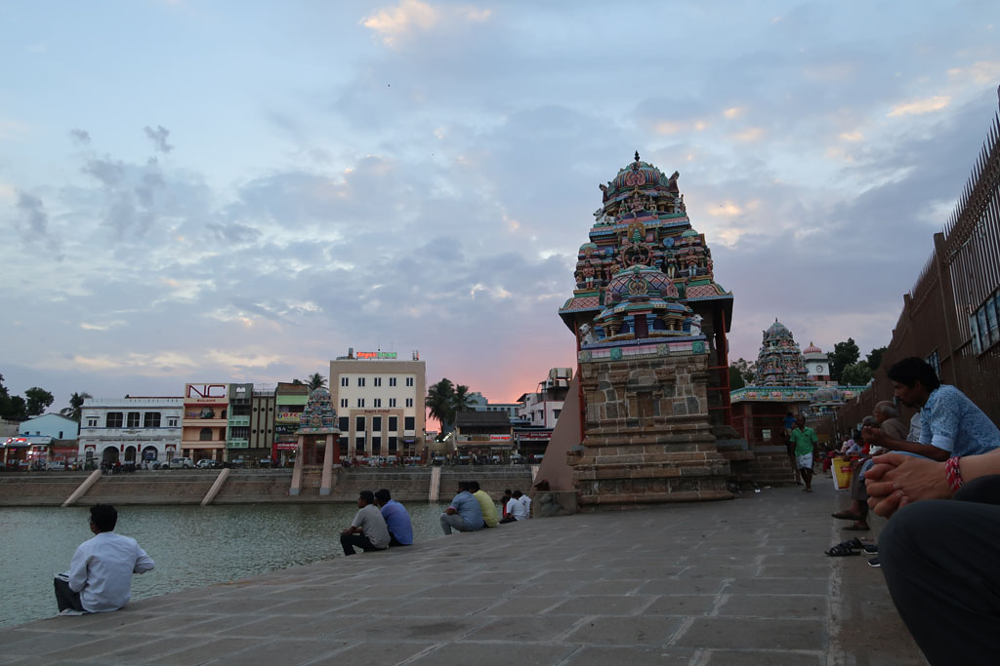

**19h00** repas dans une cantine non loin de l’hôtel, chettinad mushroom dosa, onion uttapam, chapatis, veg uttapam, onion pakoda, lemon juice x4, café x3 490R