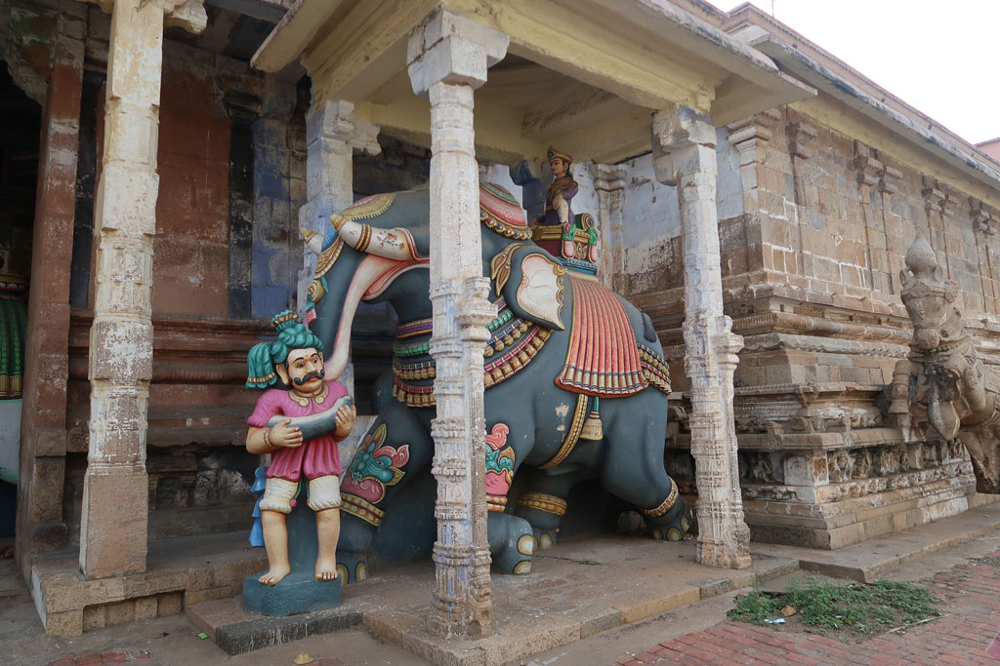
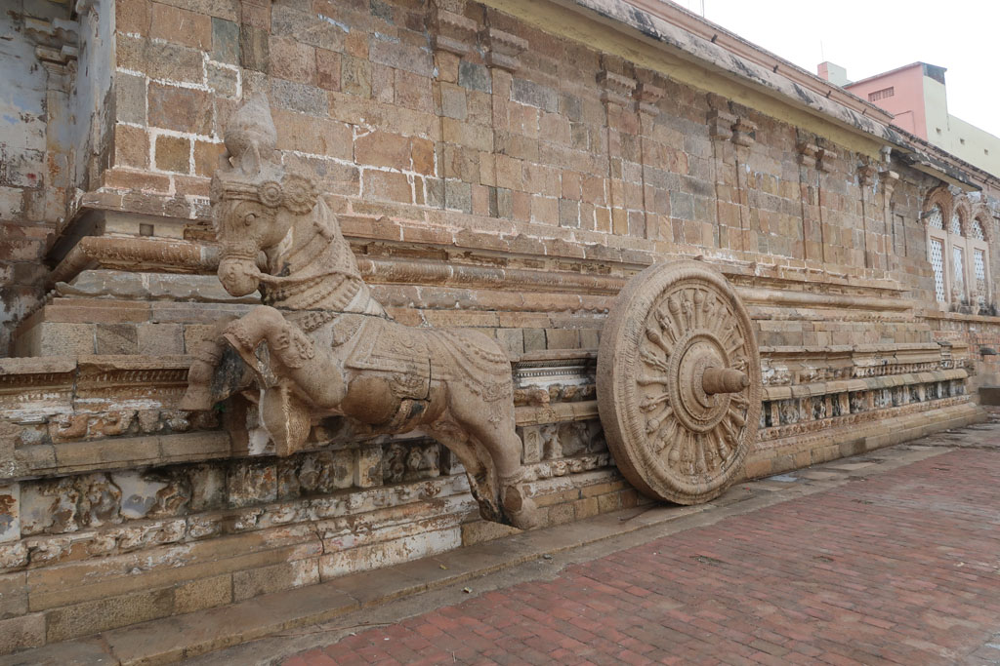
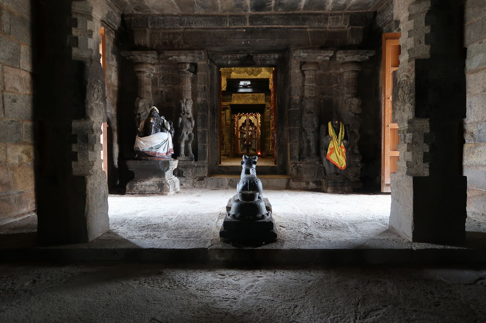
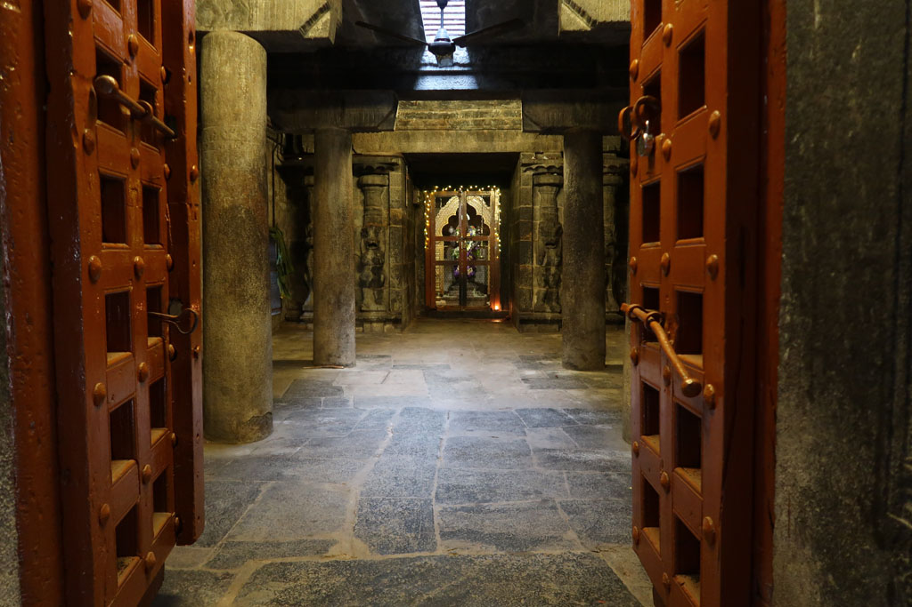

**7h00** Je descends à la lessive et je pars me promener autour du temple proche.

**7h30** réveil du reste de la troupe.

**8h00** direction la cantine du coin pour un petit déjeuner à l’indienne. Puri masala x2, café x4 200R

Après un passage par la chambre d’hôtel on négocie un tuk tuk pour aller voir un temple à l’extérieur de la ville 300R, superbe et vide.

**10h30** On part en balade dans les rues de la ville. Petits achats. IL commence à faire trop chaud pour se promener. Nous rentrons donc à notre chambre en passant par un vendeur de jus de fruits. Lemon juice, orange juice x2, grenade shake, de l’eau en bouteille. 200R

**12h00** Retour à la chambre.

**15h15** Partons en balade dans les rues de la ville, de ruelle en **temple**, en bazars, jus de fruits

**18h30** Retour hôtel. Je pars à la recherche d’un ATM qui fonctionne pendant 1h00.

**19h30** retour de lessive.

**19h45**, départ pour le restaurant, nous revenons à l’Anapurna. Mushroom dosa, fried rice, puri x2, onion chapati, lemon juice x2 420R

**21h00** bouclage des sacs