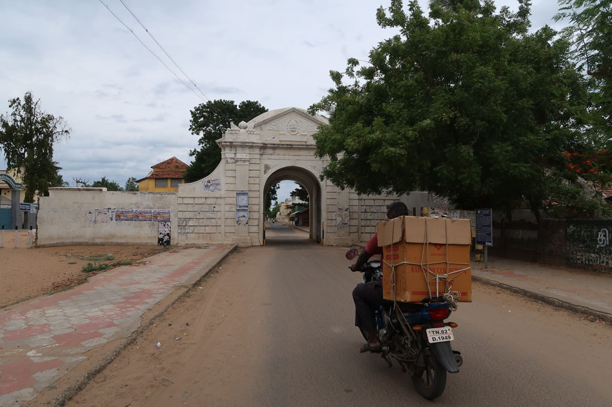
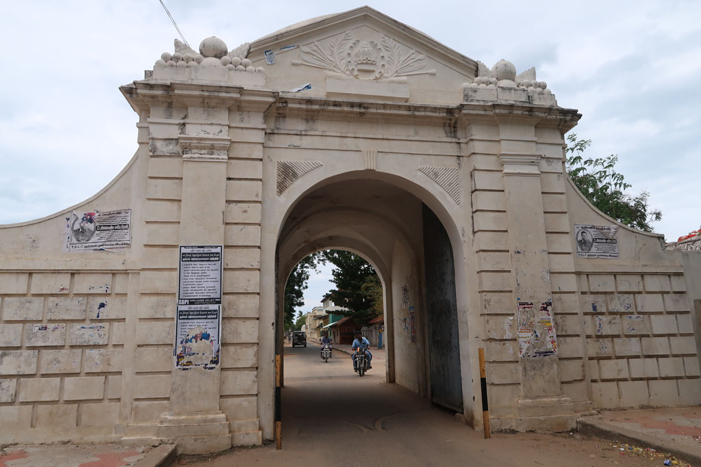
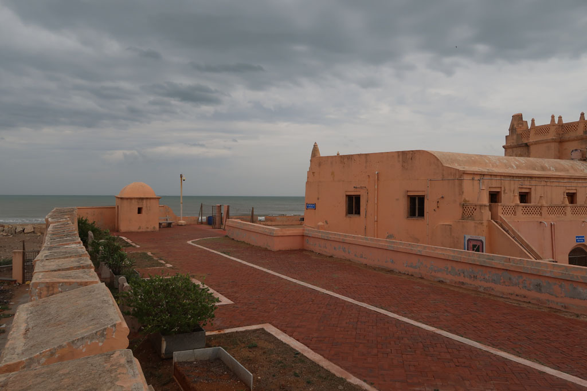
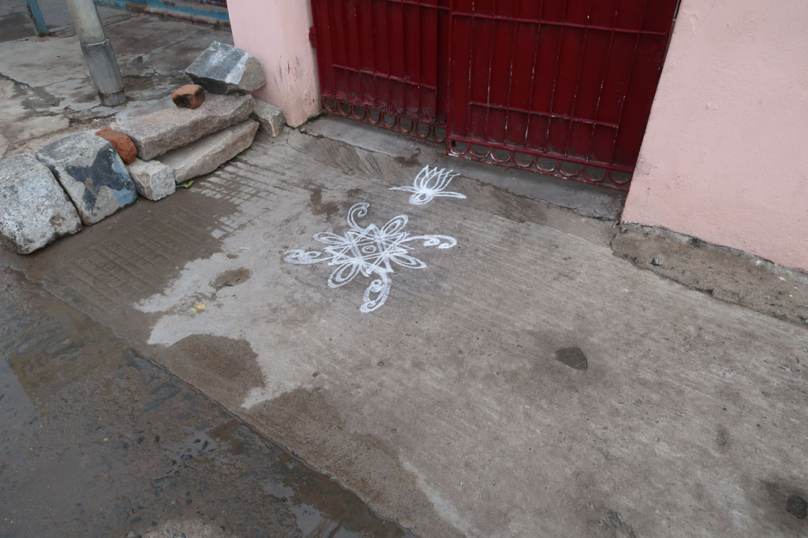
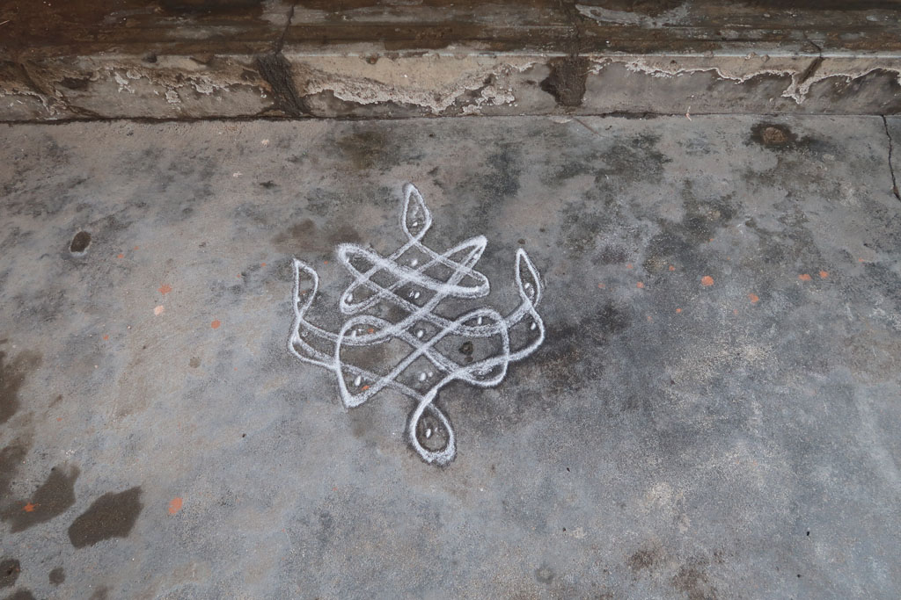

**6h30** réveil

**7h50** checkout

**8h00** tuk tuk pour la gare routière

**8h15** direction **Karikal** 40Rx4

**10h30** arrivés à **Karikal** nous attendons le bus pour **Tharangambadi** (**Tranquebar**)

**11h00** Marche à pieds pour rejoindre notre hotel situé à l’extérieur du village.

**11h30** on repart vers le village, qui se résume à quelques bouis-bouis avant l’entrée de la ville danoise fortifiée. Qui ne contient quant à elle que des écoles et vieilles maisons coloniales. Il fait très chaud. On se retrouve à l’abri du soleil sous une pergola d’un hôtel très chic. Lemon juice, plain soda, pepsi, 7 up 472R.

**13h00** retour à l’hôtel en passant par la boulangerie locale

**16h00** retour en ville, visite du fort, du musée et de la maison du gouverneur. Sur le chemin nous sommes repassés par le marchand de douceurs.

Nous nous faisons adopter par un chien galeux dont on arrive pas à se débarrasser. Arrêt boisson/selfie à un kiosque devant le fort. Bovonto, Merino, Mirinda, plain soda, water 130R

**18h00** impossible de se débarrasser du chien. On rentre dans un petit bouiboui pour manger un fried rice gargantuesque et 3 parottas, on prend aussi 2 parottas à emporter 100R le tout.

**19h00** retour hôtel en achetant de l’eau et qq gateaux. On commande un thermos de café.

**20h00** comptes et journal.