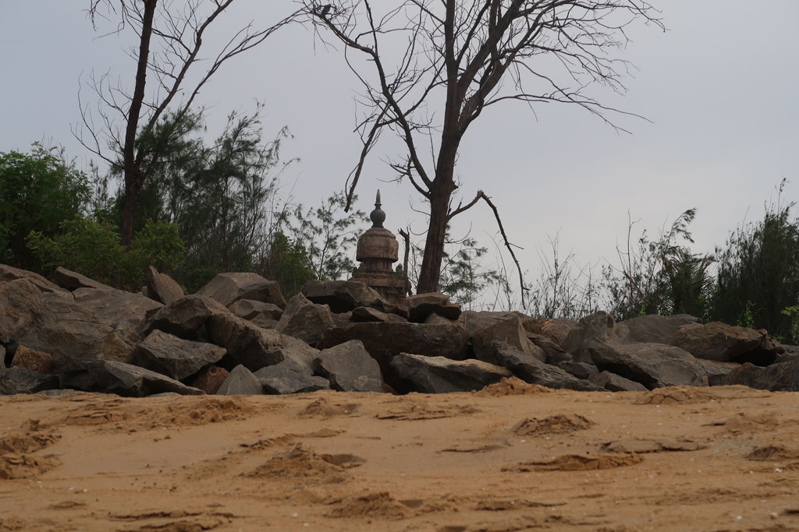
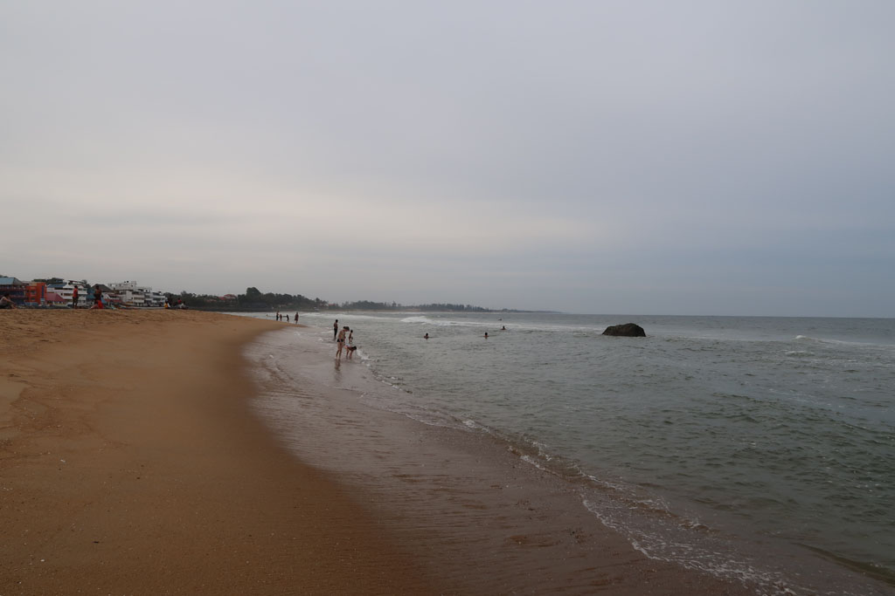

**6h30** réveil

**7h00** Checkout, on marche vers le “centre ville” pour attraper un bus de passage. Dix minutes plus tard c’est un bus VIDE qui s’arrête. Il va dans la bonne direction et ne se remplira jamais.

**9h40** Arrivée à **Chidanbaram**, où on change de bus après avoir fait le plein de samosas.

**10h00** Bus pour **Pondy**.

**11h30** Arrivés à la gare routière de Pondy on cherche notre troisième bus. On se fait embarquer dans la version luxe, mais qui ne va pas bien vite.

**14h00** Sommes enfin à **Mahabalipuram**. On prend un tuk tuk pour retourner à la guest house où nous logions il y a 3 semaines. On négocie le même prix.

**14h30** Repas au Nautilus, fried rice, veg stuffed chapati, sodas x2, coca. 430 R

**15h30** tour des boutiques pour compléter les cadeaux à ramener.

**16H00** pause à l’hôtel, comptes et journal avant de retourner à la plage.

Baignade dans une eau chargée de limon et plutôt agitée. Dangereuse. Je ne peux pas lâcher les enfants.

**17H30** Nous revenons à l’hôtel prendre une bonne douche. Nous ressortons faire un petit tour dans les boutiques de vêtements. G. se trouve un pantalon, les cols des chemises que je trouve ne me vont pas. Le bar sur la plage est fermé. On se promène dons dans les rues de la ville avant d’atterrir au milieu d’un meeting politique qui semble enflammé.

**19h30** repas au Nautilus, fried noodles, fried rice, beer, coca x2, crepesx2 800R

**21h50** dodo, ce coup ci le produit anti moustique indien fait bien son office.