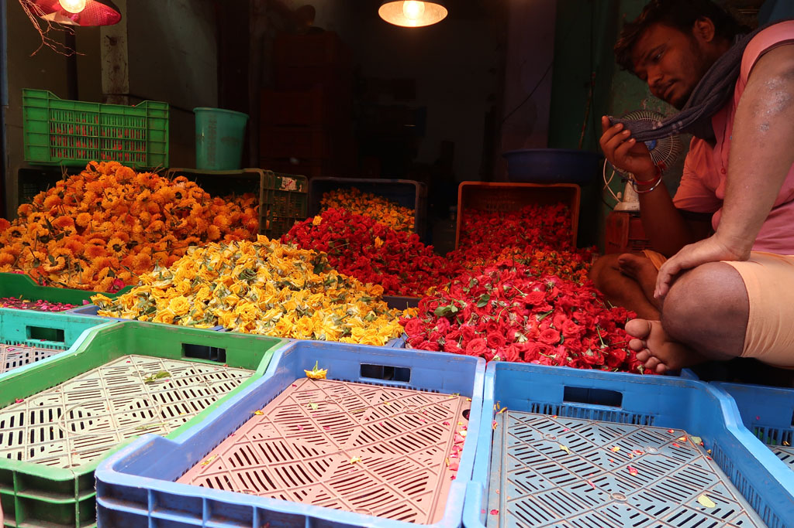
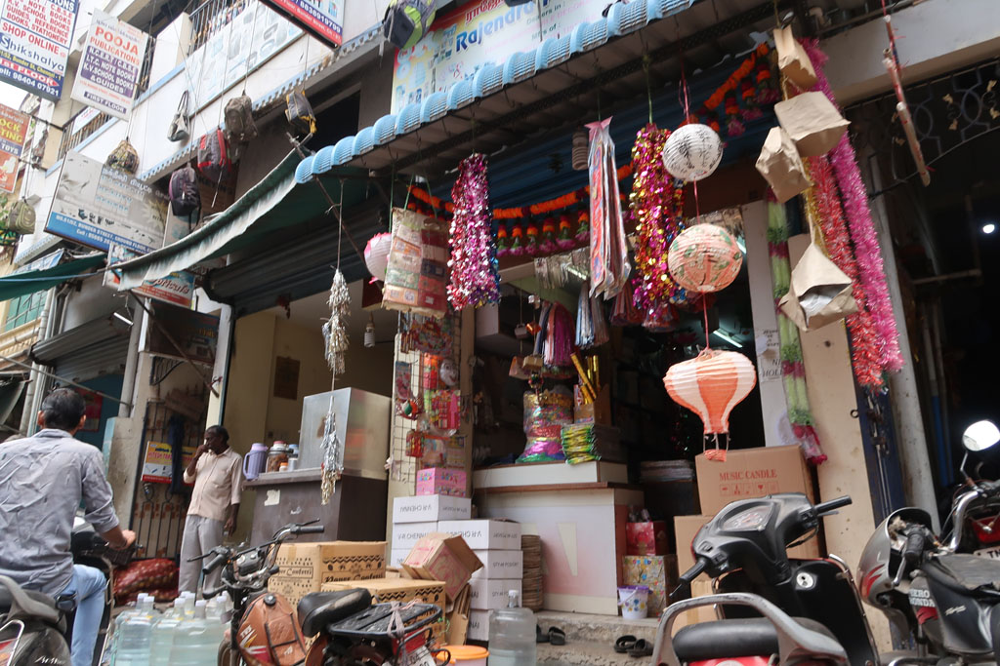

Ce matin grasse matinée.

**9h30** Balade dans les ruelles du quartier. Arrêt café dans un bouiboui. Le grand bazar n’est pas à l’endroit indiqué par les plans. Nous tombons dessus pas hasard. Et on passe notre matinée à déambuler et nous égarer dans toutes ces ruelles. Dans une boutique d’articles de sport nous augmentons notre collection de “Strickers” pour notre carrom.

**12h00** retour au woodland une autre de nos cantines, fried veg noodles, butter naan, garlic naan, masala dosa, plain soda x2, lemon soda, pepsi 364R

**13h00** retour à l’hôtel pour nous reposer de cette longue marche.

**16h00** tuk tuk pour un temple au centre de **Triplicane**. On s’aperçoit que nous avions déjà visité ce quartier lors de notre premier passage. On se dirige alors vers **Marina Beach**. On remonte la plage vers les baraques. Visite de ce marché improvisé sur la plage.

**18h00** Tuk tuk pour revenir dans notre quartier. Douches pour tous avant de ressortir manger.

… le carnet de voyage s’arrête là….  
  
mais après ce fut taxi jusqu'à l’aéroport vers 22h00