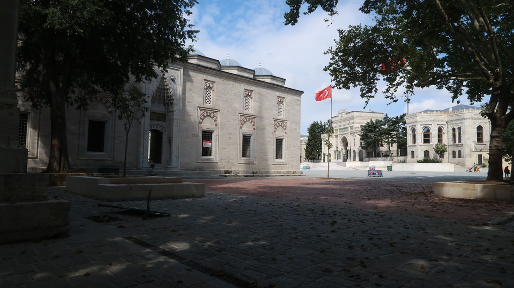
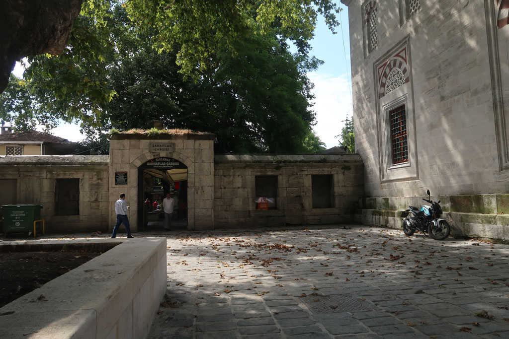
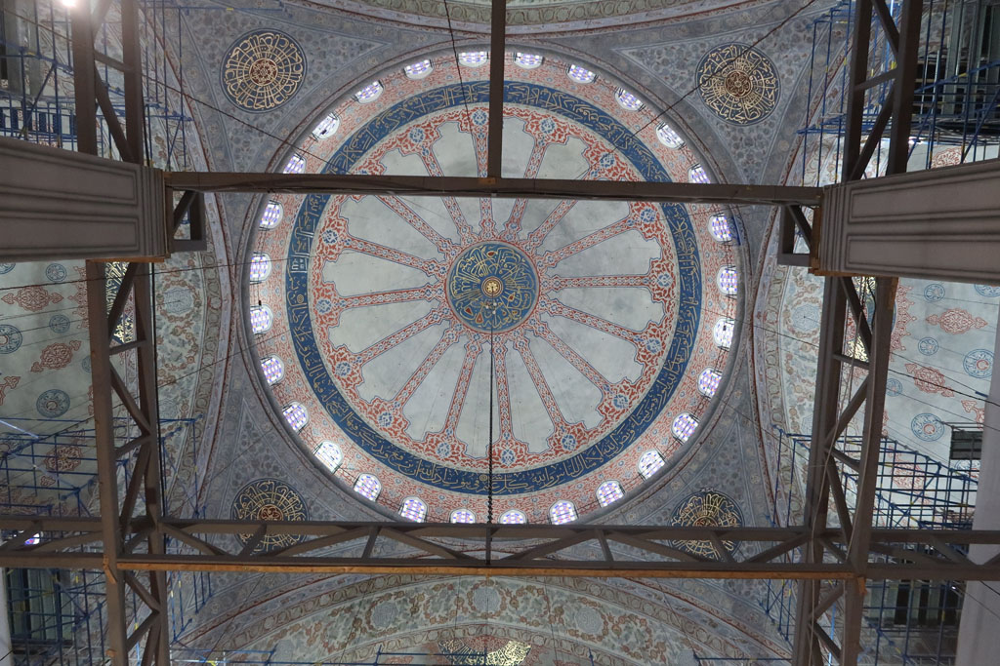
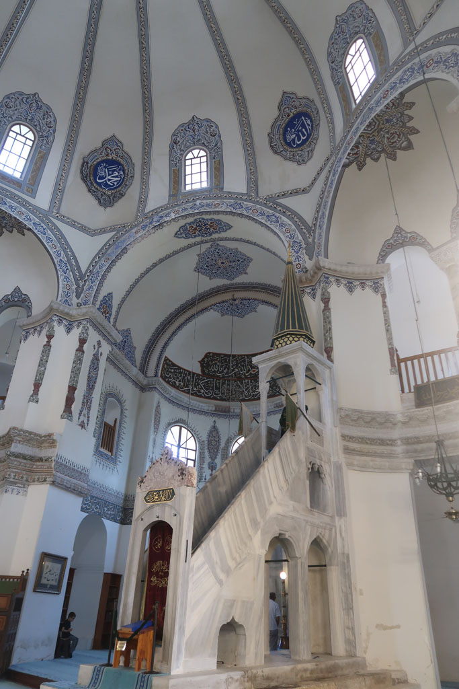
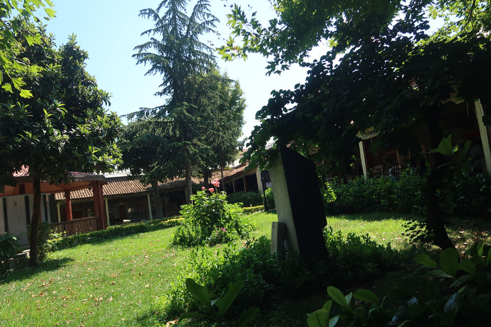
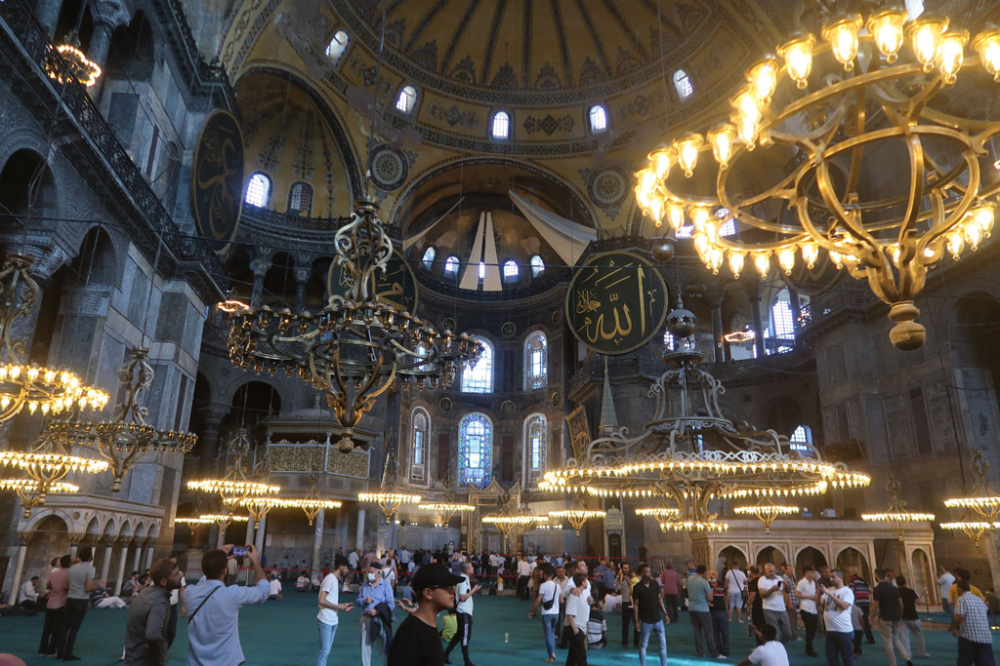

9h00 réveil, petit déjeuner sur le toit terrasse de l'hôtel.

10h00 A pieds nous parcourons les rues à partir de notre hôtel. Le grand bazar est fermé, nous nons rabattons usr celui aux livres situé non loin. Achat d'une bouteille d'eau 25 TL, d'un jus de grenade 30 TL. Visiste de la **Mosquée Bayezid II**, achat d'un petit porte monnaie (10 TL).

On se rapproche de la **Mosquée bleue** et de **St Sophie**. Mais il y a beaucoup trop de monde.

Au **Palais de Topkapi** ne sont vendus que des pass permettant de faire des visites groupées. (On renonce, nous verrons à notre prochaine passage sur **Istanbul** )

12h30 Arrêt dans une lokantasi (cantine)

13h30 Retour à Topkapi, mais les prix sont trop chers pour nous (320TL / personne)

14h00 Nous faisons la queue pour la **Mosquée bleue,** la visite sera un peu décevante à cause d'un échafaudage qui nous empêche de voir le plafond.

14h45 Visite du **Musée** des mosaïques (60 TL x 4 ). *Nous notons que tous les prix augmentent , des autocollants sont ajoutés sur les billets (24 TL -> 60 TL)*

15h00 découvrons **la petite sainte Sophie**, magnifique mosquée. Nous prenons des çays dans les jardins situés en face. Sortis des zones touristiques nous apprécions vraiment cet endroit (4 çays 15TL)

Nous tentons ensuite la **Cistern of Theodosius**, mais les prix sont trop chers pour nous maintenant (650 TL)

On se décide à faire la très longue queue pour **Sainte Sophie** (mais cela avance vite), ambiance bon enfant dans la file. La visite sera rapide, c'est très beau, mais il est impossible de se poser dans un coin, compte tenu du monde.

On revient ensuite dans le quartier de l'hôtel, sur la route les enfants achètent quelques pierres et une bague.

18h30 4 çays sur la petite place non loin

19h00 Direction la lokantasi repérée la veille (*Steppes Konya Mevlana Steak Houses, Hoca Gıyasettin, Hacı Kadın Cd. No:57, 34134 Fatih/İstanbul, Turquie*). Il n'y a pas un touriste dans le coin , on se régale.

20h30 On retourne chez notre vendeur de pâtisseries, on en teste de nouvelles. (55 TL). On achete une barquette de pastèque chez un vendeur à la sauvette.

21h00 retour sur la petite place préparer la suite du voyage en sirotant 5 çays (35TL)

21h30 retour hôtel après cette longue journée de marche/visite.