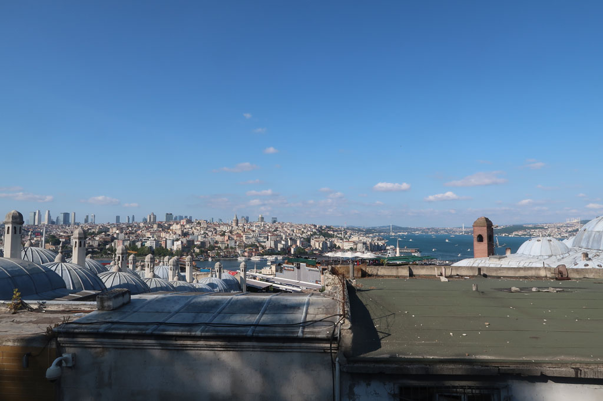
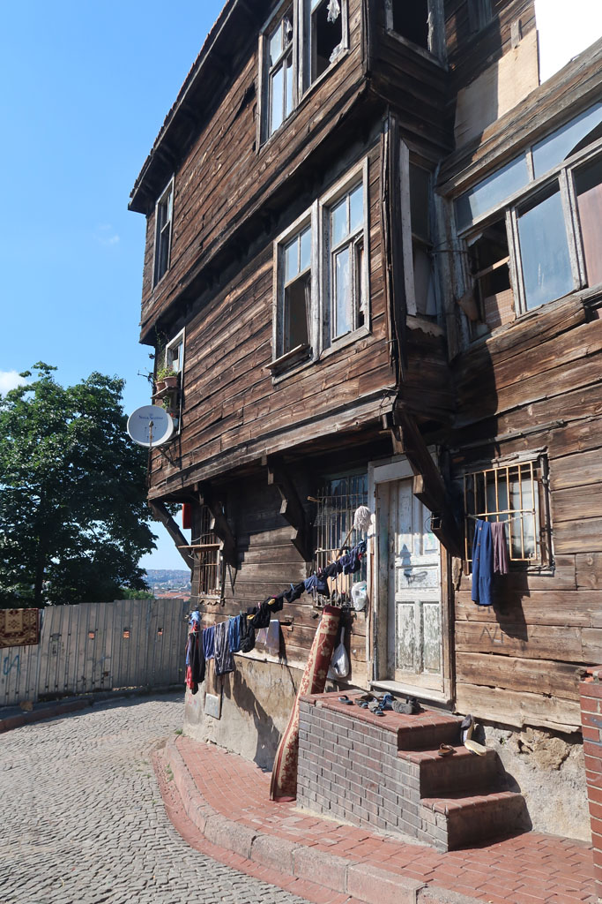

5h37 réveil au son des goélands. Je monte sur le toit terrasse profiter du levé du jour jusqu'à 8h00.

9h00 petit déjeuner en compagnie des goélands chapardeurs.

1015 Prenons notre premier bateau pour Harem (c'est gratuit ce jour là) on achète quand même une carte de transport (35TL). 4 çays sur le port. (24 TL)

11h00 début de la traversée.

11h20 arrivée à **Harem**, on achète les tickets de bus pour le lendemain. Partons ensuite à pieds jusqu'à **Kadıköy**

12h45 Nous trouvons une lokantasi dans une rue parallèle.

14h00 balade sur le front de mer, çays x 8 face à la mer dans l'embarcadère. (80 TL)

14h55 On retraverse vers **Eminönü**. On monte vers la **Mosquée Süleymaniye**. Visite de la mosquée et de ses jardins. Magnifique.

A la recherche des jardins botaniques repérés sur le plan. Un gardin nous intercepte et nous fait pénétrer dans l'enceinte d'un bâtiment administratif et les jardins ? fermés. De son thermos il nous offre à chacun un çay. Nous discutons un peu.

Nous revenons vers l'hôtel par les petites rues. Sommes dans un quartier où les maisons sont encore en bois.

18h00 pause à l'hôtel avant de ressortir vers la même cantine que la veille.

20h30 Arrêt désormais traditionnel dans notre pâtisserie, pour acheter quelques douceurs.

Puis sur la petite place prendre 4 çays (que l'on nous offre)