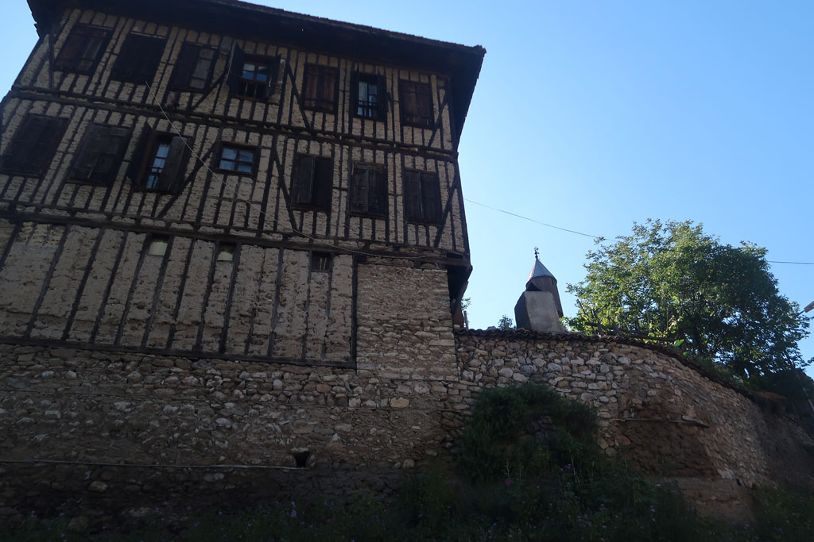

8h30 réveil et bouclage des sacs

9h00 petit déjeuner

9h30 A pieds vers l'embarcadère. Le bateau est à 10h30

En attendant notre bus, pause gourmande à la gare routière 4 çays (24TL), 1 bretzel, 1 crêpe fromage (25 TL)

11h30 c'est parti pour le grand cirque du départ. On nous offre de l'eau, nous annonce un retard, nous transporte vers une autre gare routière en passant par **Kadikoy** (où nous aurions pu aller plus simplement) récupérer d'autres passagers. A 12h45 on arrive enfin dans une gare routière dépôt perdue au milieu des échangeurs routiers. 13h10 le bus arrive enfin.

13h20 c'est le départ. Le service à bord est hallucinant. thé, gâteaux, boissons...

16h20 c'est l'heure de la pause. Nougat et **Gözleme**.

18h30 arrivée à la gare routière de **Safranbolu**. Nous montons vers le vieux village à pieds à travers la zone industrielle. On nous regarde passer tels des extraterrestres. Nous sommes sur le haut de la colline et le jour tombe. On se dirige alors vers une pension située non loin, ne nous sentant pas capable de descendre vers le vieux Safranbolu et devoir remonter ensuite si nous ne trouvions rien. La pension repérée est pleine mais le propriétaire nous emmène non loin dans une toute nouvelle qui vient d'ouvrir. Magnifique vieille maison (Aya Konak, fermée malheureusement)

19h15 Petite douche rapide avant de ressortir manger au coin de la rue. Après le festin, promenade digestive le long de la colline. On aperçoit les lumières non loin.

De retour à la pension , la patronne et le patron nous offrent le thé et des feuilles de vignes farcies et des crêpes chaudes farcies, et des graines salées....

