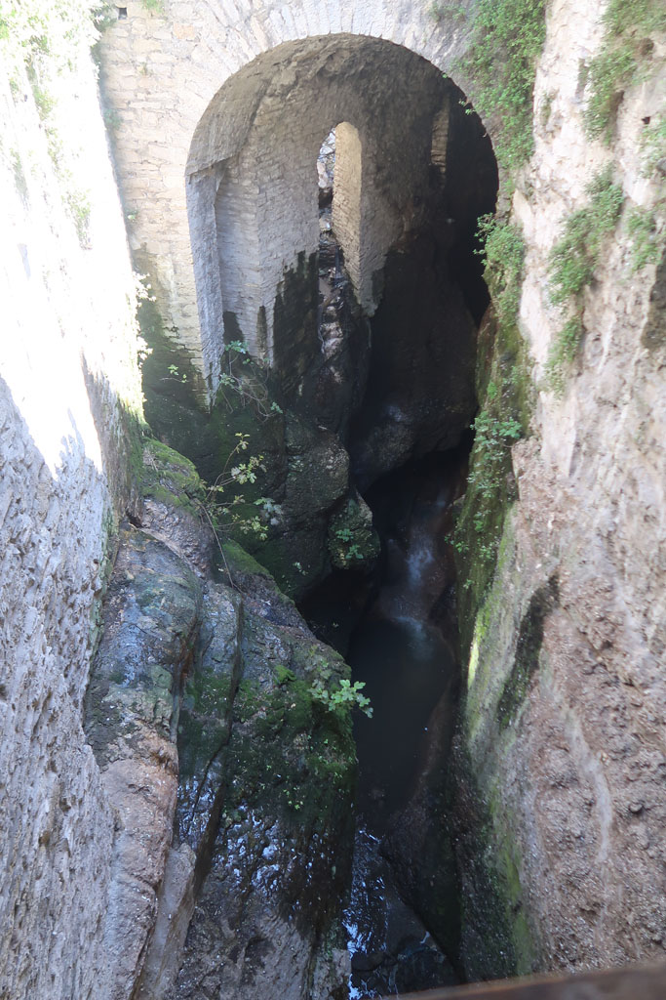
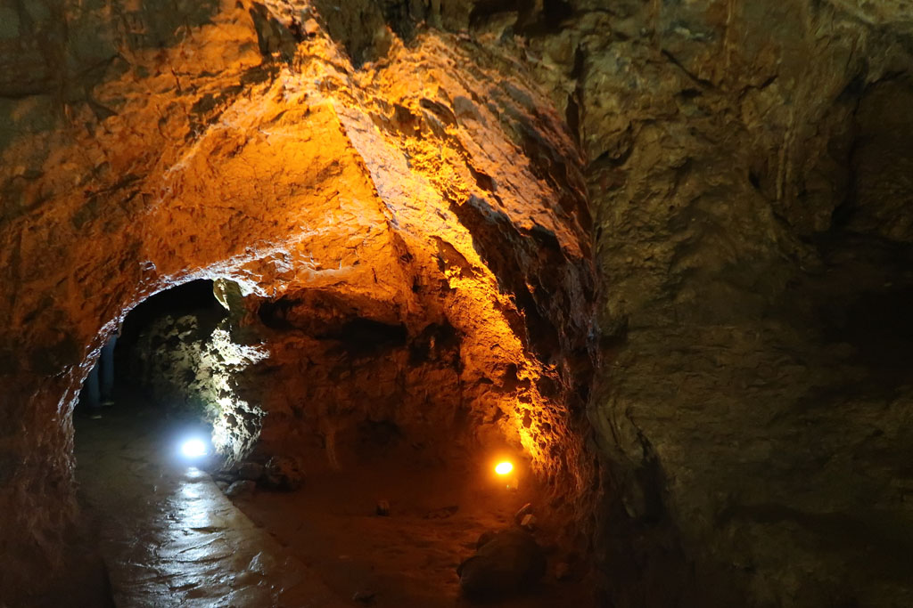
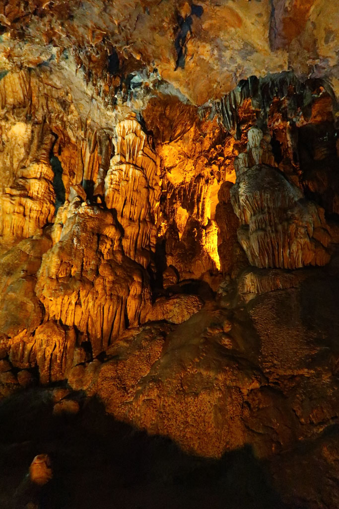
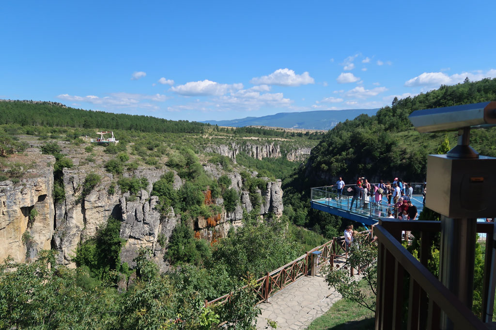

7h30 je pars me balader dans les environs, d'abord dans la ville puis par les petits sentiers.

8h30 tout le monde est réveillé, direction le cœur historique de la ville. Une longue descente nous emmène sur un pont qui traverse un canyon profond, avant de remonter jusqu’au **musée municipal**, planté au milieu d'un parc municipal rempli de "clocks towers". Visite avec des sur-chaussures de ce petit lieu hors du temps.

Nous poursuivons ensuite la descente vers la partie touristique du village. Arrêt Gözleme et 4 çays (100 TL). Visite de toutes les rues commerçantes qui proposent toutes la même chose à base de loukoum ou de produits à base de safran. Visite du caravansérail, joliment restauré qui abrite désormais un **musée du café** (4 x 5 TL).

A la sortie de la İzzet Pasha Mosque ,une passerelle offre une vue impressionnante sur le gouffre qui traverse la ville.

12h00 il va falloir remonter... 20 minutes d’ascension non stop.

Arrivée à notre pension, nos hôtes nous demandent s'ils peuvent nous aider. Il prennent donc les renseignement pour nous sur les horaires et réservations de bus pour le lendemain

13h00 Nous partons dans les rues avoisinantes à la recherche d'un endroit où grignoter un peu. ce sera le fabricant de pidé du quartier (*Közde Pide Ve Lahmacun Salonu*)

14h00 de retour à la pension. Nous nous renseignons sur la possibilité de visiter une **grotte** "**Bulak Mencilis Mağarası**" située dans les environs. Le propriétaire lance à lors les clefs du van à son fils et ce dernier nous y emmène, avec son petit frère. Nous pensions qu'il allait nous emmener à la station de bus (notre demande initiale), mais finalement, arrivés à la sortie de la ville, nous faisons demi tour, car nous emmenons aussi la sœur et une amie à elle.   
La route n'en fini pas de tourner. Arrivés sur place, les 2 frères restent au van et nous partons visiter les grottes en compagnie de la fille et son amie. Visite très sympa (50 TL).

Retour à la pension en passant par la terrasse, point de vue en verre sur le canyon. (Il y avait la possibilité de descendre en bas et de remonter, mais les 20 minutes d'ascension annoncés découragent tout le monde).

Retour à la guesthouse. Tandis que nous profitons de l’extérieur, la maitresse de maison nous apporte prunes et poires de son jardin. Moment agréable d'échange.

17h15 les étals de marché se transforment en banc public le long de la mosquée du quartier, moment détente entre dessin et lecture. Le café non loin nous ravitaille en çays. Faisons un détour par le dcentre ville acheter des loukoums dans le magasin recommandé par les gérants. De retour sur notre banc, Mustapha le patron du café qui nous ravitaille en çays se moque de notre gout pour les douceurs turques. 8 x 4 TL

19h30 nous faisons les 5 mètres qui nous séparent de la cantine de la veille.

20h30 retour à la guesthouse, nous réservons l'hôtel de notre prochaine étape et prenons en çay en compagnie des propriétaires.