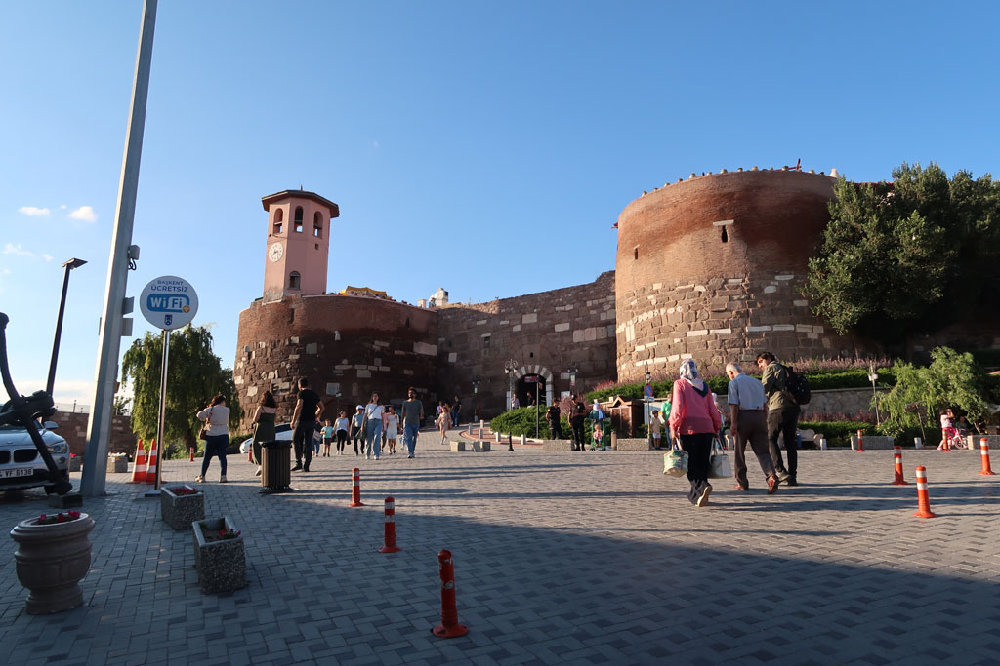
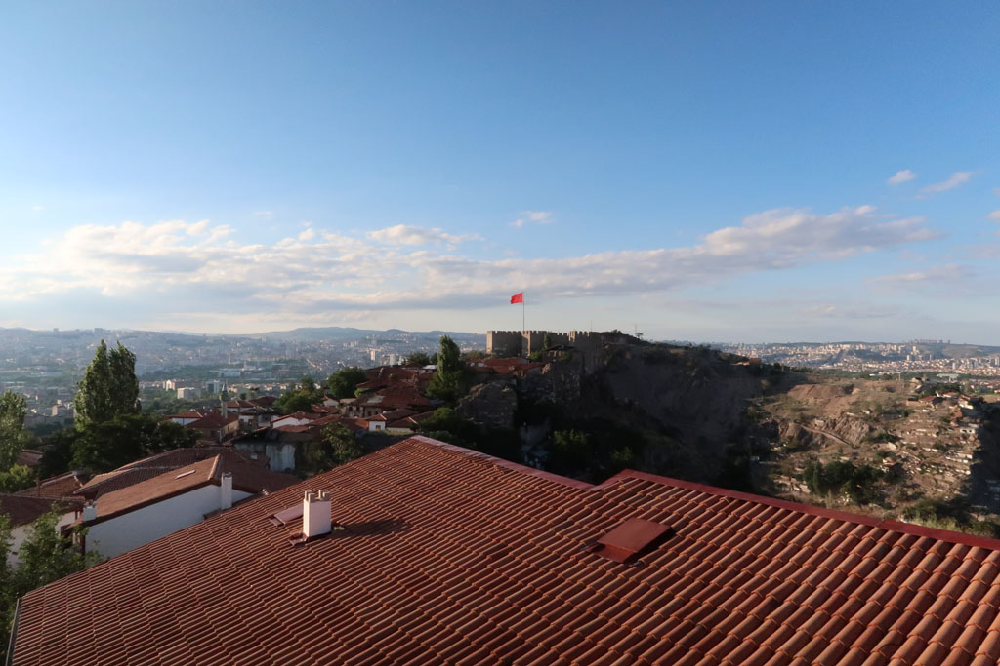
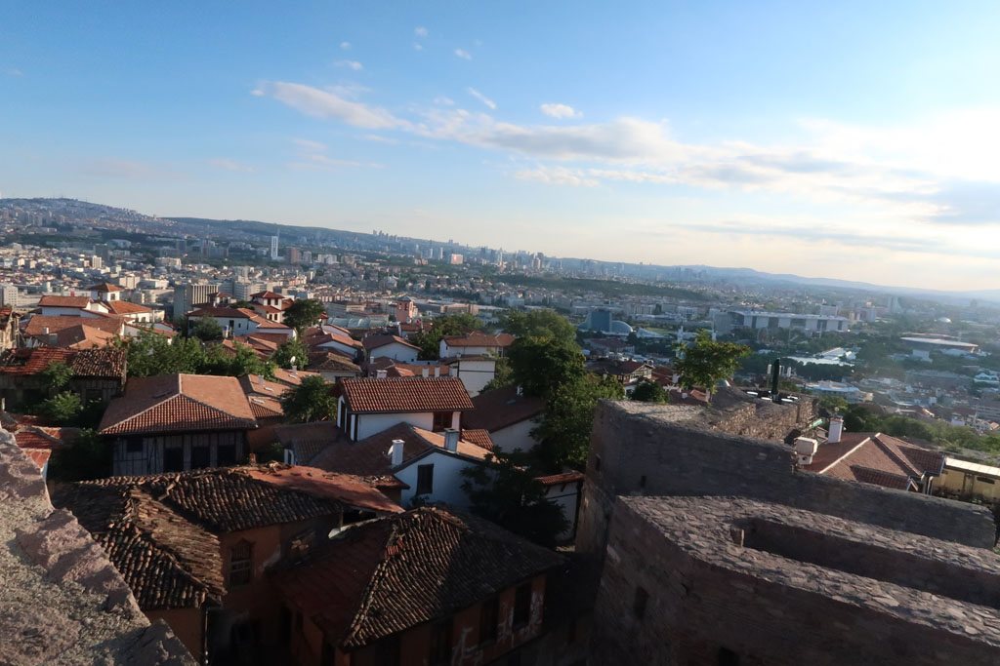
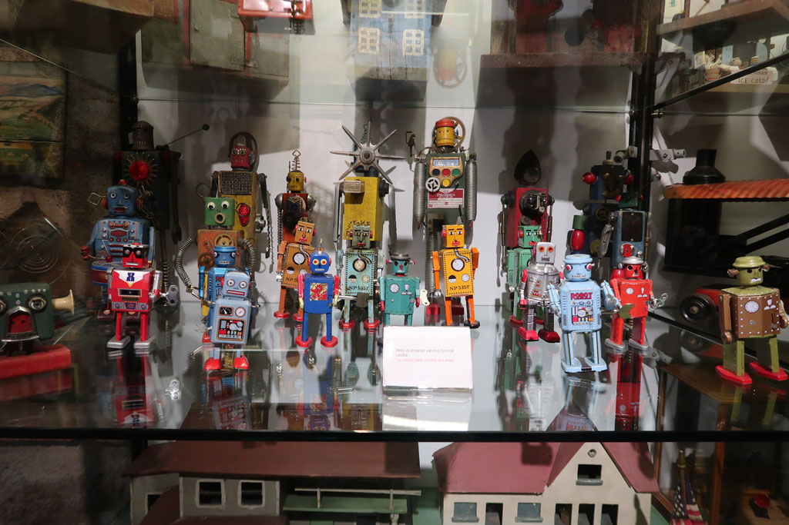

8h30 Petit déjeuner chez nos hôtes.

9h15 Le fils de maison nous emmène à la gare routière et nous aide à acheter les billets de bus

10h00 -> 13h00 En route pour **Ankara**, avec toujours ce service à bord digne d'un avion. Contrôle de gendarmerie peut avant l'arrivée, personne ne rigole.

13h10 Taxi pour l'hôtel. Une grande tour vieillotte mais pas trop chère.

14h00 Après avoir déposé les sacs nous partons en balade dans le vieil Ankara.

**Ruines** romaines   
Augustus Tapınağı (**temple**)   
**Musée** des civilisations anatoliennes (75 TL x4)   
4 çays à l'entrée de la citadelle  
Rahmi M. Koc Museum Ankara (musée où l'on trouve de tout, super impressionnant)  
visite de la citadelle

20h00 nous redescendons ensuite dans le quartier de la mosquée. tout ferme tôt. il ne reste qu'un restaurant le long de la mosquée.

21h30 retour de nuit à l'hôtel après cette bonne journée de transport et de marche.