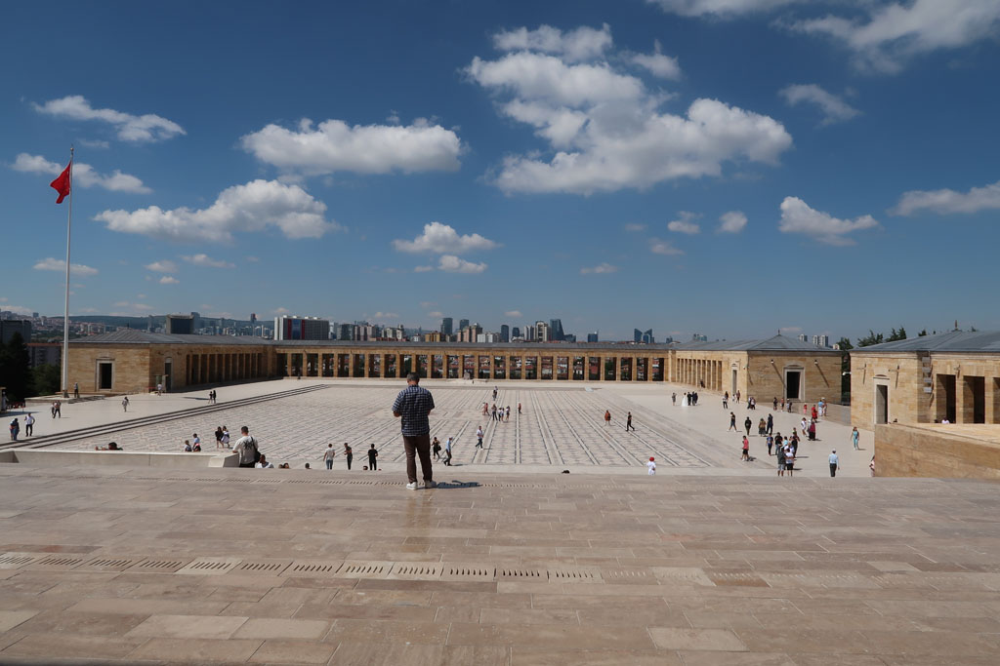

9h00 départ de l'hôtel en direction du mémorial. L'idée était de partir à pieds, trouver une boulangerie et terminer en taxi. Finalement nous trouvons une boulangerie / café dans un petit quartier résidentiel et faisons tout le trajet à pieds.

10h30 arrivée au **mémorial** / **musée** (Anıtkabir). On assite à la relève de la garde et nous visitons le lieu / musée.

12h00 nous redescendons de la colline en passant par la rue où doivent se trouver toutes les compagnies de bus. Mais nous ne les trouverons jamais. K s’achète une maillot de bain.

13h30 on attrape un taxi (30 TL). Nous voulons aller au bazar, il veut nous emmener au **château** (que nous avons visité la veille). Du coup il nous dépose en "haut". On en profite pour retourner à la citadelle et prendre 4 çays en terrasse. Nous tentons de visiter une partie lointaine de la citadelle mais cela semble inaccessible.

Sur le retour arrêt dans un jardin pour déguster une petit encas.

15h30 Direction le "**bazar**", petites ruelles où se côtoient marchands de souvenirs et artisans.

4 çays plus tard ( 20TL ) nous retournons à l'hôtel en passant devant un restaurant pour le soir.

17h09 Arrivés devant les bains romains qui ferment à 17h00.... loupés.

17h20 retour à l'hôtel, il est temps de planifier les jours suivants entre temps de transport, budget, logements et envies touristiques.

19h30 direction a cantine soit disant bon marché, qui s'avère un un truc touristique plutôt cher.

21h00 retour hôtel.