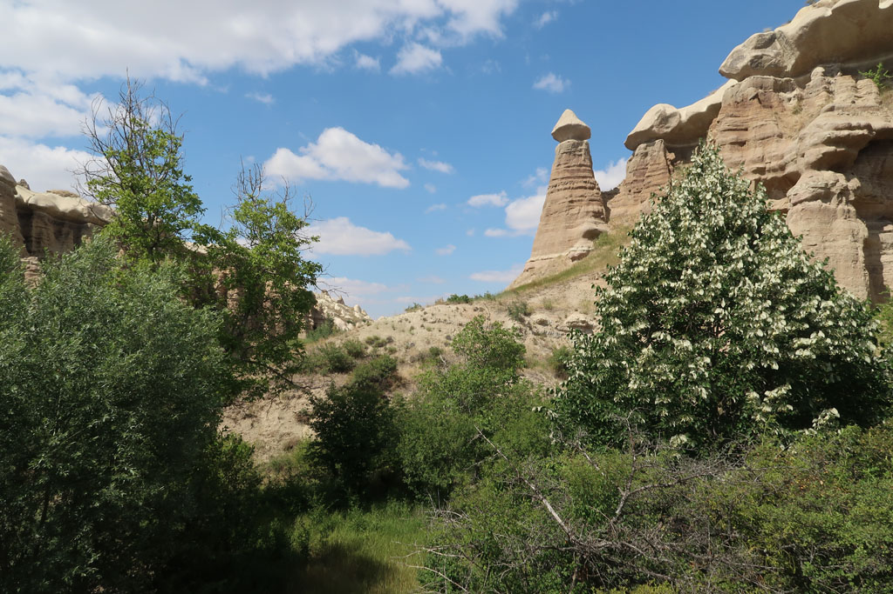

6h30 Réveil

7h00 Départ pour la gare routière de **Ankara** (AŞTİ Ankara Intercity Bus Terminal) en taxi

Nous prenons des tickets au comptoir Kamil Koç, nous sommes "dispersés" dans le bus de 8h00. Paysages magnifiques, autoroute déserte. Les billets ne nous emmenaient que jusqu’à **Uçhisar** la ville précédant **Göreme**. Mais nous savons que notre bus y va quand même. On demande à l'assistant du chauffeur si nous pouvons remonter et poursuivre. Il accepte et nous y dépose, cool, sachant que le mini bus à l'affut demande 145 TL / personne.

Arrivés à Göreme, nous réservons notre bus pour le lendemain soir.

12h00 Nous prenons possession de notre chambre dans une pension de la vieille ville. Nous explorons ensuite la rue commerçante pleine de magasins de souvenirs et de restaurants tous plus chers les uns que les autres. On fini par dégotter une gargote plus authentique qui à l'air de préparer les sandwich des excursions.

15h00 départ de l'hôtel pour une jolie randonnée ver la ville voisine de **Uçhisar** par les champs et les canyons

19h00 de retour en ville on retourne dans la catine du midi grignoter.

20h30 Profitons du toit terrasse avec G pour se prendre une bonne bière face à la ville