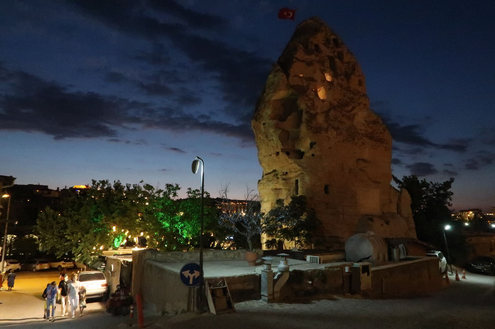
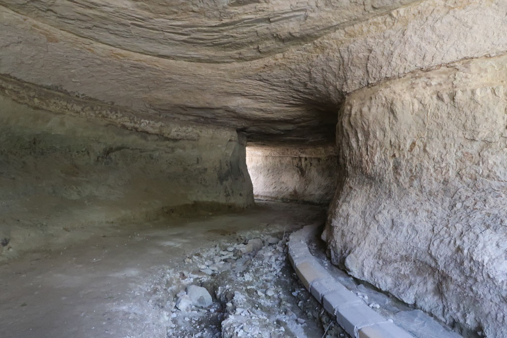
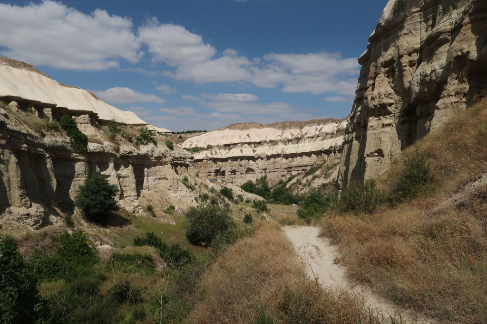
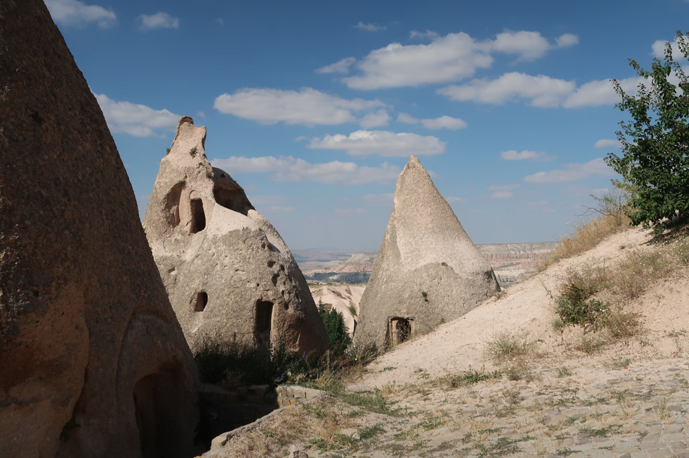
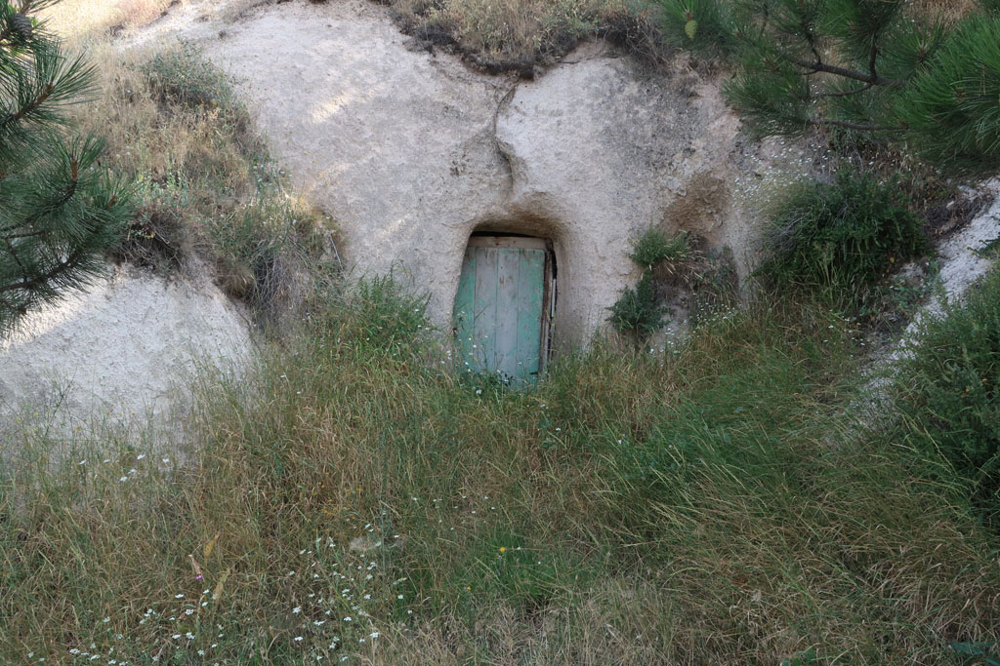
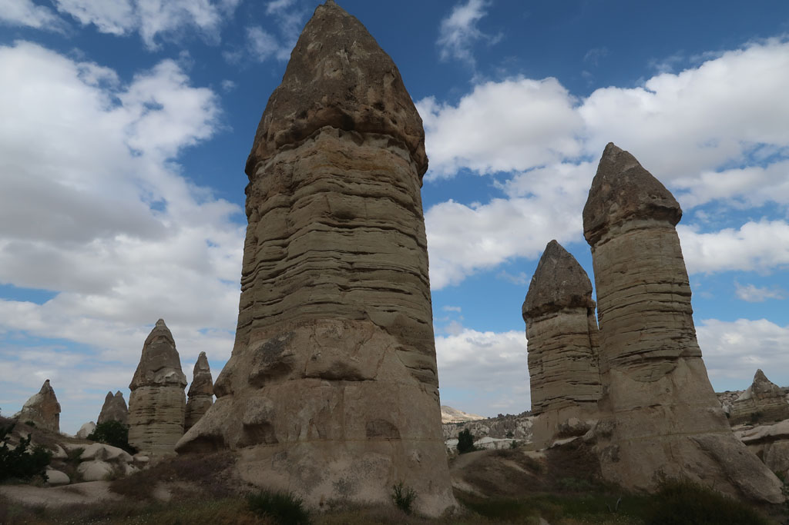

6h00 Réveil et visite de **Göreme** endormie

9h00 Petit déjeuner sur le toit de l'hôtel.

10h00 Journée exploration. On commence par le **musée** en plein air (4 x 150 TL) avec de jolies églises et pas trop de monde. On tente de revenir par le circuit (rose) qui est un ancien canal irrigation. Mais nous sommes obligés de rebrousser chemin car une échelle est cassée ( le chemin n'est clairement pas entretenu, ni balisé)

12h00 retour en zone commerciale, 2 gözlémés et 4 çays plus tard nous repartons pour ce qui devait être une boucle entre 2 vallons, à mi parcours de gris chiens nous forcent à faire demi tour. Avec E nous escaladons la parois pour visiter une vieille **église** **troglodyte** et ses souterrains attenants.  
  
Au milieu de la balade nous nous arrêtons dans un café qui ne semble fonctionner que pour les groupes du matin (nous sommes seuls mais il est très/trop cher).

Tout autour de nous ce ne sont que des abricotiers abandonnés. K passe de l'un à l'autre. Nous finissons à trouver un chemin de chèvres qui grimpe au milieu des piliers pour nous ramener au dessus de Göreme.

Pause çay en haut, douche froide sur les prix (4 x 20 TL), on zappe.

17h00 de retour en ville. Un boui-boui non loin rempli de papis, propose des prix de nouveau raisonnables 3 TL

7 çays plus tard nous retournons dans la cantine de la veille. Nous discutons avec le gérant, qui nous explique le choc de voir sa vile natale vide au retour de son service militaire . Dire que nous trouvons qu'il y a déjà trop de monde....  
  
20h30 retour à l'hôtel récupérer les sacs et profiter des toilettes.  
  
21h30 Direction la gare routière  
  
22h00 Départ pour **Antalya**