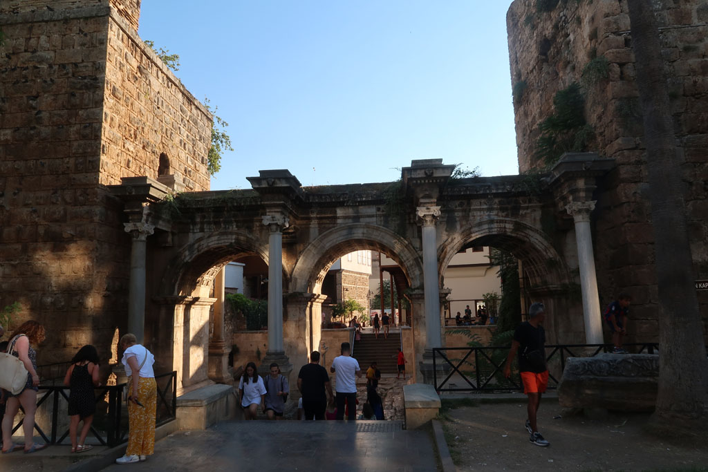
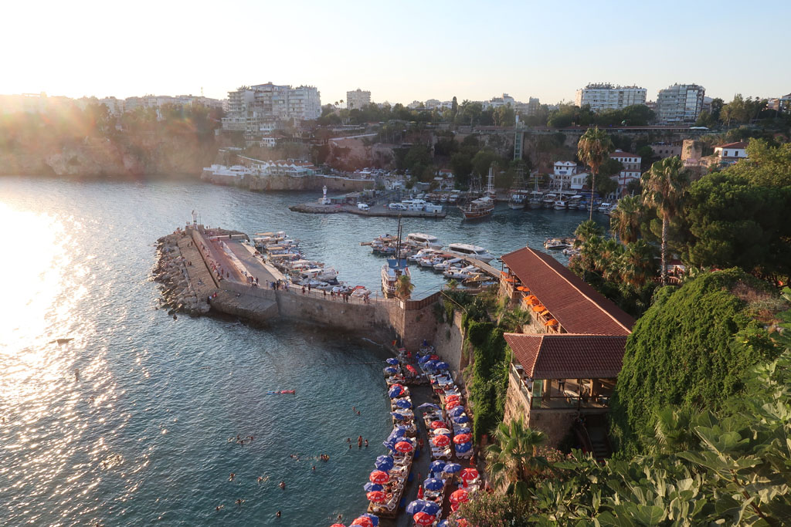

8h00 2 gros arrêts plus tard nous arrivons à **Antalya**, prenons le **tramway** pour rejoindre le centre et un hôtel repéré la veille. Après une courte pause, nous nous dirigeons vers la vieille ville, nous descendons jusqu'au vieux port avant de remonter.

12h00 petite gargote.

13h00 retour hôtel pour une bonne douche. ce matin dès que le bus à franchi les montagnes la température extérieure affichait 31° alors qu'il faisait encore nuit.

16h30 retour en ville, passage par le bazar, visite d'une veille mosquée et pause çays dans le café attenant (7 x 4 TL).

Nous suivons la ligne de tramway qui contourne la veille ville, nous essayons une boulangerie recommandée, mais les prix sont stratosphériques pour une qualité plus que moyenne.

19h00 mangeons sur le trottoir dans une gargote située dans la partie moderne de la ville.