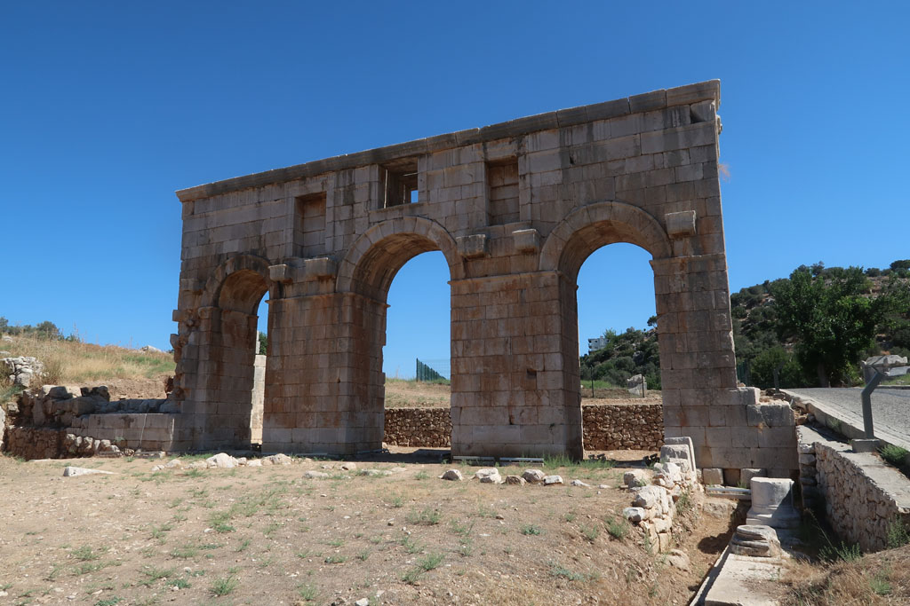

7h30 réveil

8h00 Après avoir bouclé les sacs, direction la gare routière en tramway. De l grande gare, il faut aller à la petite pour les bus locaux. Achat des billets 4x 110 TL

9h20 départ du mini bus, le voyage se déroule au milieu des montagnes et est très très beau.

13h00 le bus nous dépose sur le bord de la route. Un croisement pour **Patara**.  
 Dans une cantine sur le bord de la route nous grignotons. En discutant avec le gérant sur le moyen de rejoindre notre pension, il nous désigne un autre client qui est chauffeur de taxi. Après s’être entendus sur le prix de la course nous terminons nos plats respectifs.

14h20 Arrivée à la pension. Petit appartement sympathique dans une cour loin de l'agitation du centre touristique de ce village. Le patron nous offre le thé et du raisin de sa vigne. Il nous propose de nous emmener à la plage en voiture plus tard.

15h00 Tout le monde se repose au chant assourdissant des cigales.

17h00 Le patron nous dépose à la **plage**. Pour y aller en voiture il faut normalement s’acquitter du droit d'entrée sur le site touristique.Comme il est du village...

Sur la plage des cercles métalliques protègent des nids de **tortue**.

... pas pris de notes sur cette fin de journée. Nous avons du manger dans le centre ville, où il n'y a que des restaurants à touristes.