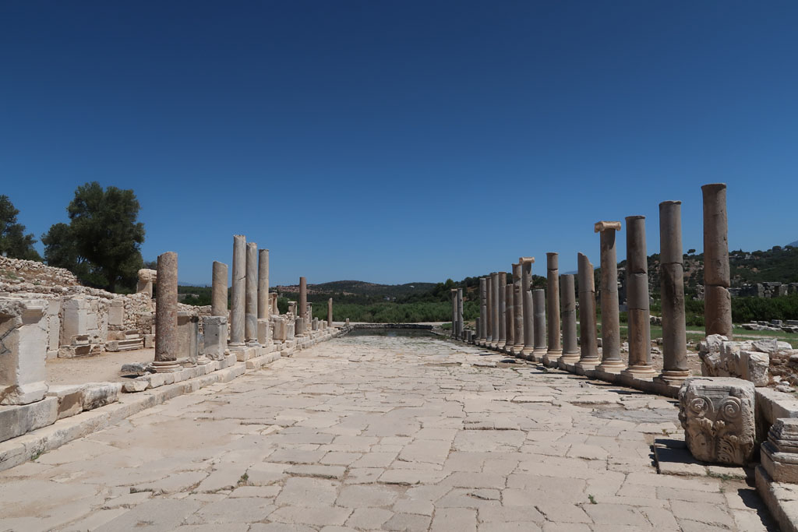

6h30 je pars me promener sur les hauteurs de la ville, un chien errant me force a rebrousser chemin.

8h30 le petit déjeuner est somptueux, on se cale bien.

9h30 direction les **ruines** après s’être acquitté du droit d'entrée pour Patara Ancient City. Il n'y a pas grand monde. Les gens qui logent à **Patara** vont à la plage, les touristes arriveront en car vers 12h00/14h00. Nous achetons de l'eau à la boutique. Le soleil tape.

12h30Nous marchons jusqu'à la station de tai de la plage pour nous faire reconduire à notre guest house.

13h30 Sieste au frais

16h30 Direction la **plage**, à pieds.

17h00 Nous profitons de la fin de journée en compagnie des familles locales qui arrivent en fin de journée aussi.

20h00 Taxi, cette fois ci pour le centre ville. Ce soir nous changeons de restaurant, ce sera burgers....

21h00 Il est temps de retirer des sous... 1er ATM en panne. 2eme ATM fonctionne mais fini par planter au moment de donner l'argent sur un crash de node\_modules sur une windows 7.... il reboot.. la carte n'est jamais rendue. Opposition à la banque... joie.

21h30 Retour à l'hôtel après un passage au supermarché pour faire la provision d'eau et de petits gâteaux.