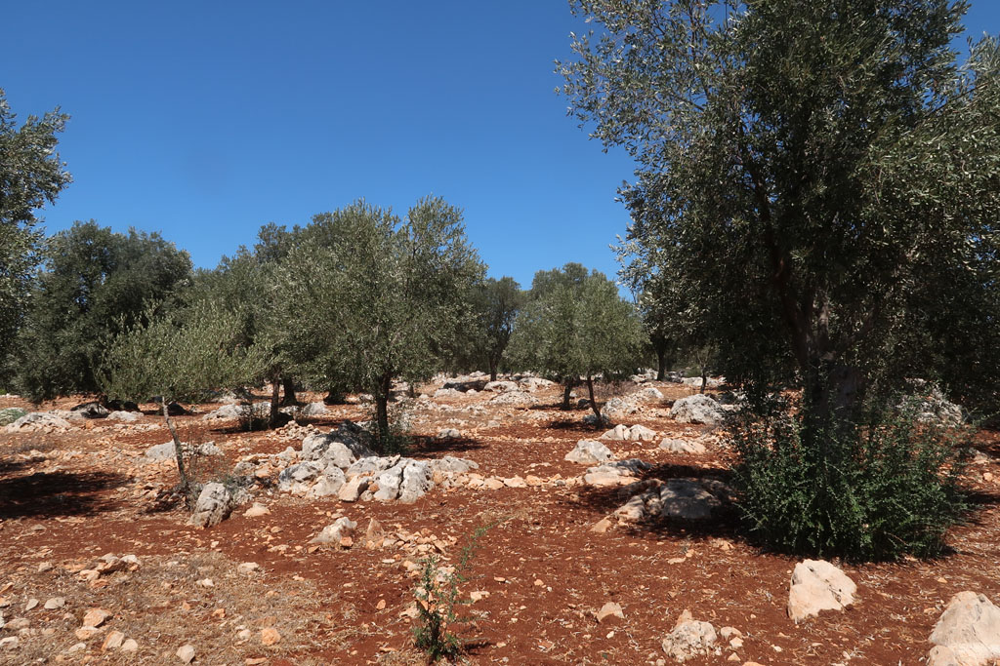

9h00 petit déjeuner sous les vignes.

10h00 nous partons visiter le site de l'autre coté de la ville. Nous nous enfonçons au milieu des champs d'oliviers. Et débouchons finalement sur l'arrière du site après avoir vu des monuments (pourtant pourvus de pancartes explicatives) qui n'étaient pas indiqués la veille.

14h00 retour à la guesthouse en taxi

16h00 on retourne à la **plage** profiter de la fin de journée

19h30 taxi pour le centre ville, on retourne au même restaurant que la veille

21h30 retour à la guesthouse. Nous discutons avec le patron qui nous offre encore du raison.