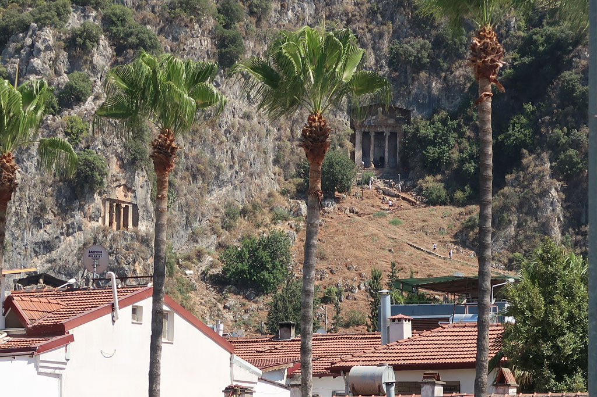
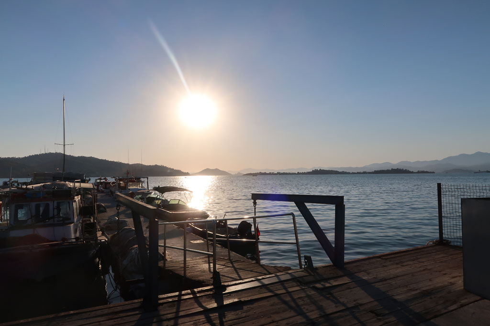
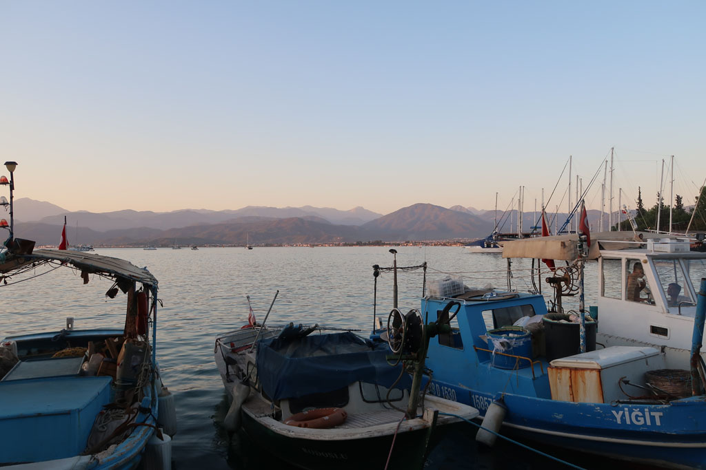

7h30 Réveil et sacs

8h30 petit déjeuner, le patron se renseigne sur les horaires de bus. Il nous emmène à l’arrêt 20 minutes avant le long de la grande route où nous étions arrivés. Il missionne un petit vieux pour qu'il arrete le bon bus qui passera par là.

11h20 Bus pour Fethiye

13h30 Arrivée dans la station balnéaire (plutot moche) de **Fethiye**, on marche jusqu'à l'hotel (plutot excentré compte tenu des tarifs trop chers du centre)

14h00 Les sacs déposés nous repartons vers le centre via le front de mer. Le repas dans uen chaine ne mérite pas d’être mentionné.

16h00 retour depuis le centre à l'hôtel pour profiter un peu de sa piscine (petite et décrépie)

19h00 Départ par le front de mer que l'on longe jusqu'au bout avec ses gros bateaux à touristes. Pour basculer dans le centre à la recherche d'une gargote plus authentique. Le repas du soir sera aussi un fiasco. Décidément cette ville n'est pas faite pour nous. Nous ne resterons pas pour visiter les tombeaux.

21h00 retour le long de l'au avec une pause çays sympa.

22h00 çays en **terrasse** à l'hôtel pendant que Ko barbote dans la **piscine**