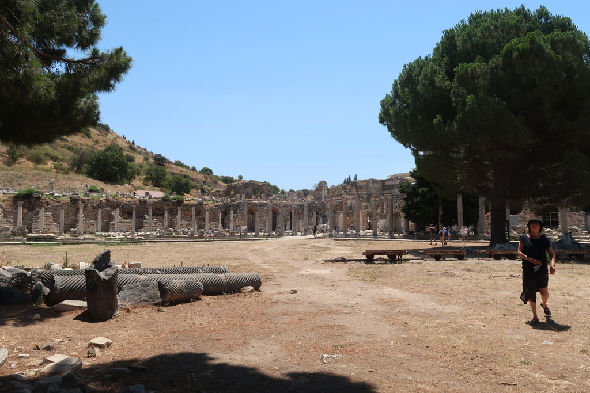

7h00 Réveil

8h00 direction la gare de **İzmir** Basmane, mais le prochain train pour **Ephèse** est à 10h45. Nous prnons donc un taxi pour la gare routière. Mini bus pour **Selçuk**. Nous faisons uen pause café / patisserie à l'arrivée avant de prendre un dolmuche pour le site de Ephesus Archaeological Site

10h00 entrée sur le site

13h00 après une très belle visite sans trop de monde (les gens arrivaient quand on partait) retour à Selçuk. Nous prenons un repas à coté de la gare routière.

15h00 cheminement inverse à celui du matin. Bus pour **Izmir**, taxi pour Basmane, retour hôtel. Je ressors avec Ko qui a repéré des chaussures la veille.

19h00 nous retournons manger là où nous avons mangé la veille devant la mosquée.   
El teste un petit dessert chez *Meşhur Hisarönü Şambalicisi*