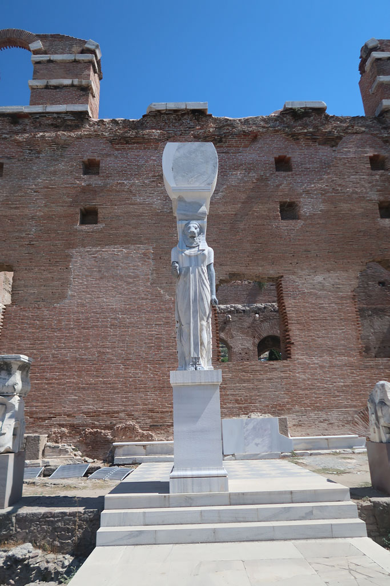
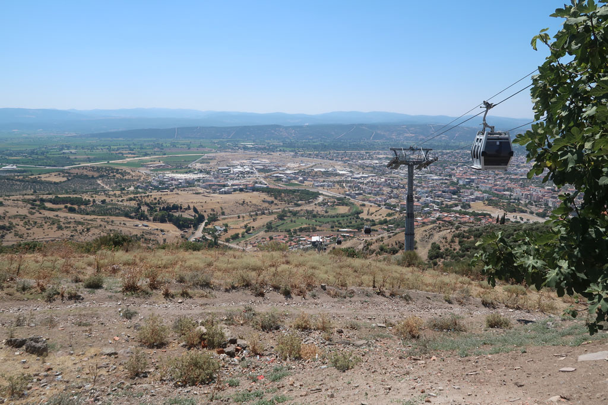
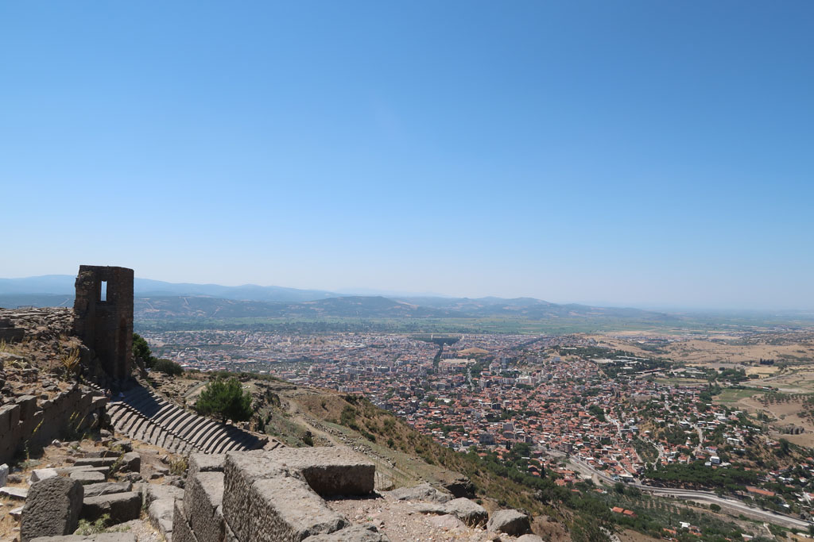
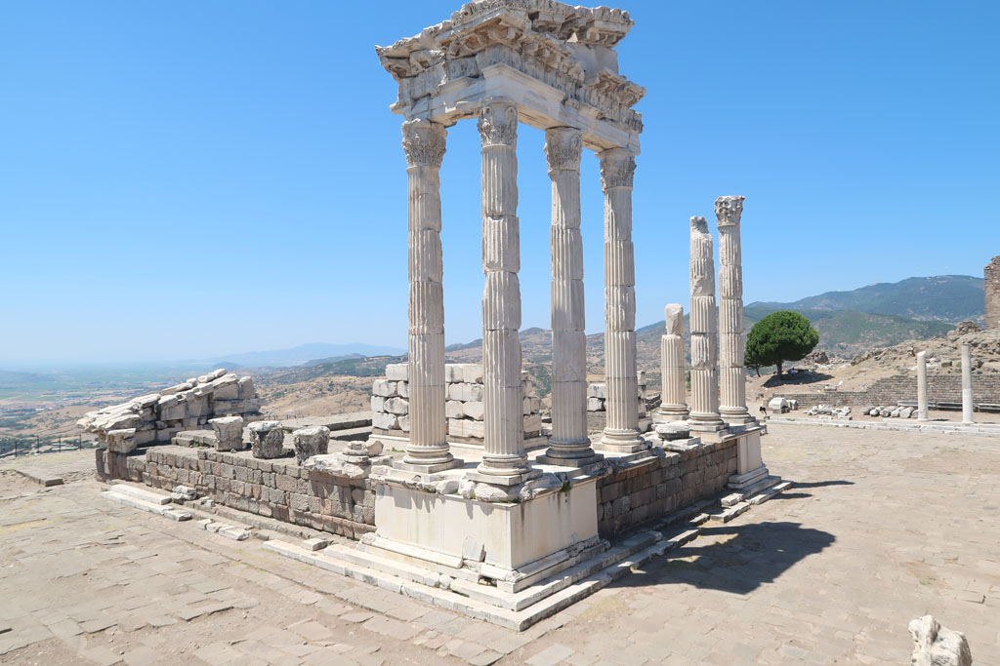
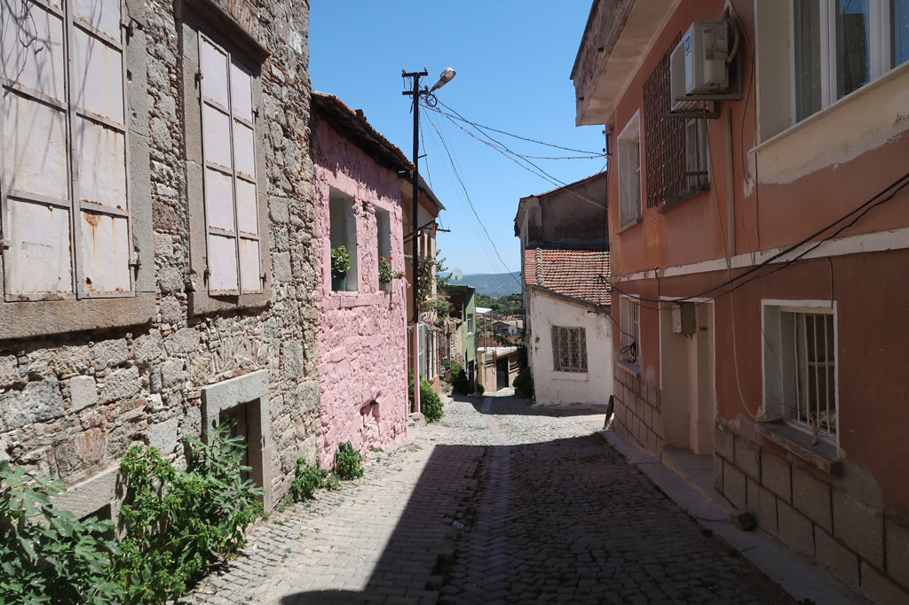

7h00 réveil

8h00 vers la agre routière en taxi puis mini bus pour **Bergame**

Visite de la **basilique** rouge, impressionnante avec son statuaire égyptien.

Pause çay chez un papi au bord de la route dans le vieux Bergame.

11h00 nous prenons le téléphérique pour monter en haut du site de **Pergamon** / **Pergame**. Superbe visite du site presque désert. Nous choisissons de redescendre par la voie romaine, toute cette colline. Pleins de sites magnifiques le long du parcours. Notre seul regret est de ne pas avoir pris assez d'eau.

15h00 arrivée en bas dans la ville c'est la ruée sur les boissons fraiches.

15h25 bus pour Izmir, taxi pour Basmane, achat des tickets pour le lendemain, retour à l’hôtel.

19h00 nous ressortons manger, au même endroit que la veille, nous commençons à être connus.

20h00 douceurs sucrées comme la veille avant de revenir à l'hôtel.