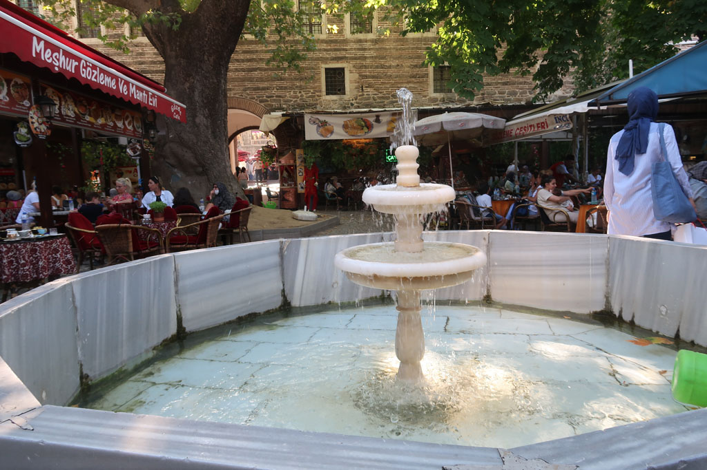

7h30 Réveil

8h30 Rendez vous devant l'agence de bus Métro située non loin de l'hôtel.

9h00 Départ du bus pour **Bursa**

13h30 Arrivée à Bursa, achat d'une carte de bus. C'est le 36 qui ramène au centre ville.

14h30 nous logeons dans l'hôtel Güner. On ressort se promener en centre ville. Et prenons notre repas du soir dans la zone touristique.

Le centre de Bursa est un assemblage de **caravansérail** (s), presque imbriqués les uns dans les autres.

Nous revenons en fin de journée dans notre hôtel, cette grande bâtisse en bois traditionnelle par les petites rues en passant par la boulangerie, le supermarché et un petit café pour prendre un dernier çay.