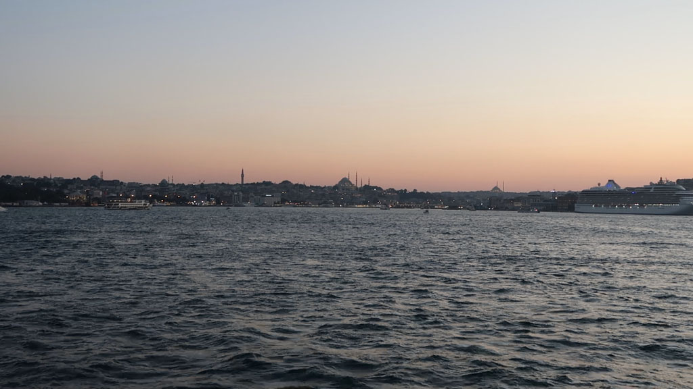

8h00 réveil

9h18 Bus F3 (non loin de l'hôtel) en direction du port situé hors de la ville. 22TL / personne. Nous n'avons pas assez sur notre carte de bus, le chauffeur, super sympa, nous arrete à coté d'un kiosque pour que nous puissions recharger notre carte.

10h45 Nous arrivons à **Mudanya**, la commune "portuaire" de **Bursa**. Le prochain bateau pour Istanbul avec des places disponibles ne part qu'a 13h30. Ce sera donc promenade le long du port, çays, et très très mauvais repas (le pire du séjour) dans cette station balnéaire.

15h40 Arrivée à **Istanbul**. Prenons des ticket de ferry et traversons pour Kadikoy. A la recherche d'un hôtel sans booking. Nous finissons par atterrir dans une auberge de jeunesse / foyer de jeunes travailleurs bien pourrie (600 TL). Mais ce n'est que pour 2 nuits.

16h30 balade dans le quartier (et première bière du séjour).

19h30 repas dans une gargote non loin de notre logement.