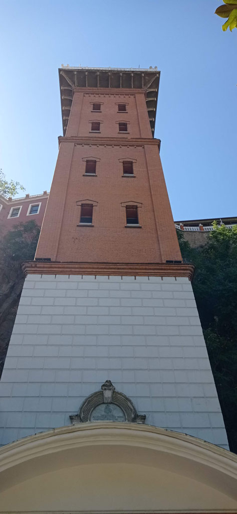
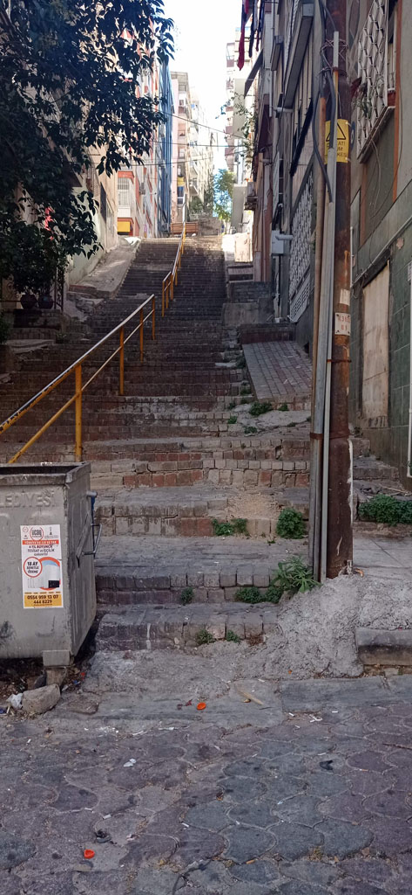
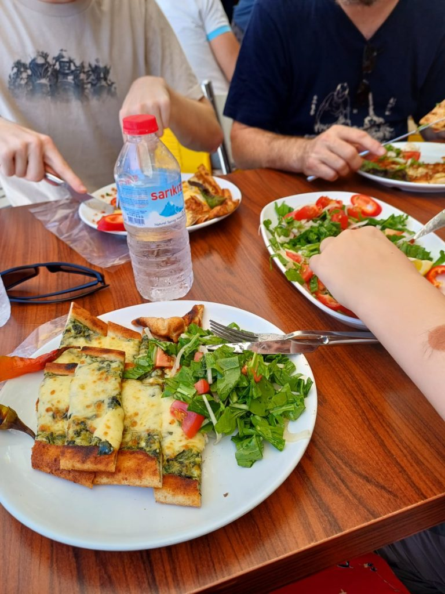
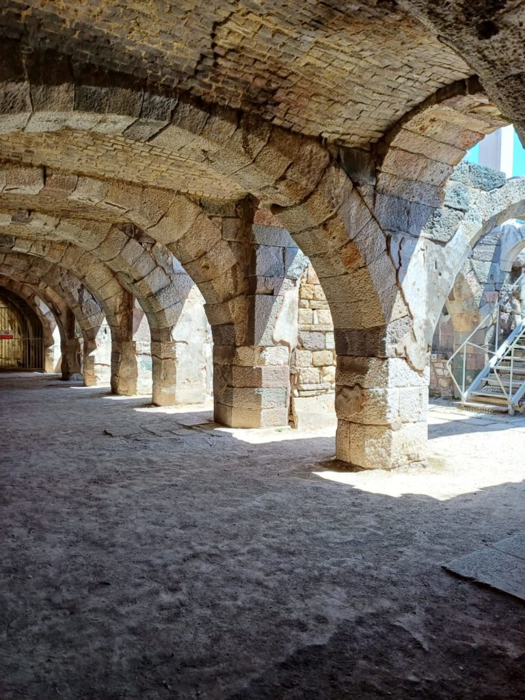
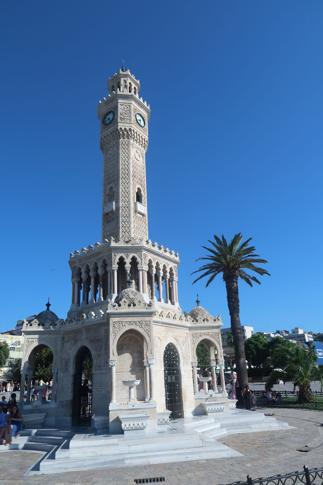
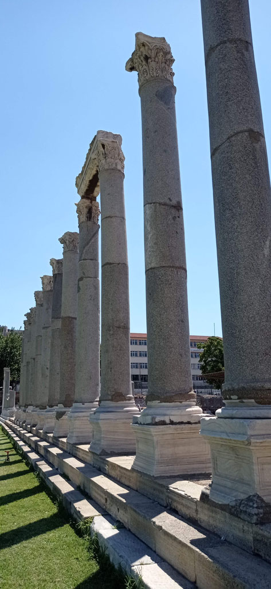
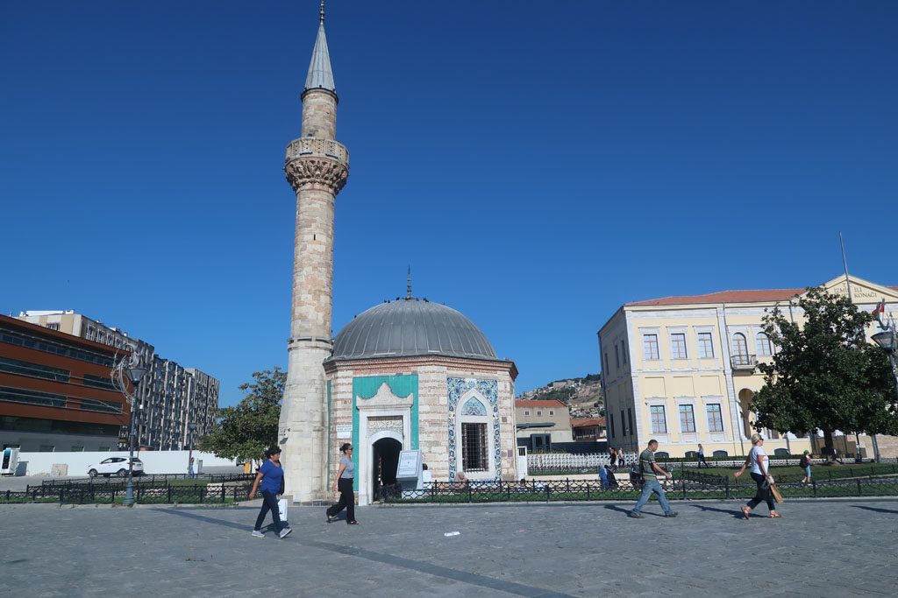

9h00 Réveil

10h00 Après le petit déjeuner, direction l'**Asensor** d'**Izmir** en passant par la tour de l'horloge

11h00 Nous repartons vers le quartier de **Varyant**. Achat de boissons et pause çai sur la route du **musée** archéologique (x4= 360)

12h30 Retour dans le quartier du bazar dans une section "artiste". on profite du passage devant une lokantasi sympathique pour manger quelques pidés.

13h30 visite du site de l'agora / basilique (4x130tl)

15h00 retour à l'hôtel pour une courte pause.

16h30 direction la mer en passant par le bazar, nous prenons un petit cafés sur l'embarcadère.

18h30 Nous reprenons nos marques par rapport à l'année dernière et retournons dans notre petite cantine près de la mosquée. Retour à l'hôtel par les petites rues.

20h30 Profitons un peu de la terrasse/jardin de l'hôtel après une bonne douche

