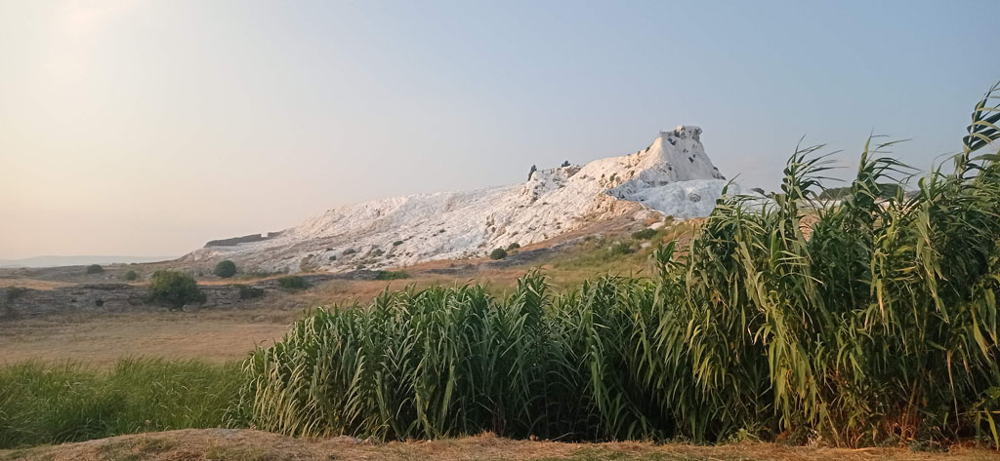

7h45 Réveil et petit déjeuner dans la cour de l'hôtel.

9h00 direction al gare Basmane d'**Izmir**. On galère un peu avec nos passeports (c'est compliqué)

10h30 Train pour Denizli

15h30 On rejoint la gare routière qui se situe juste en face. Le quai 76 au sous sol est celui qu'il faut prendre pour aller à **Pamukkale**. Nous aurions pu rester sur **Denizli** et faire les excursions depuis la ville. Mais nous vouions être sur place.

17h00 Arrivée à l'hôtel. On ressort aussitôt pour aller repérer la route pour le lendemain matin.

19h00 de retour à l’hôtel pour le repas du soir.

20h00 On profite de la soirée au bord et dans la piscine