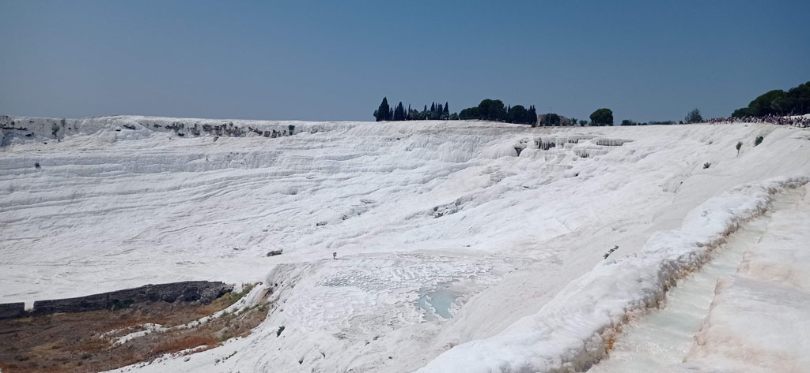

7h45 Réveil puis petit déjeuner, il faut prendre des forces.

8h30 Départ pour le site

9h00 Ouverture et achat des billets pour le site de **Pamukkale**. Les bassins du bas sont déserts, ceux du haut (accessibles en véhicules) commencent à se remplir.

Le site de **Hiérapolis** est quant à lui désert. Les lieux et les paysages sont magnifiques. Nous finissons la balade par le **théâtre** et le **musée**, là où il y a le plus de monde, avant de redescendre par les bassins, désormais remplis de gens prenant la pose. (Avec des ailes d'ange)

14h30 On sort du site après une bien jolie matinée. Pause glace sur le chemin de l'hôtel. G en profite pour demander les prix d'une sortie pour Aphrodisias le lendemain. 3000 TL.

15h00 Retour à l'hôtel après un passage au supermarché, renouveler notre stock d'eau pour le lendemain.

16h00 Nous finissons la journée au bord de l'eau à l'hôtel.

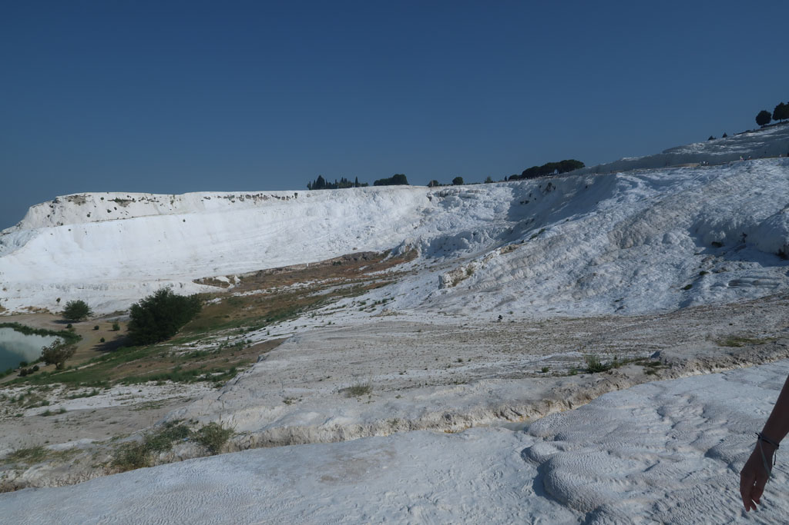
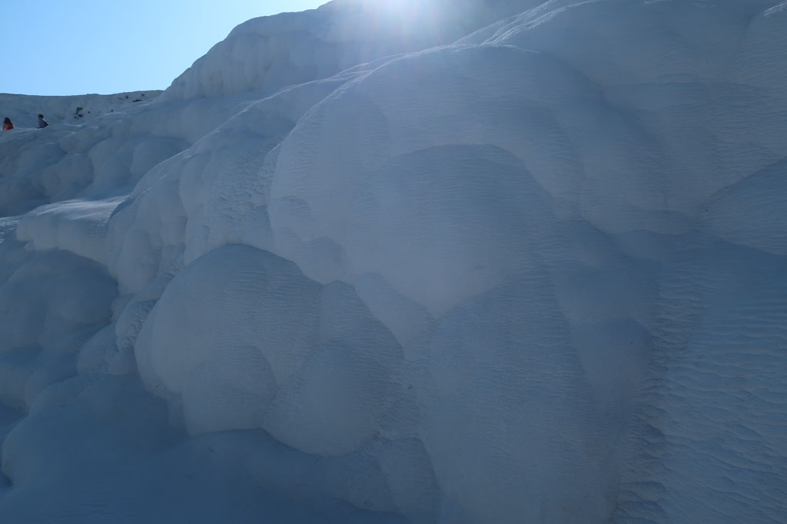
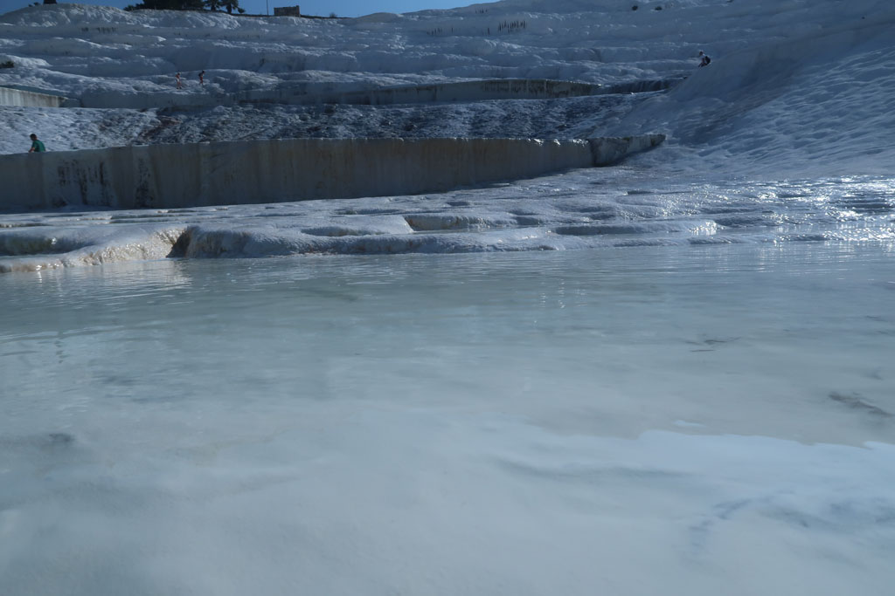
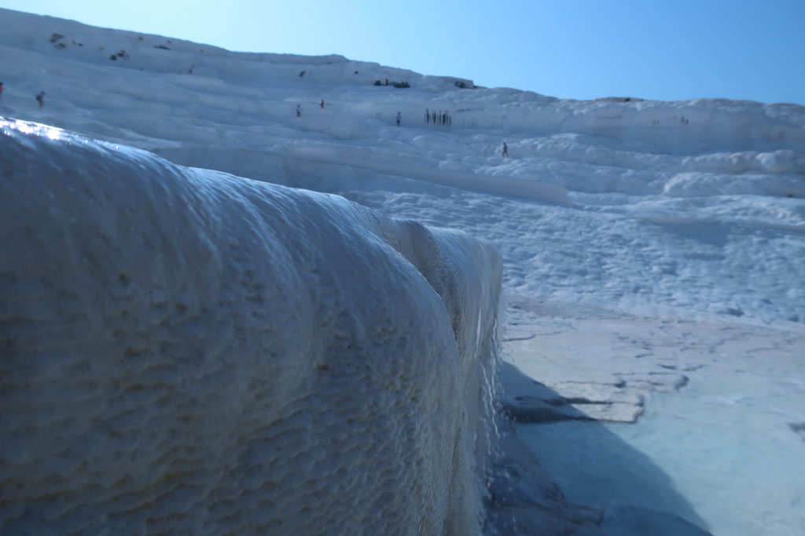
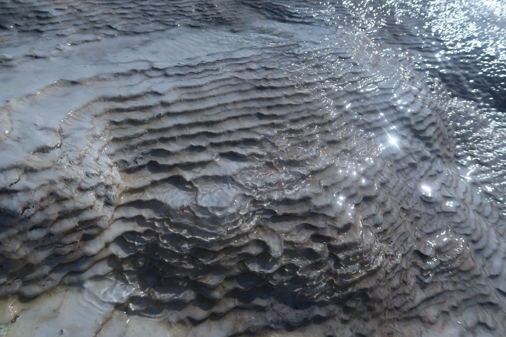
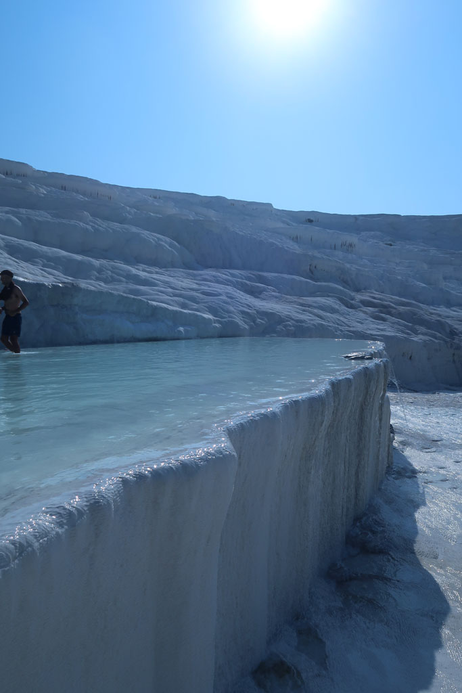
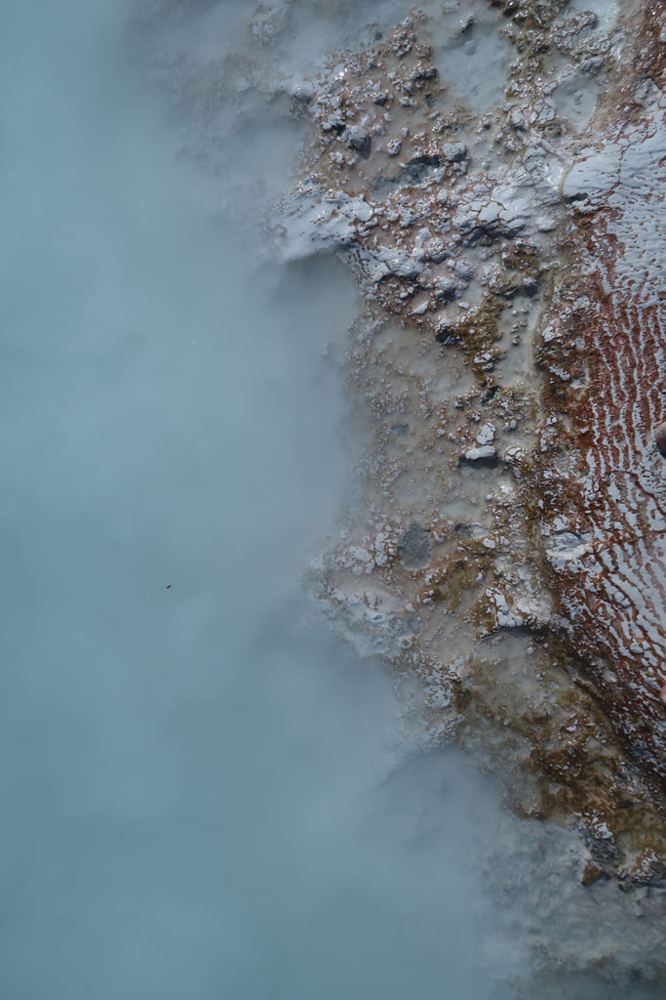
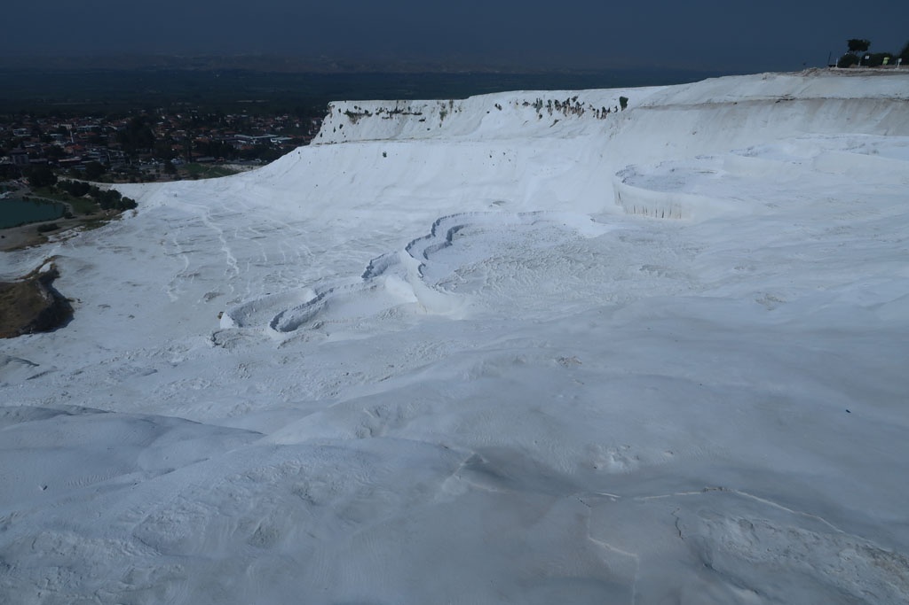
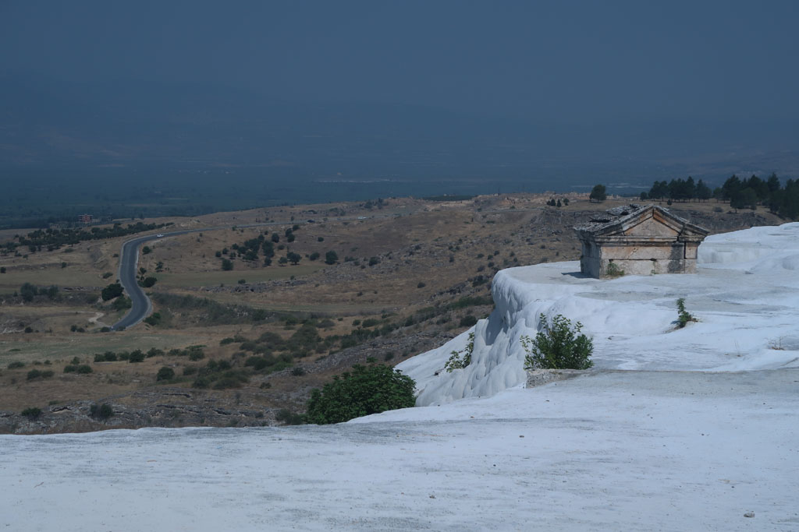
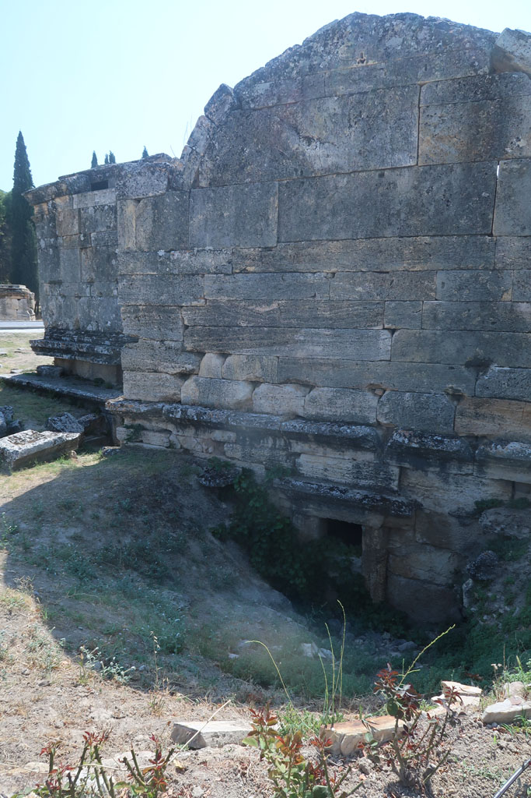
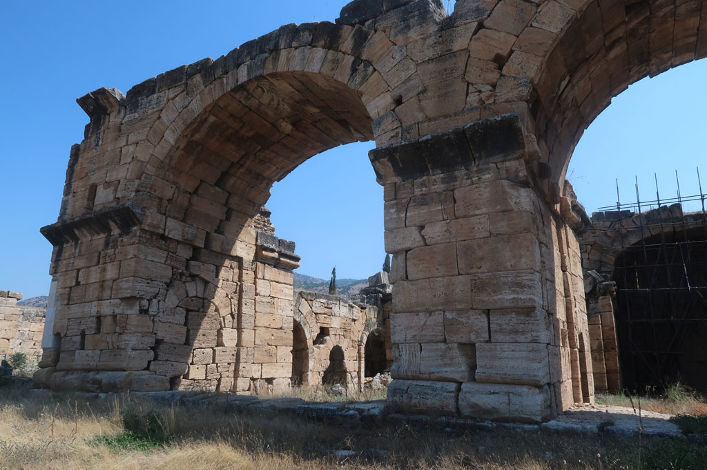
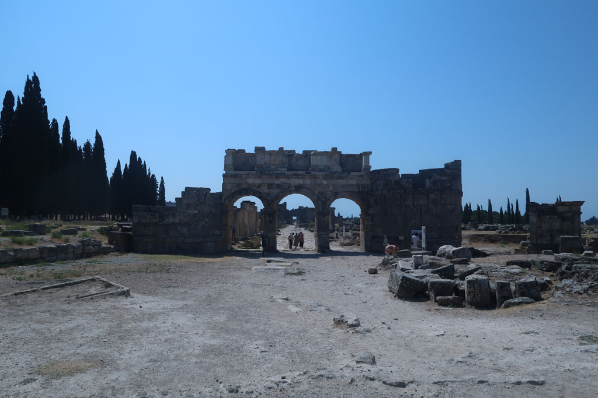
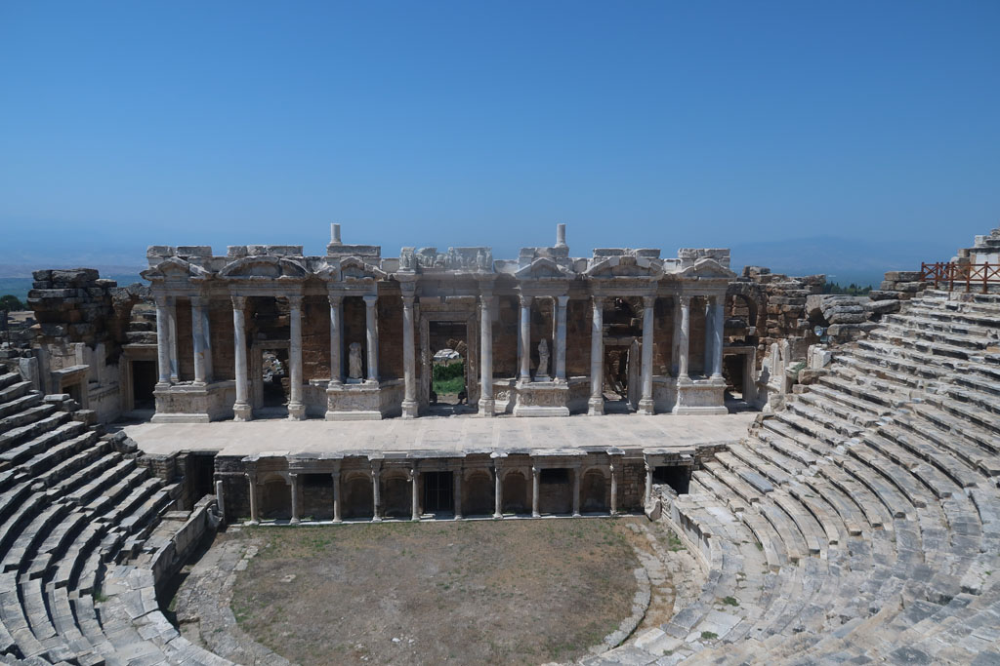