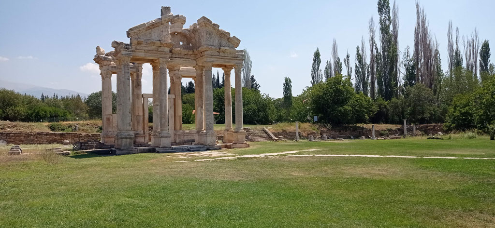

6h15 réveil

6h30 sur le toit à regarder passer les montgolfières.

7h45 réveil e la troupe.

8h00 petit déjeuner de l’hôtel

9h10 Notre chauffeur de taxi, un petit papi tout vouté vient nous chercher.

10h30 Arrivée sur le site d'**Aphrodisias**.

La visite est sublime (280TL / personne) , nous sommes totalement seuls que ce soit sur le site où dans le **musée**.

14h30 Il est temps de revenir à notre hôtel de **Pamukkale**.

15h45 direction la piscine.

19h30 direction le centre ville. Nous faisons le tour de ce bourg sinistre pour finalement revenir manger à notre hôtel.