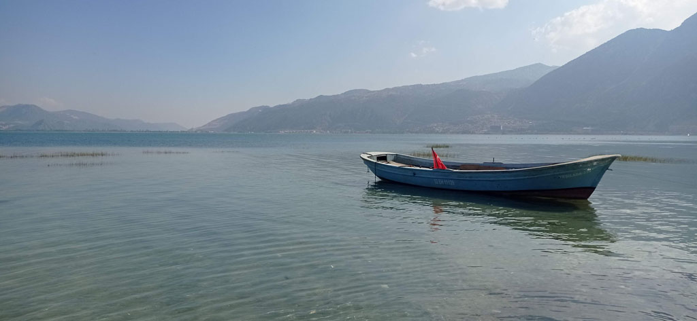
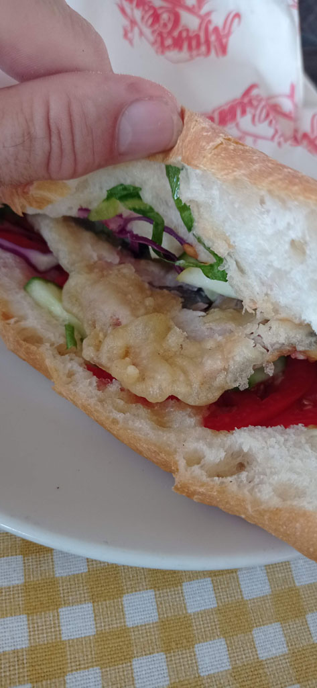
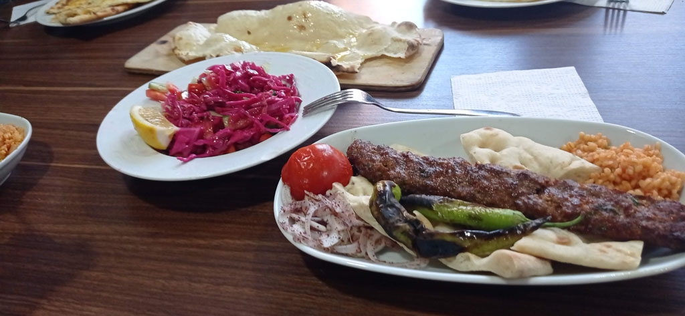
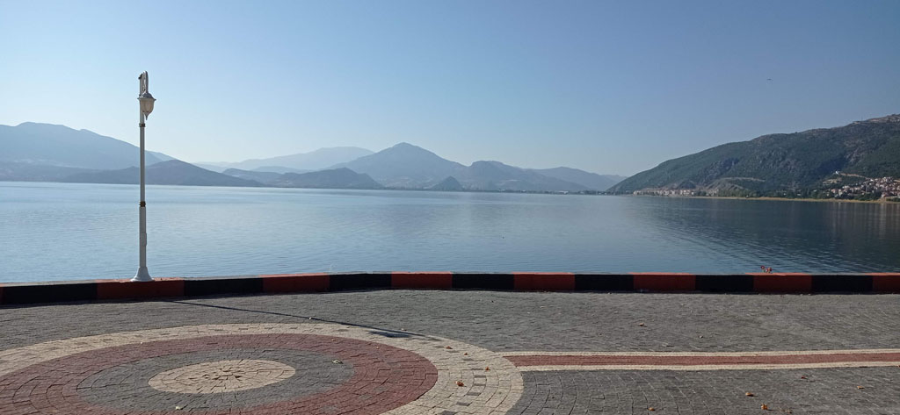

7h45 réveil

8h00 petit déjeuner après avoir bouclé les sacs.

9h00 départ après avoir réglé la note. Nous prenons le mini bus pour **Denizli**. Arrivés à la gare routière un gentil monsieur nous emmène auprès de la bonne compagnie pour poursuivre notre voyage.

10h30 Départ pour **Isparta**

13h20 On arrive à la gare routière centrale. On négocie un taxi pour faire les 30 km qui nous séparent de **Eğirdir**

14h00 trouvons un hôtel sur la presqu'ile (au début).

14h15 on part directement en balade faire le tour de la presqu'ile, on trouve qq cafés froids e ncanette

15h20 Arrêt dans une gargote pour manger face à l'eau.

17h00 passage rapide par l'hôtel après avoir repéré la gare routière pour le lendemain.

17h15 Arrêt çais dans le café municipal/associatif (il faut aller au comptoir), on prendra 8 çais pour 24 TL

On passe ensuite au supermarché, renouveler stock d'eau et de provisions pour le lendemain.

19h00 On teste un restaurant, le *Haci Aladdin Tandir Salonu*.

20h00 face au lac dans une petite gargote, on regarde le soleil se coucher en buvant des çais.

