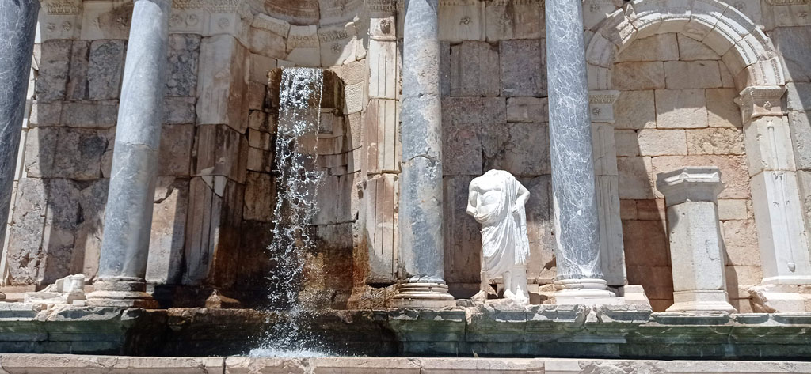
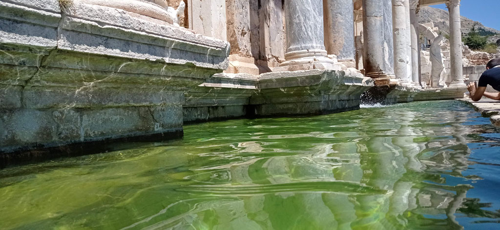
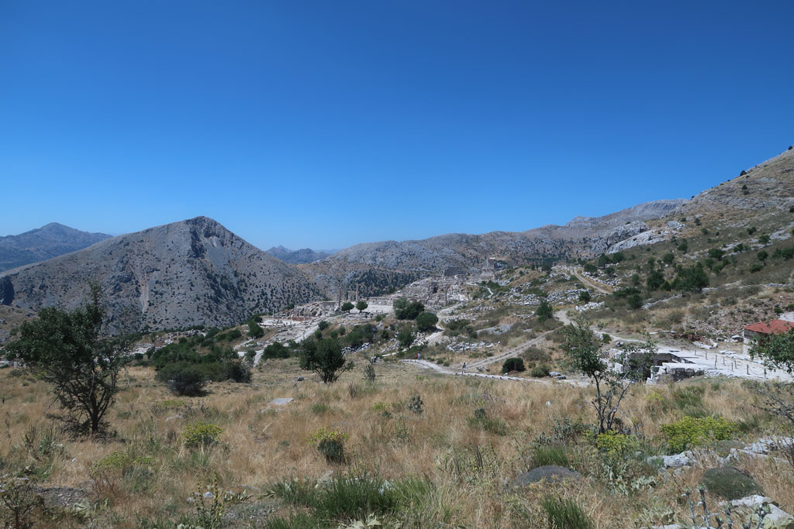
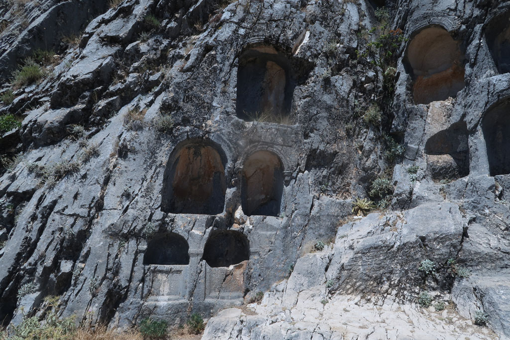
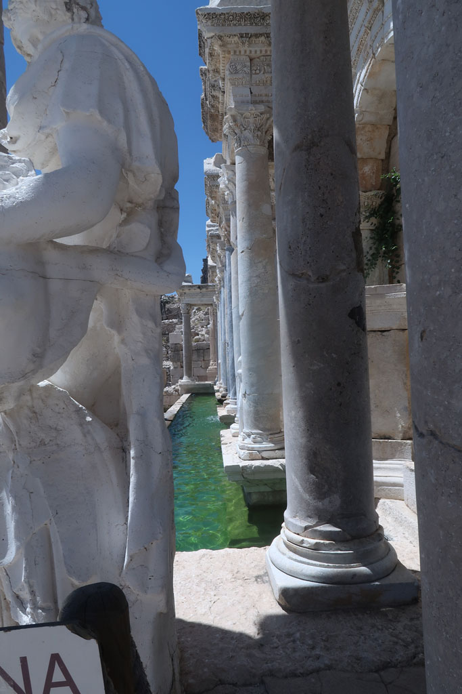
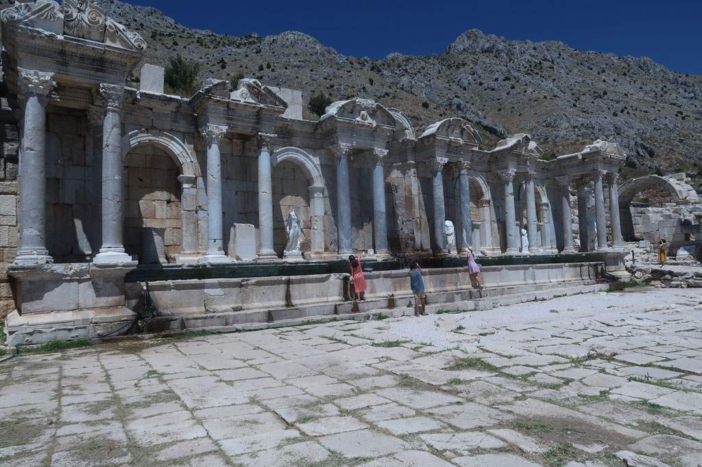
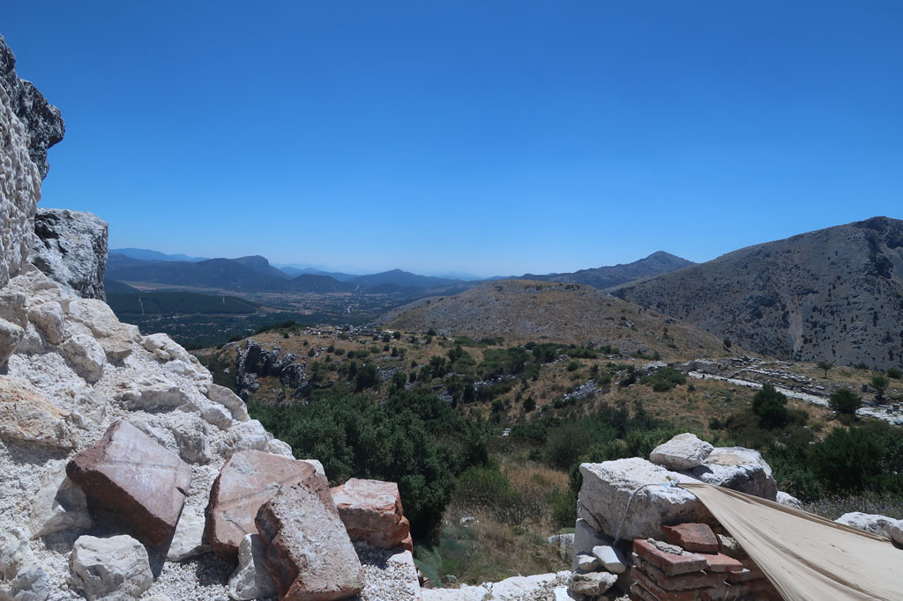
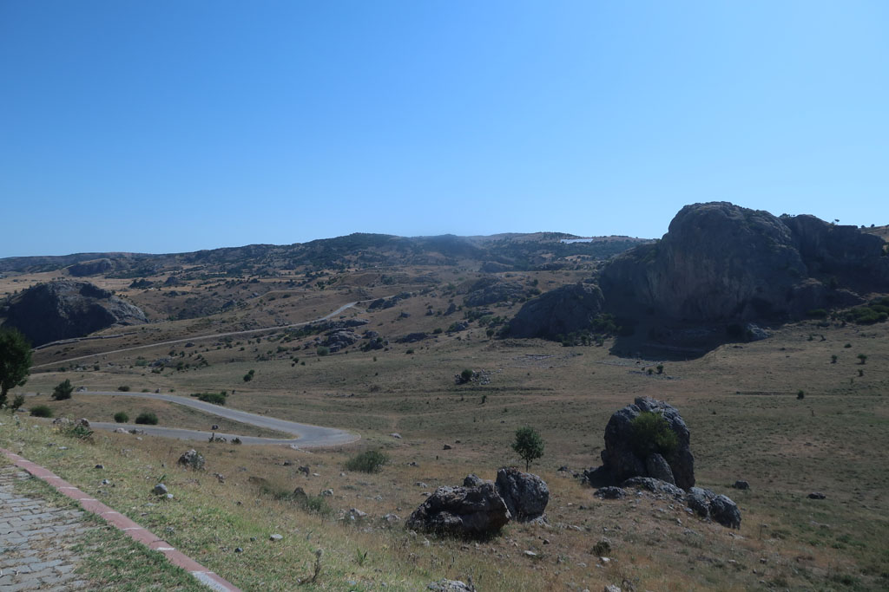

7h45 réveil.

8h00 petit déjeuner rapide à l'hôtel.

8h30 après avoir prolongé notre séjour d'une nuit, direction la gare routière.

9h00 bus pour Isparata, en l'attendant, çais sur le bord de la route.

10h15 depuis **Isparta**, bus pour **Ağlasun**, préciser au chauffeur, que l'on souhaite descendre à **Sagalassos**,il arrête alors le bus le long de la route, auprès d'une coopérative municipale de chauffeurs, qui font la navette pour le site.

11h00 après une petite boisson à l'entrée du site, début de la visite de ce site grandiose. Nous attaquons la visite par le haut du site, le théâtre, avant de redescendre en visitant tous les autres bâtiments. Nous prenons notre temps, le bus de retour passe sur la route principale à 16h15.

14h30 sortie du site. Nous prenons des boissons au kiosque situé près de l'entrée et on leur demande de prévenir la coopérative de venir nous chercher.

15h00 -> 16h15 attente du bus dans le jardibn de la coopérative, avec quelques passages au minimart pour boire/grignoter.

16h15 Bus pour Isparta

17h25 Bus pour Eğirdir

18h30 nous revenons au café municipal prendre des çais

19h00 repas dans la même cantine que la veille.

20h00 promenade digestive sur la digue

