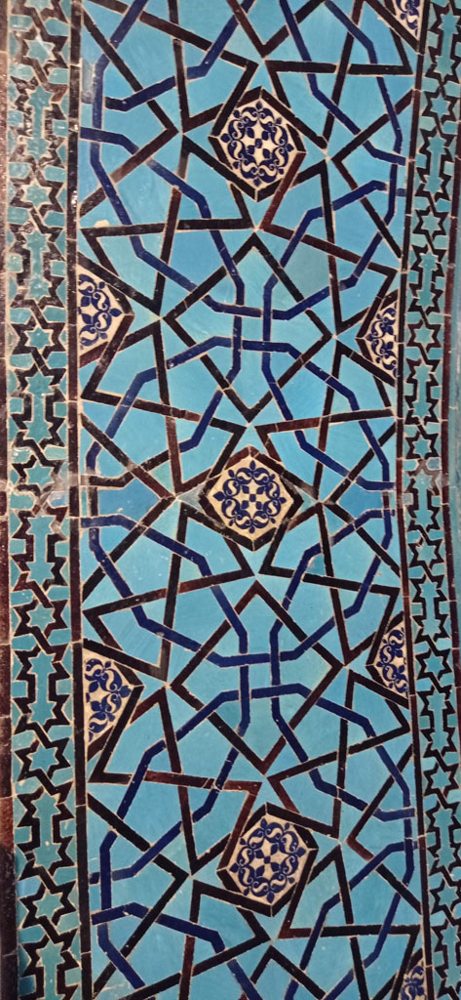

7h45 réveil et petit déjeuner.

8h45 direction la gare routière. Il y a un bus à 9h15 pour **Konya**. En attendant on profite de la vue sur le lac et on discute avec les autres passagers qui attendent aussi le bus.

12h30 arrivés à Konya, on prend le tram pour le centre ville.

13h30 on trouve un hôtel pas trop cher et pas trop miteux dans le centre ville.

14h00 repas dans un petit restaurant.

15h00 on passe l’après midi à visiter la ville et des lieux tous aussi magnifiques les uns que les autres.

Alaaddin Keykubad Câmii, Mevlana Müzesi, Sultan Selim Câmii, Sahip Ata Vakıf Müzesi.... (**Musée**, mosquées, etc...)

19h30 de retour dans la même cantine que le midi (très bonne)

20h30 on termine la soirée en buvant des çais en terrasse (7)

