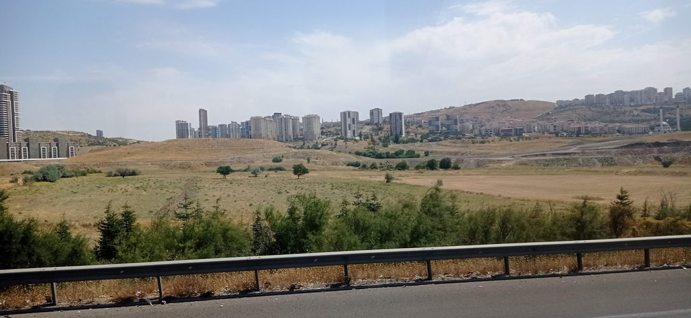
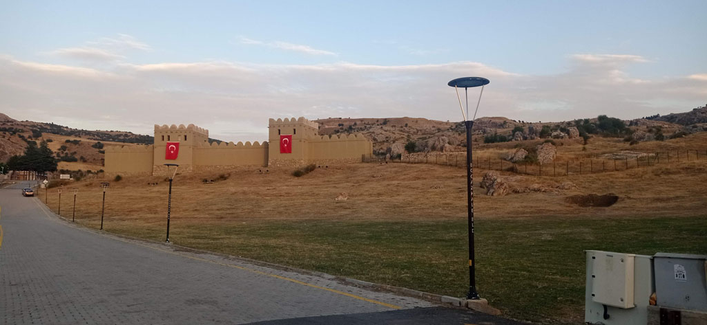

7h00 réveil et mauvais petit déjeuner dans le sous sol de notre hôtel (qui n'avait pour lui que sa localisation centrale et son prix réduit)

7h30 remplissage de la konyakart... on reprend le tram pour la gare routière.

10h00->13h30 bus pour **Ankara**. Comme nous sommes déjà passés l'année dernière, on tente de repartir directement.

13h45 bus pour Sungurlu

17h00 arrivés dans la toute petite gare routière de **Sungurlu**. On attrape un taxi et après négociations direction **Boğazkale**. L'hôtel trouvé est très excentré, on rejoint le centre ville par les petites rues dans la campagne.

18h00 çais en terrasse.

18h30 repas dans une cantine, on mange ce qu'il y a.

20h00 la nuit tombée nous revenons par la campagne en passant non loin du site historique, que nous visiterons demain.

