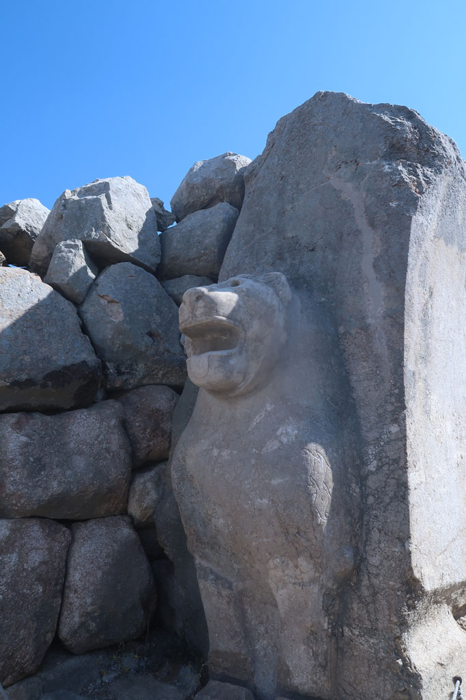
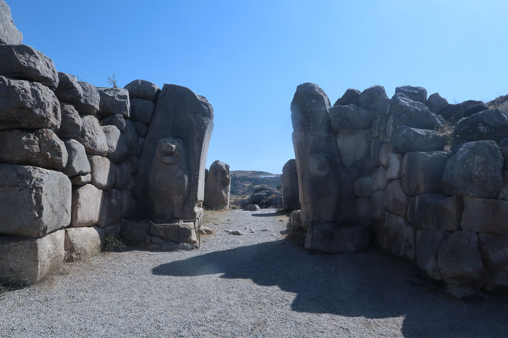
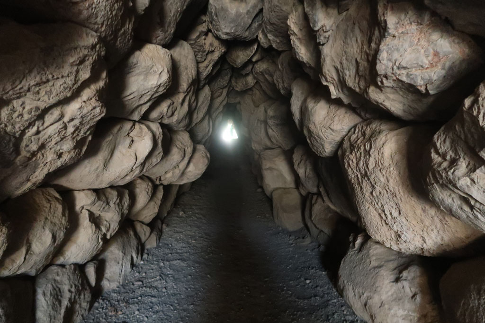
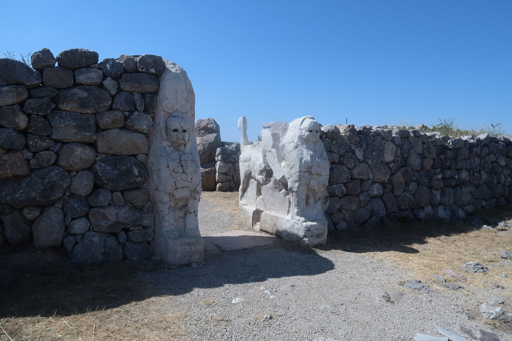
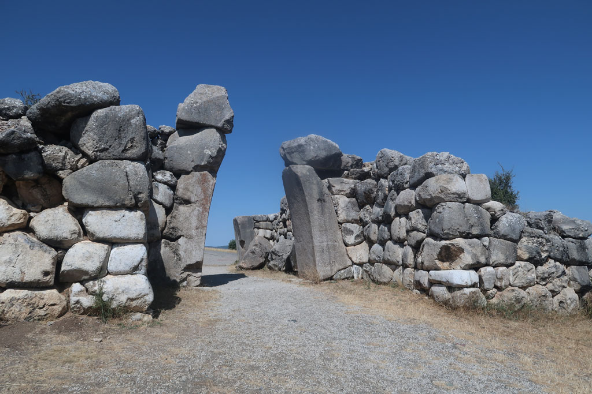

7h30 réveil, tôt pour profiter de la fraicheur.

8h00 Petit déjeuner turc, comme nous sommes les seuls clients de cet hôtel perdu sur les hauteurs de la ville, les plateaux qui attendaient dans la salle devaient être pour nous. Tandis que nous nous installons, le patron revient avec du pain frais.

9h00 Achat des billets pour la visite de ce site. (4 x 70 TL) Promenade magnifique au milieu des **ruines**, mais difficile compte tenu de la chaleur. C'est normalement une visite que s'effectue en voiture. Nous faisons le tour de cette **forteresse** hittite de **Boğazkale** à pieds.

13h00 sortie du site. direction le centre ville, çais en terrasse, passage au supermarché. Repas dans la petite lokantasi de la veille. Délicieux.

14h00 retour à l'hôtel sous une chaleur de plomb, sieste.

16h40 on tente la piscine verte et alimentée par un glacier de l'hôtel avant de se prendre une bière en terrasse.

18h00 c'est parti pour la randonnée en direction du centre ville.

19h00 repas dans la même catine que le midi.

Retour à la nuit tombée. Sans trottoir, ni lumière. Entre les chiens et les voitures c'est un peu dangereux.