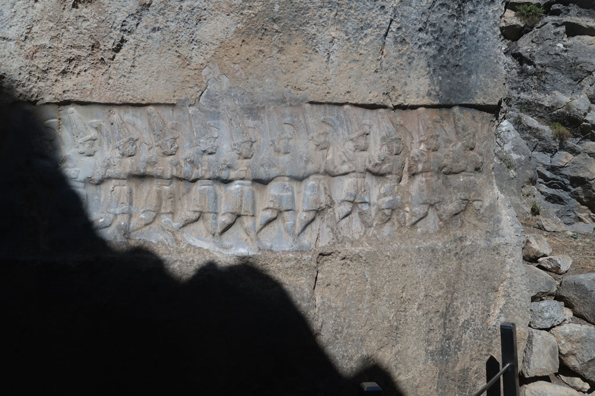

8h00 réveil

8h45 petit déjeuner en terrasse

9h30 direction les hauteurs de la ville de **Boğazkale**, explorer le dernier gros site hittite de la ville. Visite rapide de ce lieu, joli et désert.

10h30 pause boisson dans le café attenant.

11h30 arrêt au camping qui propose un repas.

13h00 de reour à l'hôtel, piscine, sieste....

18h30 retour vers le centre ville, mais mauvaise surprise la cantine est fermée. Passage par le supermarché, au cas où. Nous finissons dans le restaurant situé à l'entrée de la ville. Pas terrible.

En repartant nous découvrons une autre cantine , cachée ... dommage

20h30 on se pose en terrasse...