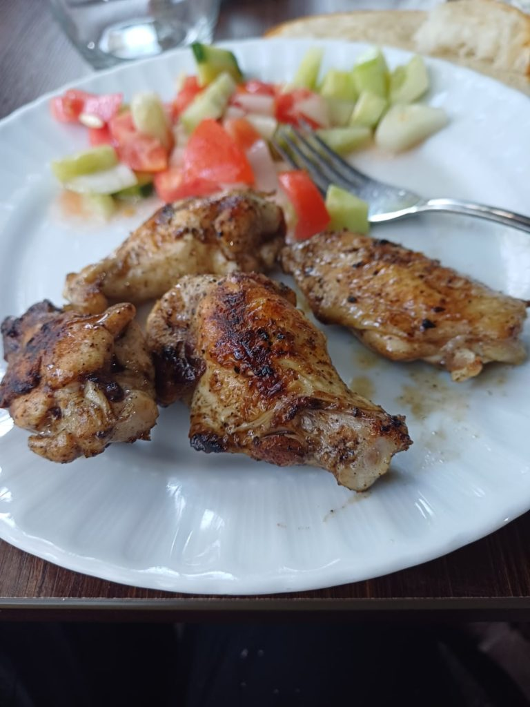
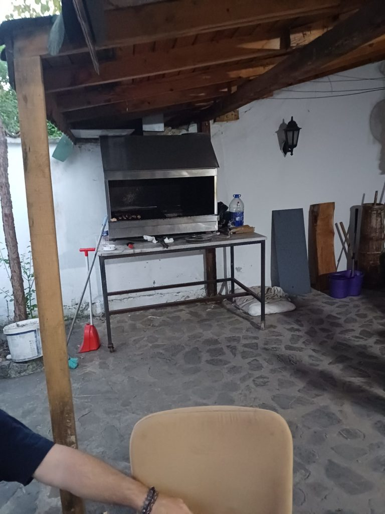

7h55 réveil

8h00 pendant le petit déjeuner, le patron nous trouve un taxi pour la ville voisine (erreur nous lui annonçons le prix payé à l'aller, ce sera donc le même. 650 TL)

10h00 le taxi se charge de nous trouver un bus pour Ankara, négocie le prix pour nous.

13h00 arrivés à **Ankara** , à peine arrivés on cherche un bus pour **Safranbolu**

13h45 -> 17h30 bus

17h30 Nous logeons au Guney Konak. C'est l'hôtel où l'on nous avait conseillé l'autre hôtel l'année dernière. (Ce dernier magnifique est fermé en ce moment)

Le patron nous informe que ce soir, c'est barbecue, si cela nous intéresse. Il est là avec un ami à lui et la fille de ce dernier. Nous sortons donc faire des courses à la boucherie du coin. (143 TL)

19h30 Barbecue tous ensemble. L'ami à appelé sa fille pour qu'elle discute avec K qui à le même age qu'elle. Le patron à préparé plein de salades pour accompagner tout ce qui grille.

22h30 Bien crevés par cette longue journée, direction le dodo.