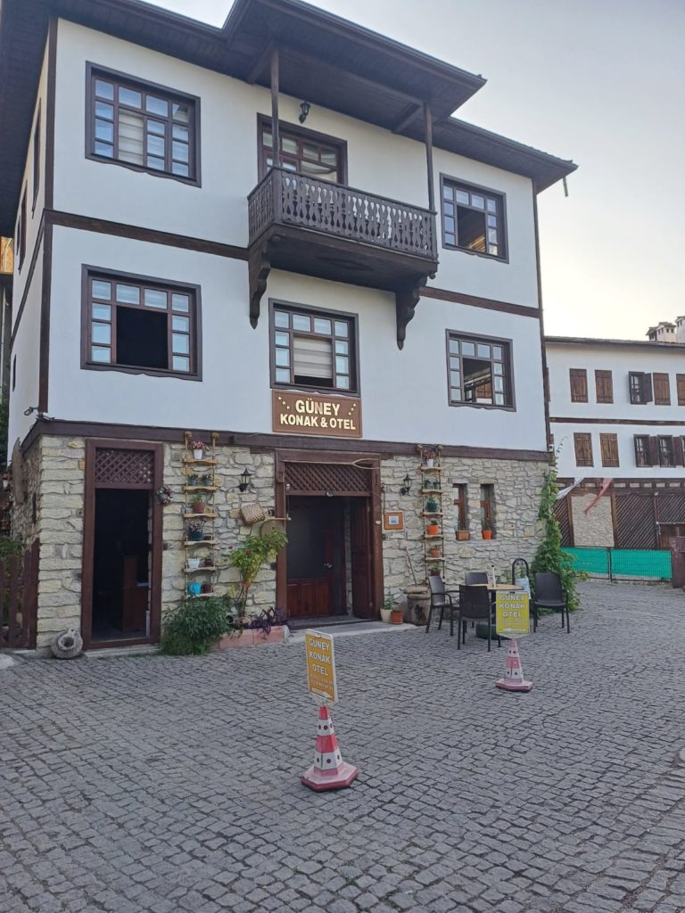
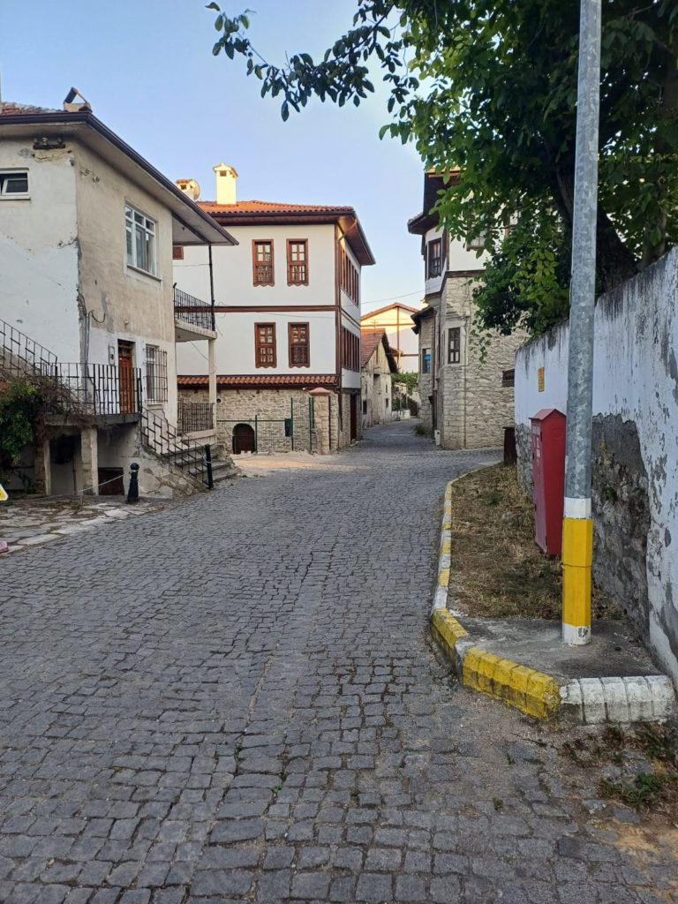

8h30 Réveil

9h00 petit déjeuner en terrasse.

10h30 Retour dans le vieux **Safranbolu**

16h00 de retour après une longue marche sous le soleil pour faire une bonne sieste. Nous retournons nous promener ensuite dans le quartier moderne de l'hôtel (Banque, minimart, etc..).

18h30 Notre cantine de l’année passée n'existe plus. Par contre le restaurant qui était en construction est terminé.

21h00 Le patron m'embarque dans une sortie en ville, dont la destination était l'achat de graines et de glaces.

Dodo après avoir refait le monde.