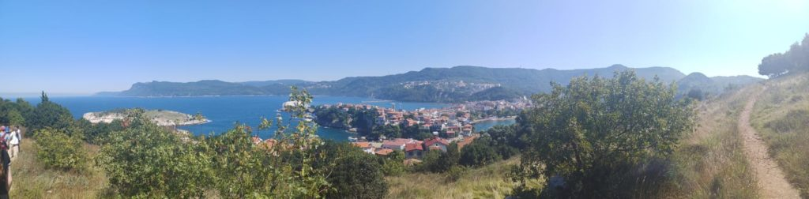
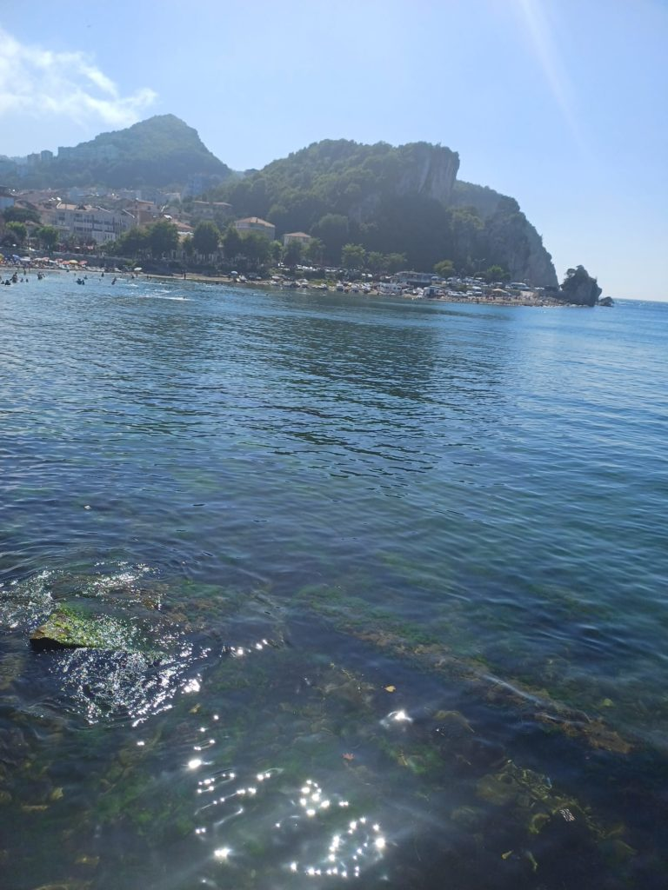
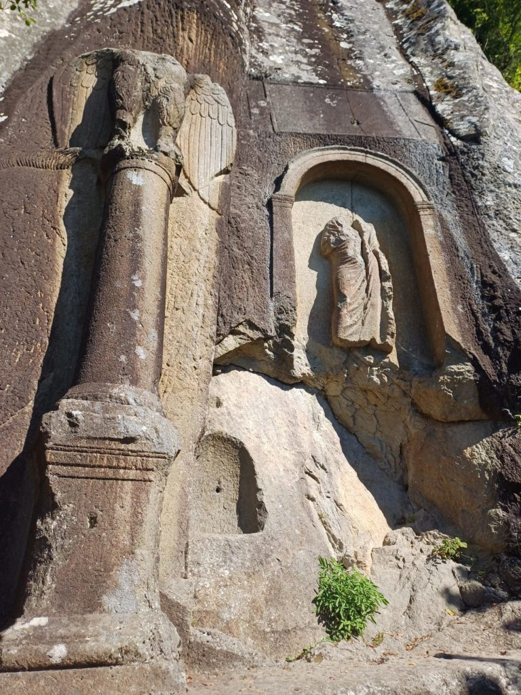

*Au départ nous voulions y aller en bus mais finalement nous y allons en voiture avec Yalçin le copain du patron et Zieneb sa fille en voiture. Heureux de nous faire découvrir la région.*

9h00 Réveil

10h00 Nous partons pour **Amasra** par une route de montagne magnifique.

12h00 Arrivés à la plage, on en profite. Je vais me baigner dans la mer Noire (pour la première fois) avec les filles. Elle est gelée mais nous passons un bon moment.

13h30 direction une petite lokantasi (470 TL pour 6)

14h30 visite de la vieille ville. Pause çais face à la mer.

16h00 Sur la route du retour, arrêt sur le bord de la route dans les hauteurs sur une aire de stationnement. Avant de grimper les marches d'un escalier perdu en pleine forêt pour arriver au pied d'une statue/gravure romaine avant de prendre de nouveau la route de **Safranbolu**.

18h300 Retour chez notre dealer de pidés non loin de l'hôtel après cette très belle journée.

20h00 Fin de journée en terrasse, paisible.